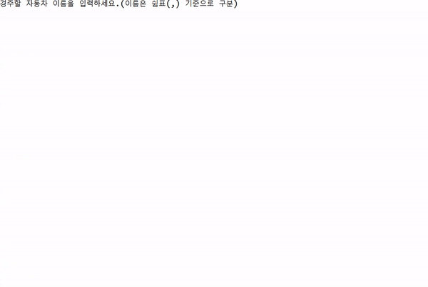
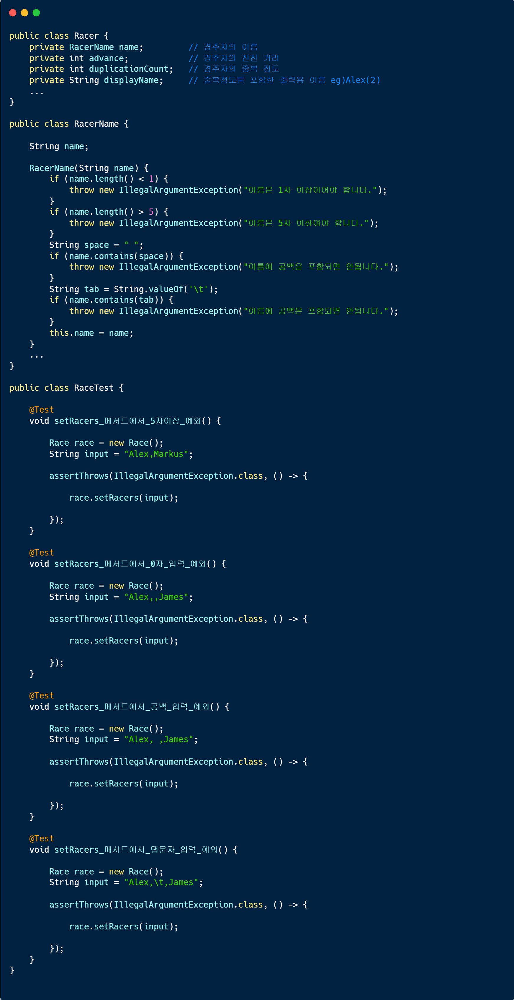
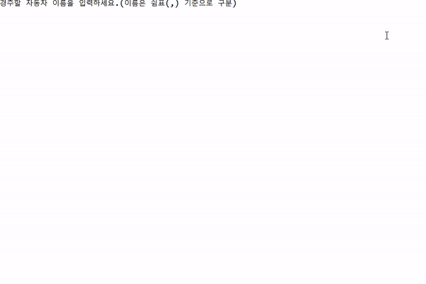
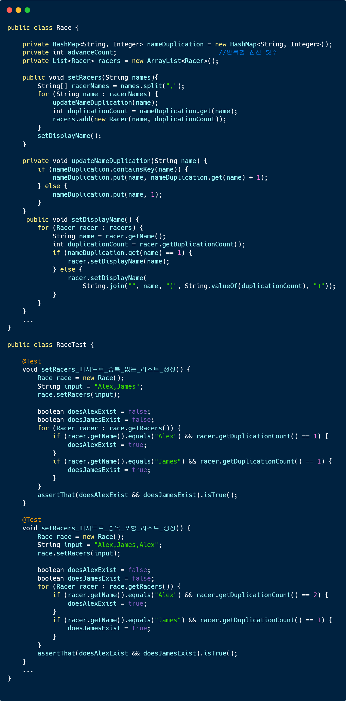
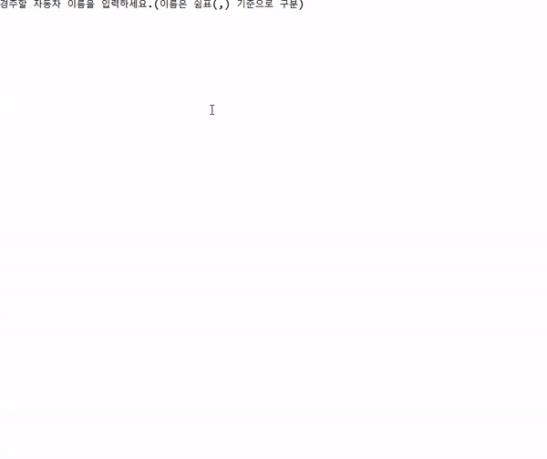
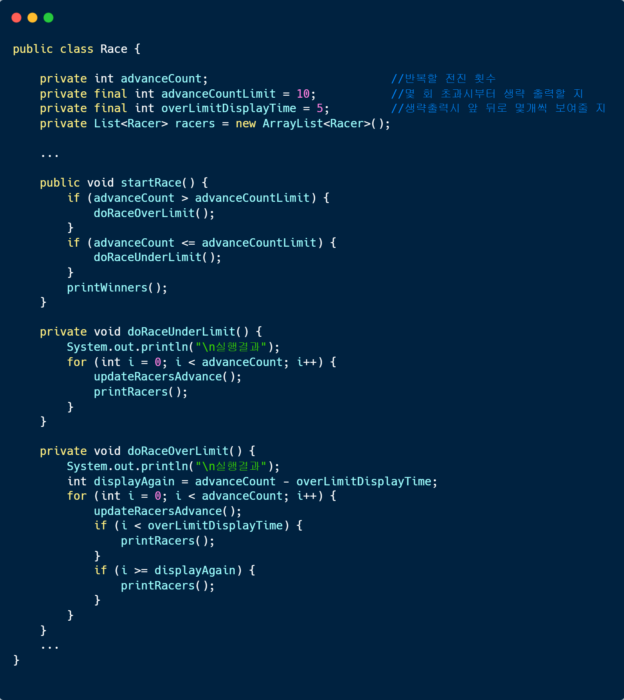

<p align="center">
    
</p>

# 2주차 미션 - 자동차 경주
> 2주차 미션 자동차 경주를 구현한 저장소입니다.

<div style="text-align:center;">
    
</div>

## 목차
 - [실행하기](#실행하기)
 - [기능](#기능)
	- [게임 시작](#게임-시작)
		- [실행 순서](#실행-순서)
		- [예외 처리](#예외-처리)
	- [실행 결과 출력](#실행-결과-출력)
		- [실행 순서](#실행-순서)

<br>

## 실행하기
현재 Repository를 Clone한 후 Eclipse(혹은 그 외 IDE)를 통해 실행합니다.
```git
git clone -b ilot12 https://github.com/ilot12/java-racingcar-6.git
```
<br>

## 기능

### 게임 시작

#### 실행 순서
- 최초 시작시에 `경주할 자동차 이름을 입력하세요.(이름은 쉼표(,) 기준으로 구분)`가 출력됩니다.
	- 자동차 이름은 쉼표(,)를 기준으로 구분하며 이름은 5자 이하만 입력해야 합니다.
	- 조건에 맞게 console에 `name1,name2,name3...`을 입력해줍니다.

- 이름들을 입력한 이후 `시도할 회수는 몇회인가요?`가 출력됩니다.

#### 예외 처리

- 	유니코드 특수문자는 허용하지만 공백문자와 탭문자는 예외를 발생하도록 했습니다.
	<br>또 0자 혹은 5자 초과의 이름 또한 예외처리 하였습니다.
	<details>
	<summary>실행 결과 보기</summary>
		
	</details>
	<details>
	<summary>예외 처리 코드 및 테스트 코드 보기</summary>
		
	</details>

- 	이름이 같은 사람이 있는 경우 이름(중복수)로 출력되도록 했습니다.
	<br>예를 들어, Alex라는 이름이 2개 입력되면 Alex(1), Alex(2)와 같은 이름이 됩니다.
	
	<details>
	<summary>실행 결과 보기</summary>
		
	</details>
	<details>
	<summary>처리 코드 및 테스트 코드 보기</summary>
		
	</details>


- 시도 횟수에 요구 사항은 없지만 (시도 횟수) x (인원 수) 만큼 출력됩니다.<br>10회 초과의 전진이 있는 경기에서는 최초 5회와 마지막 5회만 출력되도록 구현했습니다.
	- 1 ~ 10회의 전진이 있는 경기에서는 모든 전진 결과가 출력됩니다.
	- 10회 초과의 전진이 있는 경기에서는 1 ~ 5회와 마지막 5회(n-4 ~ n회)의 전진 결과만 출력됩니다.
	- 시도 횟수에 특수문자가 들어가면 예외를 발생하도록 했습니다.
	
	<br>
	<details>
	<summary>실행 결과 보기</summary>
		
	</details>
	<details>
	<summary>처리 코드 및 테스트 코드 보기</summary>
		
	</details>
<br>

### 실행 결과 출력

#### 실행 순서
- `실행 결과`가 출력됩니다.

- 처음 입력한 시도 횟수만큼 각 이름의 `name : {전진 횟수 표시}`가 출력되고 한 줄의 공백이 출력됩니다.

- 이후 전진 횟수가 가장 많은 자동차의 이름이 출력됩니다.
	- 이 때, 우승자가 여려명일 경우 쉼표(,)로 구분되어 출력됩니다.


