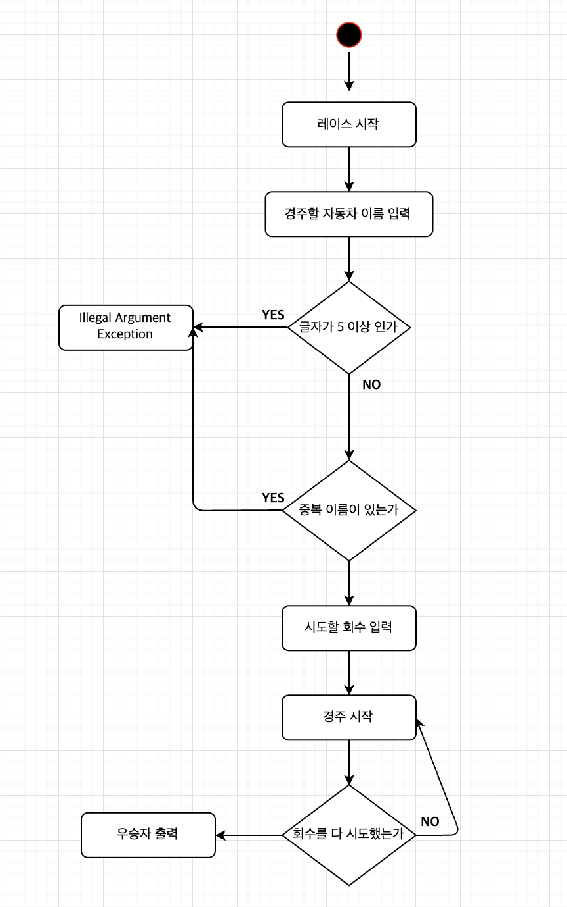

## ⛵️ 프로그램 실행 흐름
1. 경주할 자동차 이름을 입력한다
    ```
   경주할 자동차 이름을 입력하세요. (이름은 쉼표(,) 기준으로 구분)
   pobi,woni,jun
   ```
2. 시도할 횟수를 입력한다
    ```
   시도할 횟수는 몇회인가요?
   5
   ```
3. 실행 결과를 출력한다
    ```
   실행 결과
   pobi : -
   woni : 
   jun : -
   ```
4. 시도할 횟수가 다 끝날 때 까지 3번을 반복한다
5. 최종 우승자를 출력한다
    ```
   최종 우승자 : pobi, jun 
   ```
   
## 🚀 프로그램 기능 목록
### 출력 기능 
- [x] 경주할 자동차 이름을 입력받는 문구를 출력한다
- [x] 시도할 횟수를 입력받는 문구를 출력한다
- [ ] 실행 결과를 횟수만큼 출력한다
  - [x] 실행 결과는 `Car : ---` 형식을 지켜서 출력한다
- [ ] 우승자를 출력한다
  - [x] 우승자가 두 명 이상일 때 쉼표로 구분하여 출력한다 
### 입력 기능
- [x] 경주할 자동차 이름을 입력한다
  - [x] 자동차 이름을 쉼표로 구분하여 입력한다 
- [x] 시도할 횟수를 입력한다 
### 동작 기능
- [x] 자동차는 전진한다
   - [x] 0에서 9사이의 무작위 값을 구한 후 무작위 값이 4 이상일 경우 전진한다
- [ ] 레이스 후 상황을 업데이트 한다
   - [x] 경주에 참여하고 있는 자동차들의 현재 위치를 반환한다
- [x] 레이스 시 시도 횟수는 1씩 감소한다
- [x] 최종 우승자를 구한다
   - [x] 전진 거리가 제일 다 자동차가 우승한다
   - [ ] 우승자가 여러 명일 경우 쉼표를 이용하여 구분한다
### 예외 처리 기능
- [x] 검증이 실패할 경우 `IllegalArgumentException`을 발생하고 프로그램을 종료한다
- [x] 자동차 이름이 5자 이내 인지 검증한다
- [x] 자동차 이름이 중복되지 않는지 검증한다
- [x] 자동차가 두 대 이상인지 검증한다
- [ ] 쉼표(,)의 형식이 올바른지 검증한다
   - [ ] 입력의 시작이 쉼표 인지 검증한다
   - [ ] 쉼표가 두 개 이상 연속하여 있는지 검증한다
   - [ ] 쉼표 옆에 공백이 있는지 검증한다
   - [ ] 입력의 끝이 쉼표 인지 검증한다
- [ ] 입력 값이 존재하는지 검증한다
- [x] 시도 횟수가 1 이상 인지 검증한다
- [x] 랜덤 값이 지정된 범위 내에 있는지 검증한다

### 액티비티 다이어그램
