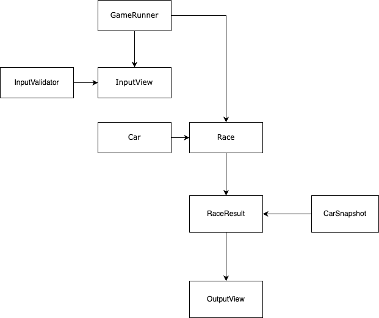

### 구현 기능 목록

**사용자 입력 받기 - RacingGameInputController**

- 자동차 이름 입력
    - 공백키가 섞인 경우
    - 이름이 5자를 넘어가는 경우
- 시도 횟수 입력
    - 정수가 아닌 값이 들어오는 경우
    - 0이 들어오는 경우

**레이싱 상태 관리하기 - RacingGameReferee**

- 레이싱을 진행시키기
- 경기 결과를 알리기

**레이싱 게임 관리하기 - RacingGameController**

- 게임 실행하기

**게임의 전반적인 출력관리하기 - RacingGameView**

- 게임 시작 시 입력받을 때 출력하기
- 게임이 진행되는 동안 출력하기
- 최종 우승자가 정해졌을 때 출력하기

