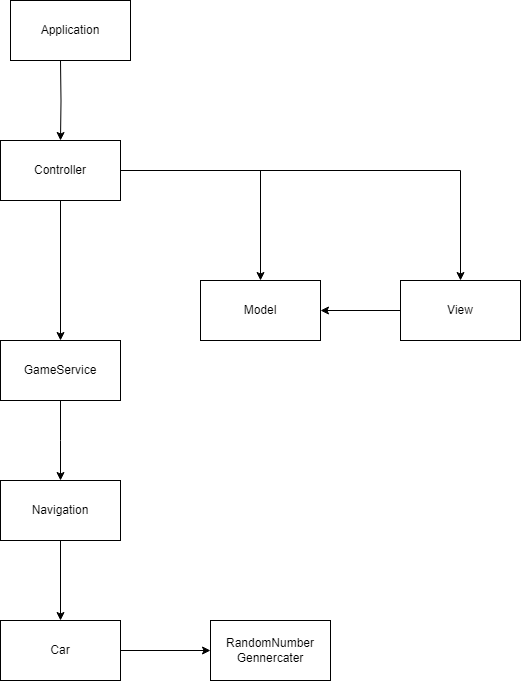

# 미션 - 자동차 경주

## 게임 룰

- 주어진 횟수 동안 n대의 자동차는 전진 또는 멈출 수 있다.
- 각 자동차에 이름을 부여할 수 있다. 전진하는 자동차를 출력할 때 자동차 이름을 같이 출력한다.
- 자동차 이름은 쉼표(,)를 기준으로 구분하며 이름은 5자 이하만 가능하다.
- 사용자는 몇 번의 이동을 할 것인지를 입력할 수 있어야 한다.
- 전진하는 조건은 0에서 9 사이에서 무작위 값을 구한 후 무작위 값이 4 이상일 경우이다.
- 자동차 경주 게임을 완료한 후 누가 우승했는지를 알려준다. 우승자는 한 명 이상일 수 있다.
- 우승자가 여러 명일 경우 쉼표(,)를 이용하여 구분한다.

## 입출력 순서

- 경주 할 자동차 이름들 입력(2명 2이상인 경우","로 구분)
- 시도 횟수 N 입력
- N번의 횟수 동안 이동 거리를 "-"를 이용하여 출력
- N번후 우승자 안내(우승자가 2명 이상인 경우", "로 구분하여 출력)

## 프로그래밍 요구사항

- Java 코드 컨벤션 가이드를 준수하며 프로그래밍한다.
- indent(인덴트, 들여쓰기) depth를 3이 넘지 않도록 구현한다. 2까지만 허용한다(함수 화가 중요할 듯 하다)
- 3항 연산자를 쓰지 않는다.(가독성이 중요하다)
- 함수(또는 메서드)가 한 가지 일만 하도록 최대한 작게 만들어라. (단일 책임의 원칙이라고 볼 수 있을 듯 하다.)
- Unit 5와 AssertJ를 이용하여 본인이 정리한 기능 목록이 정상 동작함을 테스트 코드로 확인한다(테스트 코드를 작성)
- Git의 커밋 단위는 앞 단계에서 docs/README.md에 정리한 기능 목록 단위로 추가한다.
  - 커밋 메시지 컨벤션 가이드를 참고해 커밋 메시지를 작성한다.

## 필요한 데이터

- 자동차의 위치
- 자동차의 이름
- 시도 횟수

## 기본 설계

## 기능 요구 사항
### 사용자들의 이름을 입력 받는다.
- 여러 사람이 있을 경우 ,로 구분한다.
- 이름은 5글자 이하여야 한다.
- 예외 : 6글자 이상인경우
- 예외 : 같은 이름이 들어오는 경우
- 예외 : 빈 문자가 들어오는 경우

### 시도 횟수를 입력 받는다.
- 시도 횟수를 입력받는다.
- 예외 : 숫자가 아닌 문자가 들어오는 경우

### 자동차를 이동한다.
- 자동차를 이동한다.
- 이동을 위해서는 랜덤 넘버가 4이상이여야 한다.
- 랜덤 넘버는 0에서 9 사이의 수여야 한다.
- 예외 : 랜덤 넘버가 0~9사이의 수가 아니다.

### 이동거리를 출력한다.
- 이동거리를 출력한다.(pobi : --)

### 우승자를 출력한다.
- 우승자가 여럿이면 ,로 구분하여 출력한다.

## 기능구현 목록
### Application

#### Controller
- InputView에 입력을 요청하고 GameService에 이동을 요청한다
- GameService에 승자 데이터 요청을 한다.
- GameService에 경주의 상태를 요청한다.

### Domain

#### GameService
- Navigation을 생성한다.
- Navigation에게 승자 요청을 한다.
- Navigation에게 Car의 상태를 받아온다.
- 게임이 끝났는지 판단한다.

#### Navigation
- 우승자를 판단하고 찾아온다.
- 리스트들의 이동 상태를 요청한다.
- RandomNumberGenerator에게 숫자를 요청하고 Car들에 이동 요청을 한다.

#### Car
- 이름을 검증한다.(5자 이상시 IllegalArgumentException)
- 자동차를 이동 할 수 있는지 판단한다.
  - 이동할 수 있다면 이동한다.
- getLocation를 이용하여 이동한 거리를 반환한다.
- getName을 이용하여 자동차의 이름을 반환한다.

#### RandomNumberGenerator
- 0~9사이의 랜덤한 숫자를 입력한다.

### UI

#### InputView
- 사용자의 입력을 받는다.

#### OutputView
- 출력요청을 받으면 입력에 맞게 -와 이름을 출력한다.
- 우승자를 출력한다. 다수의 경우 ,를 추가하여 출력한다.

