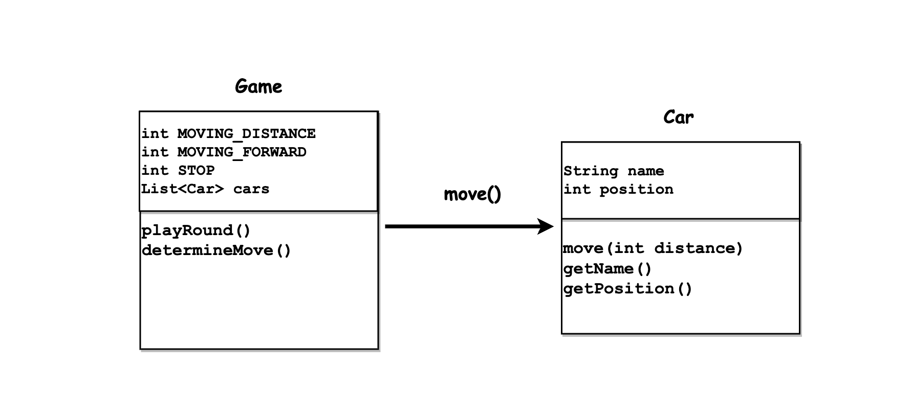

# 🚗 프리코스 2주차 기술 문서

> 다른 사람의 실력에 주눅들지 말고 내 템포에 맞춰서 하고싶은 거 다해보자 🔥 

## 1. 들어가기 전에
+ #### 2주차 개인적 목표
  + `Git Commit message` head 제외 한글로 명확하게 쓰기.
    + 저번 주차에서 영어로 쓰다 이도저도 아니게됨.
  + 객체지향 프로그래밍 연습하기
    + 다이어그램으로 객체, 행위 ,메세지 설계 하기
    + `객체지향 사실과 오해` 한번 더 정독.
  + 손보다 머리를 많이 쓰기
---
+ #### 공통 피드백 정리
  + 1주차 공통 피드백은 크게 `git` 관련 피드백, 컨벤션 관련 피드백이 주를 이루고 있다.
  + `git` 관련 피드백
    + `git`으로 관리할 파일들에대한 기준
    + 의미있는 커밋메시지로 작업 내용을 직관적으로 이해 할 수 있게한다.
    + PR 보내기전 브랜치확인
  + 컨벤션관련 피드백
    + 이름 축약금지 
    + 공백 남발금지 ----> 문맥을 분리하는 부분에 사용
    + 의미 없는 주석 금지 ----> 주석 대신 네이밍을 통해 최대한 의도를 드러낼것.
---
+ #### 그외 2주차 신경쓸 사항 
  + `indent` 2까지만 허용. 
  + 3항 연산자 금지.
  + 메서드는 한 가지 일만 할 것.
  + 내가 작성하는 기능 목록에 대해 테스트 코드 작성

## 2. 기능 구현 목록
#### 🎮&nbsp; 게임
- [ ] 게임의 진행횟수를 설정할 수 있다.
- [ ] 모든 자동차에 대하여 이동에 대한 여부를 결정할 수 있다.
- [ ] 0 ~ 9 사이의 무작위값을 구한 후 4 이상일 경우 자동차를 전진 시킬 수 있다.
- [ ] 가장 먼 거리를 이동한 자동차를 기준으로 우승한 자동차'들'을 구할 수 있다.
#### 🚙&nbsp; 자동차
- [ ] 자동차의 이름을 부여할 수 있다.
- [ ] 자동차는 이동할 수 있다.   
#### ⌨️&nbsp; 입력
- [ ] 사용자로부터 경주 할 자동차의 이름들을 입력 받을 수 있다.
  - [ ] 입력받은 이름들을 쉼표로 구분할 수 있다.
  - [ ] 이름의 길이가 5 초과 일경우 `IllegalException`을 발생시키고 프로그램을 종료한다.
- [ ] 사용자로부터 이동 횟수를 입력받을 수 있다.
  - [ ] 입력받은 문자열이 숫자가 아닐 경우 `IllegalException`을 발생시키고 프로그램을 종료한다.
#### 🖥️&nbsp; 출력
- input
  - [ ] 자동차 이름 입력구문 출력
  - [ ] 횟수 입력 구문 출력 기능
- ouput
  - [ ] 실행 결과 출력 기능
  - [ ] 최종 우승자 이름 출력 기능

## 3. 객체지향 설계 연습

  + 최초 핵심 객체 클래스 설정

