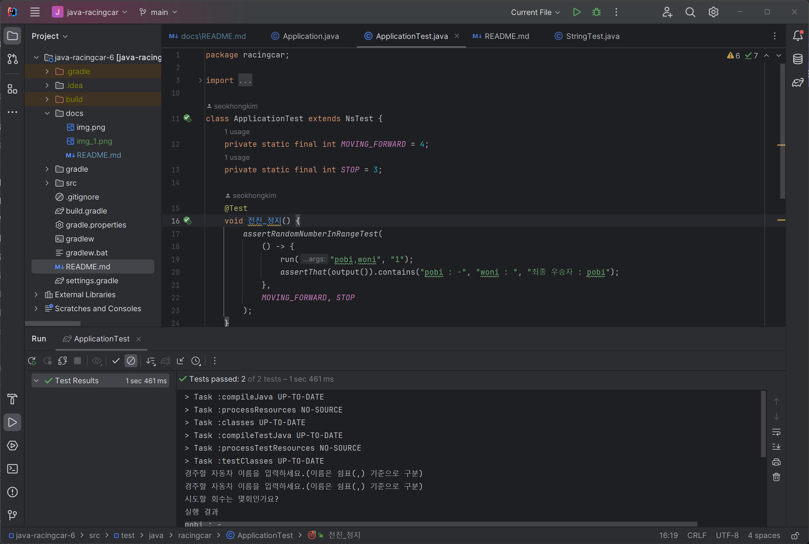

# 프리코스 미션2 - 자동차 경주

## 기능 요구 사항 & 과제 진행 요구 사항
- start: [java-racingcar-6](https://github.com/woowacourse-precourse/java-racingcar-6) 저장소를 Fork & Clone해 시작한다.
### 입출력
#### 입력
- 경주 할 자동차 이름 입력
  - 이 때, 입력받은 string을 구분하는 기준으로 ","을 통해 구분하여 List에 저장
  - IllegalArgumentException()를 사용하여, 5글자를 초과하는 경우에 대한 예외 발생
    - 아래 구현할 기능에서 checkNamelength()에 대하여 설명
```java
System.out.println("경주할 자동차 이름을 입력하세요.(이름은 쉼표(,) 기준으로 구분)");
String racerNames = scanner.nextLine();     // 경주 할 자동차 이름 입력
// ","을 기준으로 하여 각 경주 참가자들을 Array에 임시 저장
String[] racerArray = racerNames.split(",");
checkNamelength(racerArray);    // racer들의 이름을 List<Stirng>에 저장
```
- 경주를 시도할 횟수 입력(int)
```java
// 시도할 횟수 입력
System.out.println("시도할 회수는 몇회인가요?");
int tryCount = scanner.nextInt();   // 경주 시도 횟수 입력
```


#### 출력
- tryCount 만큼 race를 반복하는 내용을 출력
  - tryRace(): 반복 횟수를 입력받아 해당 반복 횟수만큼 race 실행, 각 실행마다 결과 출력
```java
System.out.println("실행 결과");
tryRace(tryCount);
```
  
```
// 에시
poni : 
koni : 
jun : -
```

- tryCount 만큼 반복 후 최고로 멀리 간 winner 출력
  - printWinner() : 앞서 최종 우승자를 찾아낸 뒤, 해당 정보를 바탕으로 우승자 출력
```java
// 멀리 간 position에 해당하는 car를 우승자로 선정하여 List 형태에 저장
List<String> winners = findWinners(maxPosition);
printWinner(winners);   // 최종 우승자 출력
```
```
// 출력 결과 에시
최종 우승자 : jun
```

### 구현할 기능 및 구현 내용
#### 외부 선언 변수
 - Scanner scanner : 외부에 선언하여 별다른 정의 없이 입력 정의가 가능하도록 선언
 - racerList : 외부에서 선언하여 다른 함수에서도 사용할 수 있는 global variable 역할 수행

#### 'Car' class 생성
- 자동차 이름(carName)과 자동차의 위치(position) 정의
- getName(), getPosition() : 각 class에 해당하는 정보를 사용하기 위한 함수
- 자동차가 이동하는 조건 정의(move())
  - Randoms.pickNumberInRange(0,9) : 0~9까지 랜덤한 숫자 반환
  - 4보다 큰 경우 이동하는 조건 작성
```java
class Car {
    private String carName;
    private int position;

    public Car(String carName) {
        this.carName = carName;
    }

    public String getName() {
        return carName;
    }

    public int getPosition() {
        return position;
    }

    // move 조건 설정
    public void move() {
        int randomNumber = Randoms.pickNumberInRange(0,9);
        if (randomNumber >= 4) {
            position++;
        }
    }
}
```

#### racing() 함수 생성 및 세부 기능
- racing() : 프로그램의 전체적인 기능 수행
```java
public void racing() {
    scanner = new Scanner(System.in);
    // Implement input
    // 경주 할 자동차 이름 입력
    System.out.println("경주할 자동차 이름을 입력하세요.(이름은 쉼표(,) 기준으로 구분)");
    String racerNames = scanner.nextLine();
    // ","을 기준으로 하여 각 경주 참가자들을 Array에 임시 저장
    String[] racerArray = racerNames.split(",");
    checkNamelength(racerArray);    // racer들의 이름을 List<Stirng>에 저장
    // 시도할 횟수 입력
    System.out.println("시도할 회수는 몇회인가요?");
    int tryCount = scanner.nextInt();

    System.out.println("실행 결과");
    tryRace(tryCount);

    // 제일 멀리 간 position 확인
    int maxPosition = findMaxPosition();
    // 멀리 간 position에 해당하는 car를 우승자로 선정하여 List 형태에 저장
    List<String> winners = findWinners(maxPosition);
    printWinner(winners);   // 최종 우승자 출력
}
```
- checkNamelength() : 이름 입력 시, 각 이름별로 5글자를 초과하는 경우 Exception이 발생하도록 정의
```java
public void checkNamelength(String[] racerArray) {
    for (int i = 0; i < racerArray.length; i++) {
        // name의 길이가 5를 넘어가는 경우 -> 예외 발생
        if (racerArray[i].length() > 5) {
            throw new IllegalArgumentException();
        }
        racerList.add(new Car(racerArray[i]));
    }
}
```
  - findMaxPosition() : 외부에 정의 된 List의 element들이 이동한 값을 바탕으로 멀리 이동한 값이 무엇인지 확인, 결과 int 반환
```java
public int findMaxPosition() {
    int maxPosition = 0;
    for (Car car : racerList) {
        maxPosition = Math.max(maxPosition, car.getPosition());
    }
    return maxPosition;
}
```

- findWinners() : 앞서 정의한 maxPosition을 바탕으로 해당 값만큼 이동한 car를 찾아낸다.
```java
public List<String> findWinners(int maxPosition) {
    List<String> winners = new ArrayList<>();
    for (Car car : racerList) {
        if (car.getPosition() == maxPosition) {
            winners.add(car.getName());
        }
    }
    return winners;
}
```
- tryRace() : 시도횟수(tryCount) 만큼 race를 진행하고 진행할때 마다 이동 결과 출력
```java
public void tryRace(int tryCount) {
    for (int i = 0; i < tryCount; i++) {
        for (Car car : racerList) {
            car.move();
            System.out.printf("%s : ", car.getName());
            for (int j = 0; j < car.getPosition(); j++) {
                System.out.print("-");
            }
            System.out.println();
        }
        System.out.println();
    }
}
```
- printWinner() : 앞서 찾아낸 우승자 list(winners)를 입력으로 받아, 결과를 출력해주는 함수
```java
public void printWinner(List<String> winners) {
    System.out.print("최종 우승자 : ");
    for (int i = 0; i < winners.size(); i++) {
        System.out.print(winners.get(i));
        // 2명 이상이 되는 경우 ", "를 포함하여 출력하도록 설정
        if (i < winners.size() - 1) {
            System.out.print(", ");
        }
    }
}
```

---
## test 결과
※ 노트북 환경에서 프로그램 실행할 경우, 출력 시 한글이 깨지는 문제가 발생하지만, test 진행시 정상임을 확인
1. 처음 시작 조건 : 만족

2. Test 확인
- StringTest : 만족

- ApplicationTest : 만족


