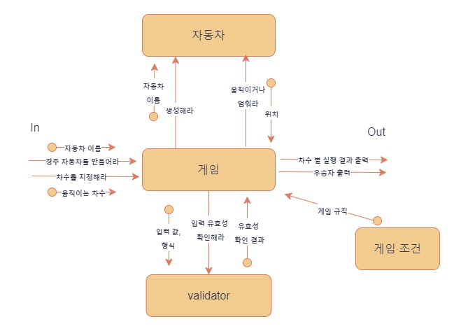

# 구현 기능 목록
***
## 기능 목록
- 게임에 필요한 데이터를 셋팅한다.
  - n대의 자동차를 생성한다.
      - ","기준으로 자동차를 구분
      - 이름이 5글자 이하
  - 차수를 입력받는다.
- 입력받은 차수 동안 자동차들을 전진/멈춘게 한다.
    - 자동차가 전진하는지 확인한다.(랜덤 수 생성 후 확인)
        - 랜덤 수는 0~9까지의 수이다.
        - 랜덤 수가 4이상이면 전진이다.
        - 랜덤수가 4미만이면 멈춤이다.
- 우승자를 확인한다.
***
## 🚀필요한 객체
- 게임
- 자동차
- 게임 조건
- validator
## 🔍협력과 책임 설계
### 1. 협력 설계 (객체 지향 설계)
 
### 2. 책임
- 게임
  - 하는 것 : 사용자 입출력, 자동차 생성, 차수별 자동차 위치 계산, 우승자 확인 및 출력
  - 아는 것 : 입력 형태, 게임 규칙
- 자동차
  - 하는 것 : 전진한다
  - 아는 것 : 자동차 이름, 자동차 위치
- 게임 조건
  - 아는 것 : 랜덤수 범위 , 전진 조건, 자동차 이름 크기 제안, 출력 메시지
- validator
  - 하는 것 : 사용자 입력형식을 확인한다.
  - 아는 것 : 게임의 입력

***
## 🔍 Class Diagram
 
