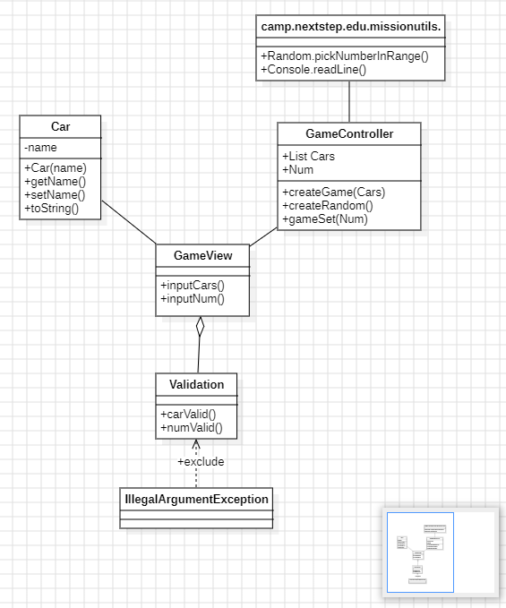

# 요구 사항
-- --
## 기능 요구 사항
> 🤵기능을 구현하기 전에 기능 목록을 만들고, 기능 단위로 커밋 하는 방식으로 진행한다.
>
초간단 자동차 경주 게임을 구현한다.

- 주어진 횟수 동안 n대의 자동차는 전진 또는 멈출 수 있다.
  - 횟수, n대, 자동차, 전진/후진 기능 존재
- 각 자동차에 이름을 부여할 수 있다. 전진하는 자동차를 출력할 때 자동차 이름을 같이 출력한다.
  - 게임 진행 시 출력 요구 사항이다.
  A,B 자동차가 있다는 가정이면 <br>
      ```
      # 1회차의 경우 
      A: - 
      B: 
      # 2회차의 경우
      A: --
      B: -
    ... 
      ```
- 자동차 이름은 쉼표(,)를 기준으로 구분하며 이름은 5자 이하만 가능하다.
  - 자동차 이름 입력 시 요구 사항이다. 
- 사용자는 몇 번의 이동을 할 것인지를 입력할 수 있어야 한다.
  - 사용자 입력 요구 사항이다. 
- 전진하는 조건은 0에서 9 사이에서 무작위 값을 구한 후 무작위 값이 4 이상일 경우이다.
  - 전진/멈춤 알고리즘 요구사항이다. 조건 : 랜덤값, 4이상의 값일 때만 전진 
- 자동차 경주 게임을 완료한 후 누가 우승했는지를 알려준다. 우승자는 한 명 이상일 수 있다.
  - 우승자 조건 사항이다. 공동 우승이 가능하다.
- 우승자가 여러 명일 경우 쉼표(,)를 이용하여 구분한다.
  - 예를 들면 `최종 우승자 : A,B`
- 사용자가 잘못된 값을 입력할 경우 IllegalArgumentException을 발생시킨 후 애플리케이션은 종료되어야 한다.
  - 예외 처리에 관한 내용이다. 사용자 입력에 제한을 둔다.

## 입출력 요구 사항
### 입력
- 경주 할 자동차 이름 입력
    <br>`A,B,C`
- 시도할 횟수 입력
  <br> `3`
### 출력
- 회차별 출력 예시
  위 입력 상태와 마찬가지로 A,B,C 자동차가 있다는 가정이면 <br>
  ```
  # 1회차의 경우
  A: -
  B:
  C: -
  # 2회차의 경우
  A: --
  B: -
  C: -
  # 3회차의 경우
  A: --
  B: --
  C: -
  
  최종 우승자 : A,B
  ... 
- 

## 프로그래밍 요구사항
### 추가된 요구 사항<br>
- indent(인덴트, 들여쓰기) depth를 3이 넘지 않도록 구현한다. 2까지만 허용한다.
  - 예를 들어 while문 안에 if문이 있으면 들여쓰기는 2이다. 최대한 중첩문을 피해라. 
- 힌트: indent(인덴트, 들여쓰기) depth를 줄이는 좋은 방법은 함수(또는 메서드)를 분리하면 된다.
  - 함수 하나에서 모든 걸 해결하려 하지 마라. 분리해라
- 3항 연산자를 쓰지 않는다.
  - 3항 연산자란 `<조건문> ? <True일 때 결과1> <False일 때 결과2>`를 말한다.
- 함수(또는 메서드)가 한 가지 일만 하도록 최대한 작게 만들어라.
  - 메서드를 잘게잘게 나눠라.
- `JUnit 5`와 `AssertJ`를 이용하여 <b>본인이 정리한 기능 목록</b>이 정상 동작함을 테스트 코드로 확인한다.
- 테스트 도구 사용법이 익숙하지 않다면 test/java/study를 참고하여 학습한 후 테스트를 구현한다.

# 기능 목록 체크 리스트
- [x] 자동차 이름 작성 기능
- [x] 자동차들을 구분하는 기능
- [x] 자동차 출발/멈춤 기능 (랜덤하게)
- [x] 회차별 게임 진행 사항 출력 기능
- [x] 최종 우승자, 공동 우승자 출력 기능
- [ ] 사용자 입력(자동차 이름, 시도할 횟수)에 대한 예외 처리 기능
  - [x] 공백 예외 처리
  - [x] 자동차 이름 입력 시 콤마가 연속으로 두개(,,) 들어가는 경우 예외 처리
  - [ ] 같은 이름이 생기지 않도록 예외처리 

## 클래스 다이어그램 초기 구상도

