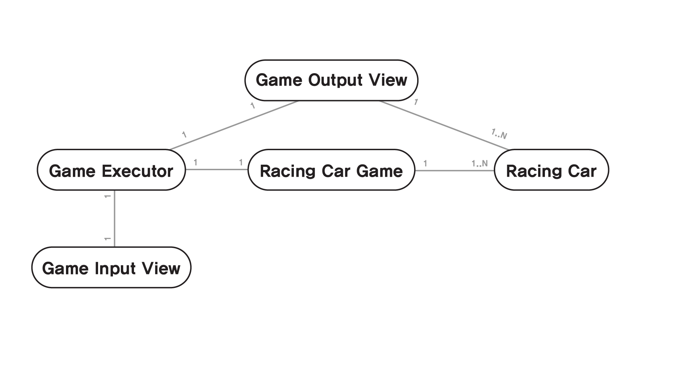
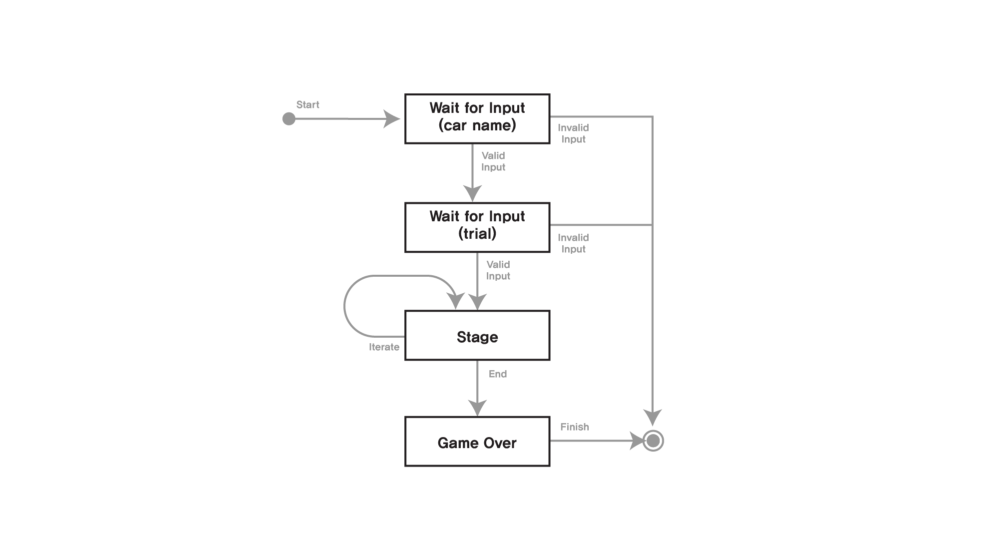

## 기능목록

- [X] 게임을 시작한다
- [X] 입력을 받는다
  - [X] 자동차 이름을 받기 전에 "경주할 자동차 이름을 입력하세요.(이름은 쉼표(,) 기준으로 구분)"를 출력한다.
  - [X] 자동차 이름을 입력 받는다
  - [X] 시도할 횟수를 입력하기 전에 "시도할 회수는 몇회인가요?"를 출력한다.
  - [X] 시도할 횟수를 입력 받는다 
- [X] 입력이 유효한지 검증한다
  - [X] 자동차 이름이 빈 공백이면 IllegalArgumentException을 발생시키고 종료한다
  - [X] 자동차 이름이 6자 이상이면 IllegalArgumentException을 발생시키고 종료한다
  - [X] 시도할 횟수가 0 이하의 값이라면 IllegalArgumentException을 발생시키고 종료한다 
  - [X] 기타 입력이 유효하지 않는 경우에 IllegalArgumentException을 발생시키고 종료한다
- [ ] 게임을 진행한다
  - [ ] 게임을 진행하기 전 "실행 결과"를 출력한다
  - [ ] 중간 결과를 계산하기
  - [ ] 중간 결과를 출력한다
      - [ ] 각 자동차별 실행 결과를 출력하기
- [ ] 결과를 출력한다
  - [ ] 최종우승자를 산정한다
  - [ ] 최종우승자를 출력한다
  

## 설계

### 초기 도메인 모델

* Game Executor  : 게임을 실행
* Racing Car Game : 레이싱 카 게임의 로직을 수행 
* Racing car : 레이싱 카의 로직을 수행
* Game Output View : 게임의 아웃풋 뷰
* Game Input View : 게임의 인풋 뷰 

## 초기 도메인 상태 모델

1. 상태
   * Wait For Input(car name) : 레이싱 카의 이름들을 입력으로 받는다
   * Wait For Input(trial) : 시도할 횟수를 입력으로 받는다
   * Stage : 각 게임의 찻수를 실행한다
   * Game Over : 최종 결과를 출력한다

2. 트리거
   * Invalid Input : 유효하지 않은 입력을 받는다
   * Valid Input : 유효한 입력을 받는다
   * Iterate : 찻수를 반복한다
   * End : 게임을 종료한다

