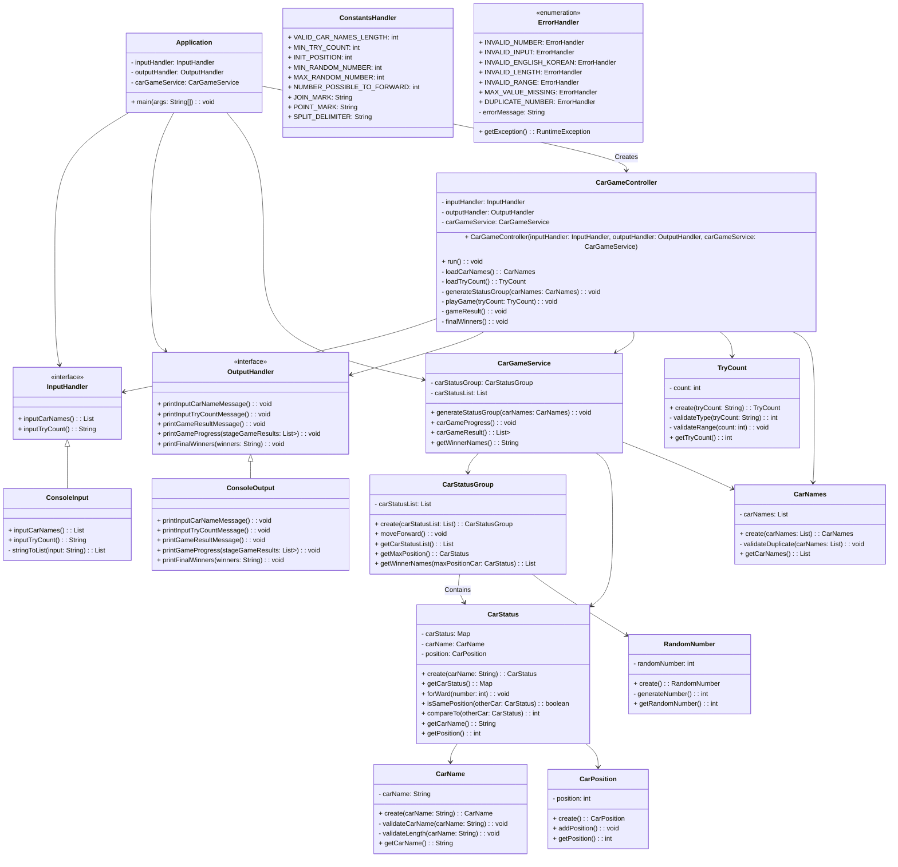

# :notebook_with_decorative_cover: 우아한테크코스 프리코스 2주차 : 자동차 경주

## 목차

- [1. 구현 기능 목록](#ballotboxwithcheck-구현-기능-목록) 
- [2. 문제 해결 과정](#bookmark_tabs-문제-해결-과정)
  - [2.1 🧪 1주 차 미션 피드백과 적용 사항](#-1주-차-미션-피드백과-적용-사항)
  - [2.2 ❓ DTO와 VO의 차이](#-dto와-vo의-차이)
  - [2.3 🧐 Arrays.asList vs List.of](#-arraysaslist-vs-listof)
  - [2.4 🚗 예외 처리한 내용과 정규 표현식](#-예외-처리한-내용과-정규-표현식)
  - [2.5 💬 wrapper 클래스와 정적 팩토리 메서드](#-wrapper-클래스와-정적-팩토리-메서드)
- [3. 다음 미션에 적용할 학습 내용](#ledger-다음-미션에-적용할-학습-내용)
    - [3.1 🧐 코드 리뷰를 통해 받는 피드백 적용](#-코드-리뷰를-통해-받는-피드백-적용)
    - [3.2 ⛓ 구현 시간 줄여보기](#-구현-시간-줄여보기)

# :ballot_box_with_check: 구현 기능 목록
- [x] controller Package
    - [x] CarGameController
        - view Package와 domain Package의 데이터를 전달하며 값을 출력하는 클래스
        - 프로그램을 실행하는 `run` 메서드
        - CarNames객체를 반환하여 자동차 이름을 받아오는 `loadCarNames` 메서드
        - TryCount객체를 반환하여 시도 회수를 받아오는 `loadTryCount` 메서드
        - 자동차의 이름과 위치를 모두 갖고있는 그룹을 만드는 `generateStatusGroup` 메서드
        - 게임을 진행시키는 `playGame` 메서드
        - 게임을 결과를 내보내는 `gameResult` 메서드
        - 최종 우승자를 구하는 `finalWinners` 메서드


- [x] domain Package
    - [x] RandomNumber
        - 전진하는 조건이 되는 번호를 생성하는 클래스
        - 전진하는 조건이 되는 번호를 생성하는 `generateNumber` 메서드
        - 전진이 가능한지 판단하는 `isMovePossible` 메서드
        -  `validateCarNames` 메서드
    - [x] CarStatus
        - 자동차의 이름과 위치를 갖고 있는 클래스
        - 객체를 생성하고 반환하는 `create` 메서드
        - 전진이 가능한지 판단하고, 가능하다면 위치를 전진시키는 `forWard` 메서드
        - 자동차의 이름과 위치를 Map 컬렉션으로 저장하고, 그 값을 반환하는 `getCarStatus` 메서드
        - 들어오는 자동차 객체의 위치와 같은 위치를 가진 자동차의 이름을 반환하는 `isSamePosition` 메서드
        - 자동차의 위치 값을 비교하는 `compareTo` 메서드
        - 자동차의 이름을 반환하는 `getCarName` 메서드
        - 자동차의 위치 값을 반환하는 `getPosition` 메서드
    - [x] CarStatusGroup
        - 자동차들의 이름을 그룹화하는 클래스
        - 객체를 생성하고 반환하는 `create` 메서드
        - 뽑은 랜덤한 값을 CarStatus 클래스로 보내 전진을 판단하는 `moveForward` 메서드
        - 가장 전진을 많이 한 자동차의 위치값을 반환하는 `getMaxPosition` 메서드
        - 가장 많은 위치를 이동한 자동차의 이름들을 반환하는 `getWinnerNames` 메서드
        - 자동차들의 이름과 위치 그룹을 반환한는 `getCarStatusList` 메서드
    - [x] wrapper Package
        - [x] CarName
            - 자동차 이름 정보를 가지고 있는 wrapper 클래스
            - 객체를 생성하고 반환하는 `create` 메서드
            - 입력값이 영어와 한글인지 확인하는 (대문자와 소문자 영어, 한글만 가능하고 그 외의 숫자, 기호, 스페이스 바는 예외처리) `validateCarName` 메서드
            - 입력한 값이 5자리 이하인지 확인하는 `validateLength` 메서드
            - 자동차 이름을 반환하는 `getCarName` 메서드
        - [x] CarNames 
            - 자동차 이름 정보를 List형태로 가지고 있는 wrapper 클래스   
            - 객체를 생성하고 반환하는 `create` 메서드
            - 입력값에 중복된 값이 있는지 확인하는 `validateDuplicate` 메서드
            - 자동차 이름들을 반환하는 `getCarNames` 메서드
        - [x] CarPosition
            - 자동차 위치를 가지고 있는 wrapper 클래스
            - 객체를 생성하고 반환하는 `create` 메서드
            - 위치의 값을 더해주는 `addPosition` 메서드
            - 위치 정보를 반환하는 `getPosition` 메서드
        - [x] TryCount
            - 시도할 횟수에 대한 유효성 검사와 값의 반환을 담당하는 wrapper 클래스
            - 객체를 생성하고 반환하는 `create` 메서드
            - 숫자로 변환할 수 있는 값인지 확인하는 `validateType` 메서드
            - user가 입력한 값이 1 이상의 수 인지 확인하는 `validateRange` 메서드
            - 시도 횟수를 반환하는 `getTryCount` 메서드


- [x] handler Package
    - [x] InputHandler
        - view Package의 ConsoleInput의 확장성과 변경 용이성을 위한 인터페이스
        - `inputCarNames` 메서드의 추상화
        - `inputTryCount` 메서드의 추상화
    - [x] OutputHandler
        - view Package의 ConsoleOutput의 확장성과 변경 용이성을 위한 인터페이스
        - `printInputCarNameMessage` 메서드의 추상화
        - `printInputTryCountMessage` 메서드의 추상화
        - `printGameResultMessage` 메서드의 추상화
        - `printGameProgress` 메서드의 추상화
        - `printFinalWinners` 메서드의 추상화
    - [x] ErrorHandler
        - Enum 클래스를 활용하여 프로그램에서 발생하는 에러 코드들을 관리하는 클래스
        - ErrorMessage와 함께 `IllegalArgumentException` 예외를 발생시키는 `getException` 메서드
    - [x] ConstantsHandler
        - 프로그램내의 상수들을 관리하는 클래스


- [x] service Package
    - [x] RacingCarGameService
        - 자동차 경주 게임에 대한 비즈니스 로직을 담당하는 클래스
        - 자동차들의 이름을 그룹화하는  `generateStatusGroup` 메서드
        - 자동차 게임의 시도 횟수별 게임을 진행하는  `carGameProgress` 메서드
        - 자동차의 이름과 위치 상태를 반환하는 `carGameResult` 메서드
        - 자동차 경주 게임의 최종 우승자를 반환하는 `getWinnerNames` 메서드


- [x] view Package
    - [x] ConsoleInput
        - 입력을 담당하는 클래스
        - 경주 할 자동차 이름을 입력받는다. 단, 이름은 쉼표(,) 기준으로 구분하는 `inputCarNames` 메서드 구현
        - 시도할 횟수를 입력하는 `inputTryCount` 메서드 구현
        - string의 입력을 List로 변환하는 `stringToList` 메서드 구현
    - [x] ConsoleOutput
        - 출력을 담당하는 클래스
        - 자동차 이름 입력을 요청하는 `printInputCarNameMessage` 메서드 구현
        - 시도할 횟수 입력을 요청하는 `printInputTryCountMessage` 메서드 구현
        - 실행 결과를 출력하는 `printGameResultMessage` 메서드 구현
        - 각 차수별 실행 결과를 출력하는 `printGameProgress` 메서드 구현
        - 최종 우승자를 출력하는 `printFinalWinners` 메서드 구현



---

# :bookmark_tabs: 문제 해결 과정

## 🧪 1주 차 미션 피드백과 적용 사항

➡️ 2주 차 미션에서는 1주 차 미션에서 적어뒀던 다음 미션에 적용하고 싶었던 내용들을 적용해보고, 1주 차 미션 후 진행한 코드 리뷰를 통해서 받았던 피드백을 적용해 보는 시간을 가졌다. 가장 먼저 내가 적용해야겠다고 생각한 학습 내용이다.

1. 테스트 코드는 마지막이 아닌 기능이 완성되는 경우 바로 작성을 하도록 했고 이를 통해, 놓치고 있는 예외 사항에 대해서 체크할 수 있다는 사실을 알 수 있었다. 다만 구현에 걸리는 시간이 오래 걸렸기 때문에 상황에 맞게 사용하는 것이 좋겠다는 생각을 가졌다.


2. 커밋 주기를 메서드별 커밋이 아닌 기능별 커밋으로 적용했다. 메서드별 커밋을 할 때 보다 커밋 하는 부분에 대해서 고민이 많이 줄어들었다. 기능별 커밋을 하더라도 메서드가 다른 메서드를 의존하지 않는다면 하나의 메서드가 곧 기능이 되기 때문에 메서드별 커밋을 할 때와 큰 차이가 없었고, 의존하는 경우 커밋 시점을 고민하지 않아도 되기 때문에 앞으로의 미션은 기능별 커밋을 적용하기로 했다.


3. 2주 차 미션에서는 처음 커밋 하게 되는 구현 기능 목록을 처음부터 자세하게 작성함으로써 프로젝트의 전체적인 구조를 설계하고 시작했다. 인터페이스의 경우는 결합도를 느슨하기 위해서 사용하는 것이 좋다고 생각했고, 프로젝트의 구조를 더 명확하게 파악하기 위해서 UML을 그려봤다. UML을 통해서 interface가 클래스와의 직접적인 결합을 막음으로써 느슨한 결합도를 만드는 모습을 볼 수 있었다. 또한 클래스 간의 상호작용을 한눈에 파악이 가능해 `CarName`, `CarPosition`의 정보에 대한 직접적인 접촉이 불가능하다는 것을 알 수 있었다. <br/><br/>

➡️ 다음은 첫번째 피드백 내용이다. 1주 차 미션이 끝나고 코드 리뷰를 하며 저번 미션 중 고민하던 부분에 대한 피드백을 받을 수 있었다. 피드백의 내용은 상수화한 매직넘버를 어느 곳에서 관리해야 할까? 라는 내용이었고, 나의 경우는 직관적인 파악을 위해 사용한 클래스 상단에 표시하는 게 맞다고 생각했지만 피드백을 통해 2주 차 미션에서는 `ConstantsHandler`로 상수들을 관리하는 클래스를 만들었다.

🔸 **(@minnim1010)** : 3은 숫자 야구의 길이를 의미하는데, 3을 가진 상수가 여러 번 선언되어있는 것 같습니다. 같이 변경되는 상수라면 같은 변수를 참고하는 게 좋지 않을까요?

🔹 **(본인)** : 마침 제가 딱 고민하던 부분입니다! 말씀하신 것과 같이 3은 여러 클래스에서 사용하게 되는데 이런 경우 constants 혹은 util 이라는 package를 만들어서 관리할 수 있다고 생각했습니다. 하지만, 매직 넘버를 의미를 알 수 있도록 상수화 해주더라도 어떤 값으로 사용되었는지 직관적으로 파악할 수 있도록 클래스 상단에 작성하는게 좋지 않을까 라는 생각이 들더라고여🤔 혹시 이 부분에 대해서 어떻게 생각하시나요!?

🔸 **(@minnim1010)** : 변수명을 잘 정해주면 무리 없다고 생각합니다. BASEBALL_LENGTH와 같이 도메인 차원의 네이밍을 하면 어느 클래스든지 의미를 파악할 수 있다고 생각해요. 저한테는 변경이 발생했을 경우 유지보수성이 떨어지는 부정적 측면이 더 커보입니다.<br/><br/>

➡️ 두 번째 피드백 내용은 정적 팩토리 메서드에 대한 내용이다. 피드백을 받았지만 모르고 있던 부분이라 이번 미션에 적용해 보기 위해서 학습했고, 그 과정에서 기존의 설계와는 다르게 wrapper 클래스와 정적 팩토리 메서드를 활용하는 방식으로 리팩토링 하는데 시간을 많이 사용하게 되었다. 

🔸 **(@h-beeen)** : GameChoice의 생성자에 따라 결과가 달라지는 것 같아요. 인자값 없이 사용되면, RESTART_GAME을 선언하고, 인자값이 있다면 choice를 검증 후 반영하는 생성자인 것 같아요. 생성자 오버로딩으로 설계할 때는 `정적 팩토리 메소드`를 고려해보시는 것도 좋을 것 같습니다.

이런 식으로 설계한다면 생성자를 오버로딩해서 설계해도, 누구나 해당 메소드가 어떤 의미로 어디에 사용되어야 할 지 직관적으로 파악이 가능할 것 같네요!

🔹 **(본인)** : 이 답변은 진짜 놀랐어요😲!! 생각하지 못했던 방향성인데 생성자를 오버로딩하는 경우가 있다면 이런식으로 사용하는게 훨씬 직관적일 것 같습니다!

## ❓ DTO와 VO의 차이

🔹 코드 리뷰를 하면서 DTO를 사용한 코드를 많이 볼 수 있었다. 개인적으로 미션에서 DTO를 사용할 만한 부분이 보이지 않았었는데 문득 DTO와 VO의 정확한 차이를 모르고 있다는 생각이 들었다. 

DTO와 VO에 대해서 알아보며 느꼈던 점은 Data를 전달하는 객체로 동일한 개념을 갖고 있지만, VO는 값 자체를, DTO는 Data를 전달한다는 차이점을 알게 되었다. 즉, DTO는 getter/setter 두 가지의 메서드만 존재해야 하지만 VO의 경우는 불변성을 위해서 setter가 없어야 하고 다른 로직이 들어가도 된다고 이해했다. 그렇다면 미션에서는 VO를 통해 내부적으로 validate와 같은 유효성 검사 로직을 구현해도 좋고, DTO를 활용한다면 외부의 Validator 클래스를 두고 호출을 통해 검증하는 과정을 만든다면 어느 방식을 사용해도 괜찮다는 결론을 내렸다.

## 🧐 Arrays.asList vs List.of

🔹 저번 미션에서는 배열을 리스트로 변환할 때 `Arrays.asList`를 사용했지만 이번 미션을 진행하면서 `List.of`를 알게 되었다. 단순하게 둘은 같은 타입을 반환할 것이라고 생각했지만, 전혀 다른 타입을 반환한다는 사실에 놀랐다. 이 두 함수에 대해서 좀 더 자세하게 알아볼 필요성을 느끼게 되었다.

1. `.collect(Collectors.toList())`:

stream을 사용하여 데이터를 처리한 후, .collect(Collectors.toList())를 사용하면 ArrayList를 반환한다. 이 ArrayList는 변경 가능하며 요소를 추가, 제거 또는 변경할 수 있다.

2. `Arrays.asList()`:

`Arrays.asList()`를 사용하여 배열을 List로 변환하면 java.util.Arrays.ArrayList의 인스턴스를 반환한다. 이 ArrayList는 수정할 수 없으며 요소를 추가 또는 제거할 수 없다. 즉, 크기가 고정된 리스트.

3. `List.of()`:

`List.of()`를 사용하면 수정할 수 없는 불변한 List를 반환한다. 이 List는 크기가 고정되어 있으며 요소를 추가, 제거 또는 변경할 수 없다. 

🔹 학습을 진행하면서 `.collect(Collectors.toList())` 도 같은 타입을 반환할지 궁금해서 추가해서 학습하게 되었고 위와 같은 결과를 얻게 되었다. 추가적인 사실로는 `Arrays.asList()`는 `List.of()`보다 힙에 더 많은 개체를 생성하기 때문에 더 많은 오버헤드 공간을 차지한다. 따라서, 단지 값 요소가 필요한 경우라면 `List.of()`가 적합하다 라는 내용에 이번 미션은 `List.of()`를 활용했다.

```java
// 중략
public class ConsoleInput implements InputHandler {

    // 중략

    private List<String> stringToList(String input) {
        try {
            return List.of(input.split(","));
        } catch (Exception e) {
            throw INVALID_INPUT.getException();
        }
    }

    // 중략
}
```

## 🚗 예외 처리한 내용과 정규 표현식

🔹 코드를 작성하면서 유효성 검사와 정규 표현식에 대한 고민을 했다. 문제의 요구사항에는 자동차의 이름으로 한글, 스페이스 바 등의 입력이 가능한지 명시되어 있지 않았기 때문에 이런 부분은 개인적으로 판단해서 해결해야겠다고 생각했다. 

**예외 사항으로 체크한 항목**

1. 자동차 이름으로 가능한 것은 소문자와 대문자 영어, 한글만 가능하도록 했다. 보통의 자동차 이름은 현대, BMW와 같이 숫자, 스페이스바, 기타 기호가 들어가지 않기 때문에 앞에서 말한 값에 대한 예외가 발생하도록 처리했다. 이런 부분에 대해서 예외 처리를 함으로써 ,가 두번 들어가는 부분에 대해서도 처리가 가능했다. 이에 대한 정규 표현식은 아래와 같이 적용해 보며 활용했다. 

2. 각 자동차의 이름이 중복되지 않도록 했다. 최종 우승자가 동일한 이름을 갖는다는 것은 옳지 않다는 생각에 예외로 처리했다.

3. 요구사항에 나와있던 입력이 5자 이하가 아닌 경우 예외가 발생하도록 했다.

4. 시도할 횟수로 입력 가능한 값은 숫자로 변경이 가능한 값이여야 하기 때문에 다른 부분에 대해서는 예외로 처리했다.

5. 시도할 횟수라는 것은 적어도 1번 이상의 시도는 한다고 판단했기 때문에 1보다 아래의 값이 들어온다면 예외가 발생하도록 했다.

## 💬 wrapper 클래스와 정적 팩토리 메서드

🔹 이번 미션에서는 CarName, CarNames, CarPosition, TryCount를 wrapper 클래스와 같이 만들었다. wrapper 클래스를 사용한다면 아래와 같은 장점을 갖는다. 이러한 장점을 이유로 wrapper 클래스를 사용했다.

🚧 **의미 부여** : 이름을 통해 변수의 의미를 더 명확하게 전달할 수 있다.

🚧 **유지보수성** : 코드의 변경이 필요한 경우, 해당하는 wrapper 클래스만 수정하면 된다. 이렇게 하면 코드 변경이 더 효율적이고 다른 부분에 미치는 영향을 최소화할 수 있다.

🚧 **SRP** : 객체 지향 설계 원칙 중 하나인 단일 책임 원칙(SRP)을 지키는데 도움이 된다. wrapper 클래스는 특정 데이터나 개념을 캡슐화하고 관리하는 역할을 수행하므로 단일 책임을 갖는다. <br/><br/>

🔹 정적 팩토리 메서드의 경우 피드백을 통해 알게되어 활용했다. 정적 팩토리 메서드는 객체 생성을 위해 클래스의 인스턴스 생성자 대신 사용되는 정적 메서드이다. 이러한 메서드는 해당 클래스의 인스턴스를 반환하며, 주로 해당 클래스의 인스턴스를 생성하고 초기화하는 과정을 캡슐화하거나 다양한 생성 방법을 제공하는 데 사용한다. 정적 팩토리 메서드의 컨벤션을 지키고 이를 활용한다면 아래와 같은 장점을 갖기 때문에 이번 미션에 활용했다.

🚧 **객체 생성의 캡슐화** : 객체 생성 로직을 클래스 내부에 숨기는 역할을 한다. 이로써 객체 생성에 필요한 복잡한 로직이나 초기화 코드를 숨길 수 있으며, 단순히 메서드를 호출하여 객체를 얻을 수 있다.

🚧 **코드 가독성** : 이름으로 객체 생성의 목적을 더 명확하게 나타내므로 코드 가독성이 향상된다.

---

# :ledger: 다음 미션에 적용할 학습 내용

## 🧐 코드 리뷰를 통해 받는 피드백 적용

🔹 이번 미션에서는 1주 차에 생각했던 적용할 학습 내용뿐만 아니라 코드 리뷰의 피드백 내용도 적용하게 되었다. 이번 미션이 시작한 목요일 하루 동안 코드 리뷰를 하면서 과연 이 과정이 도움이 될 수 있을까? 반신반의했지만 코드 리뷰를 받으면서도, 코드 리뷰를 하면서도 발전하는 모습을 보며 확신을 얻게 되었다.

피드백을 통해 고민하고 있던 부분에 대한 해결이 되기도 하고, 생각하지 못했던 부분을 학습하기도 했다. 코드 리뷰를 하면서는 더 정확한 정보를 제공하기 위해서 학습하고, 돌아오는 다른 견해를 보며 미션에 접근하는 시야가 넓어진다고 느꼈다. 

## ⛓ 구현 시간 줄여보기

🔹 미션을 진행하며 기존의 기능 목록과 많은 부분이 달라지게 되었다. 처음 적용해 보는 wrapper 클래스와 정적 팩토리 메서드에 의해 프로그램의 구조를 생각하면서 많은 시간을 사용했고, 리팩토링 과정도 길었다. 바뀐 부분이 많았기 때문에 접근제어자를 실수하는 부분도 있었고 다른 세밀한 부분에서 실수가 나왔던 것 같다. 다음 미션은 이런 세밀한 부분을 처음부터 실수하지 않도록 하여 구현 시간을 줄이는 것을 목표로 하고 있다.
