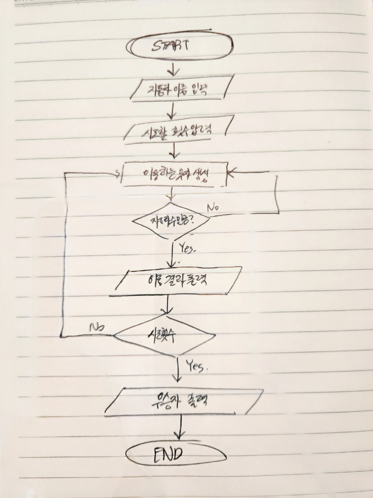

# 지난 주차 미션 PR 리뷰
```java
private int[] scoreBoard = {0, 0};
```

A : 크기가 정해진 배열보다는 컬렉션을 사용하는 것은 어떨까요?

B : 볼, 스트라이크를 정의하는 배열보다 클래스로 정의했으면 더 좋았을 거 같아요.

```java
/*
    * setter
    * Game Class의 멤버 변수들에 대한 set method이다.
    * 멤버 변수들 모두 외부에서는 set할 수 없도록 접근제어자는 private으로 설정한다.
    * */
    private void setGameFlag(int gameFlag) {
		...
    }
```
A : 네이밍을 통해 충분히 어떤 메서드인지 짐작할 수 있기 때문에 주석은 필요 없을 것 같습니다.

```java
// Input User Baseball Number
    private void inputUserNumber() {
        this.initializeScoreBoard();
        print("숫자를 입력해주세요 : ");
        StringBuilder userNumber = new StringBuilder(Console.readLine());
        print(userNumber+"\n");
        this.validationCheckUserNumber(userNumber);
        this.setUserNumber(userNumber);
    }
```
A : 단일 책임으로 구현됐더라도 그 안에 단위마다 공백으로 구분하면 더 이해하기 쉬울 거 같아요!

```java
for(int i = 0; i < MAX_LENGTH; i++) {
            char c = userNumber.substring(i, i+1).charAt(0);
            if (!( c >= ASCII_FIRST_RANGE_NUMBER
                    && c <= ASCII_LAST_RANGE_NUMBER)
            ) {
                throw new IllegalArgumentException();
            }
        }
    }
```
A : 추상적인 변수명 보다는 의미가 드러나도록 짓는 것이 좋을 것 같아요!

```java
import static utils.Console.print;
```
A: 자바 코딩 컨벤션을 살펴보시면 static import는 사용하지 않는다고 적혀있습니다!
확인해보세용 https://newwisdom.tistory.com/m/96

```java
Game.java
```
A :Game 클래스가 너무 많은 일을 하고 있습니다. 게임 로직, 사용자 입력, 결과 출력, 랜덤 숫자 생성, 스트라이크/볼 판단 등의 기능들이 한 클래스에 들어가있는데요.
SRP원칙 위반으로 보입니다.

기능 별로 클래스를 분리할 수 있으면 좋을 것 같아요

```java
    private void setScoreBoard(){
        StringBuilder userNumber=this.getUserNumber();
        StringBuilder computerNumber=this.getComputerNumber();
        ...
    }
```
A: 이 부분은 딱히 get으로 받지 않아도 되지 않을까요?

```java
for(int i = 0; i < MAX_LENGTH ; i++) {
            String userSubNum = userNumber.substring(i , i+1);
            if(computerNumber.indexOf(userSubNum) > -1) {
                if(computerNumber.substring(i, i+1).equals(userSubNum)) {
                    this.scoreBoard[1]++;
                } else {
                    this.scoreBoard[0]++;
                }
            }
        }
```

A: 이 코드를 처음보는 사람이 봤을 때에 이 코드의 의미를 한눈에 파악하기는 어려워보입니다.
조금더 메소드를 분리해서 더 읽기 쉬운 코드를 만들 수 있으면 좋을 것 같습니다

```java
public class Console {
    Console() {
    }
}
```
A:유틸리티 클래스에 생성자를 package-private 보다는 private으로 아예 잠궈주시면 좋을 것 같습니다! https://rules.sonarsource.com/java/RSPEC-1118/


---

## Git Commit Convention
1. docs: 문서작업
2. feat: 기능추가
3. refactor: 리팩토링
4. test: 테스트 코드
5. rename: 파일 이름 변경
6. remove: 파일 삭제
7. comment: 주석 추가/변경
8. style: 코드 포맷 변경, 세미 콜론 누락, 코드 수정이 없는 경우

---

# Flow Chart


---
# 요구사항 분석

## 입력

- 경주 할 자동차 이름
  - 쉼표 기준으로 구분
  - 5자이하 만 가능
- 전진 시도할 횟수
- 전진 수
  - 0 ~ 9 사이에서 무작위 값을 구한 후 무작위 값이 4이상일 경우 전진

## 출력

- 각 차수별 실행 결과
- 우승자 안내 문구
  - 단독 우승장 안내 문구
  - 공동 우승자 안내 문구

## MVC

1. Model
   - 자동차 이름
   - 시도할 횟수
   - 이동한 거리/횟수
2. View
   - 사용자로부터 자동차 이름 입력 받기
   - 사용자로부터 시도할 횟수 입력 받기
   - 경주 중간 결과 출력하기
   - 우승자 출력하기
3. Controller
   - Model - View 메시지 전달

---
## 객체
### Class RacingGame
- Member
  - GameRoundNumber: 라운드 횟수/시도 횟수
- Method
  - setter
  - getter
  - printWinner: 우승자 출력
  - printMiddleResult: 중간 결과 출력
### Class Car
- Member
  - CarName: 자동차 이름
  - CarMoveCount: 자동차 이동 횟수
- Method
  - setter
  - getter

