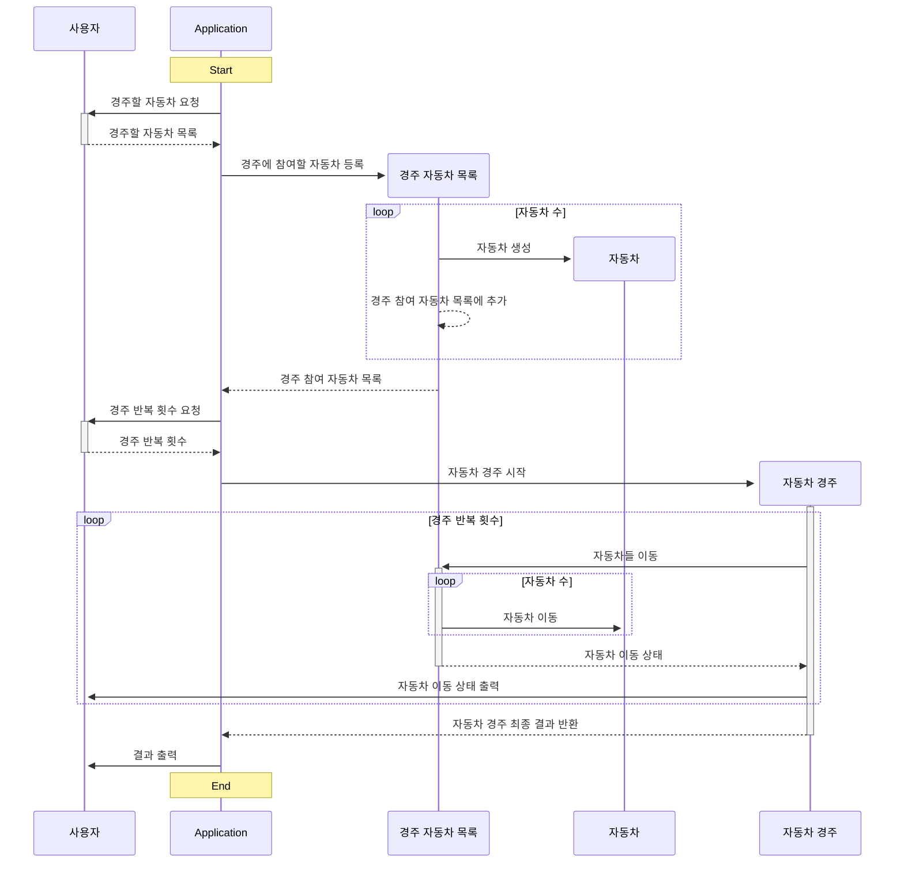
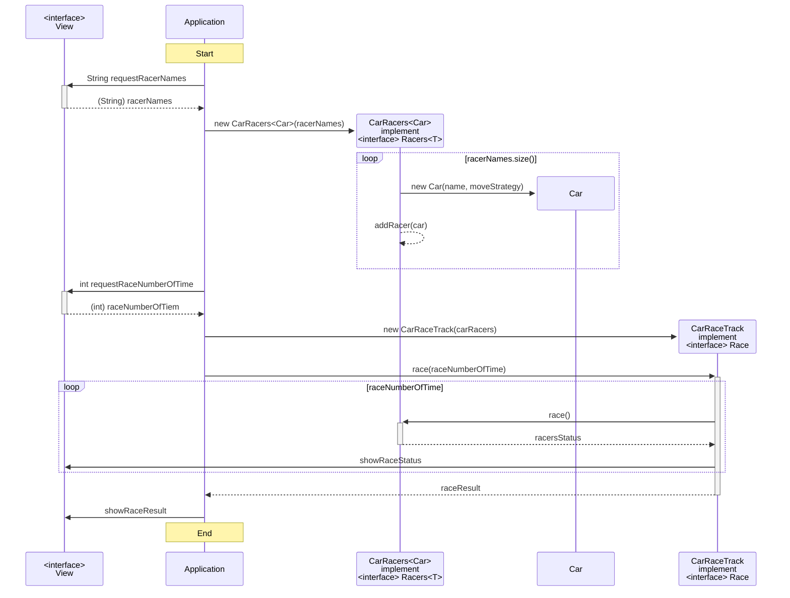

# 💻 기능 목록 정리

```text
[Application]
실제 요구사항에 대해 준비하고 적절한 객체의 기능명세를 이용하여
요구 사항을 만족할 수 있도록 동작하는 책임을 가진다.

[<interface> View ]
사용자와 상호작용에 대한 기능을 명세한다.
- 사용자에게 경주에 참여할 레이서 이름들을 요청한다.
- 사용자에게 경주 반복 횟수를 요청한다.
- 사용자에게 레이스 상태를 보여준다.
- 사용자에게 레이스 결과를 보여준다.

[OutputConsole]
콘솔 출력의 책임을 가진다.
- 콘솔에 레이스 상태를 출력한다.
- 콘솔에 레이스 결과를 출력한다.

[InputConsole]
콘솔 입력의 책임을 가진다.
- 콘솔로 부터 경주 참여 레이서 이름들을 읽어온다.
- 콘솔로 부터 경주 반복 횟수를 읽어온다.

[ConsoleView implements View]
콘솔로 사용자와 상호작용하는 책임을 가진다.
- 사용자에게 경주에 참여할 레이서 이름들을 요청한다.
    - 콘솔로 부터 경주 참여 레이서 이름들을 읽어온다.
- 사용자에게 경주 반복 횟수를 요청한다.
    - 콘솔로 부터 경주 반복 횟수를 읽어온다.
- 사용자에게 레이스 상태를 보여준다.
    - 콘솔에 레이스 상태를 출력한다.
- 사용자에게 레이스 결과를 보여준다.
    - 콘솔에 레이스 결과를 출력한다.
    
[<interface> Racers<T>]
제네릭 객체들의 목록을 Wrapping 하고 필요한 동작을 명세한다.
- T 를 이용하는 레이서들에게 움직이도록 요청한다.

[ CarRacers<Car> implements Racers<T> ]
자동차 레이서 목록을 Wrapping 하고 필용한 동작을 수행하는 책임을 가진다.
- T 를 이용하는 레이서들에게 움직이도록 요청한다.
    - 자동차 레이서들에게 움직이도록 요청한다.
    
[Car]
자동차 자체가 할 수 있는 정보를 담는 역할을 한다.
- 자동차의 이름을 가질 수 있다.
- 자동차가 가질 수 있는 이름인지 검증한다.
- 자동차가 움직이는 조건 전략을 가질 수 있다.
- 자체적으로 움직인 거리를 가질 수 있다.
- 자동차가 움직이는 조건 전략에 따라서 움직여 거리를 증가할 수 있다.

[<interface> Race]
실제 작동하는 레이스의 동착을 명세한다.
- 레이서들이 경주 반복 횟수 만큼 움직이도록 요청한다.

[CarRaceTrack implements Race]
자동차 경주 동작을 수행하는 책임을 가진다.
- 레이서들이 경주 반복 횟수 만큼 움직이도록 요청한다.
    - 자동차 레이서들이 경주 반복 횟수 만큼 움직이도록 요청한다.

```

## 📝기능 목록 정의 과정
> 1. 문제 해결에 참여할 객체 정리

```text

자동차
- 이름을 부여할 수 있다.
- 이름은 5자 이만 가능하다.
- 전진하는 조건은 0~9 사이에서 무작위 값이 4이상인 경우 전진하고 그 외는 움직이지 않는다.
- 전진하면 전진한 거리를 알고 있다.

자동차 경주
- 주어진 n 회동안 자동차를 움직인다.

사용자와 상호작용
- 경주할 자동차의 이름을 쉼표로 구분하여 입력할 수 있다.
- 몇번 이동 할 것인지 입력할 수 있다.
- 전진하는 자동차를 출력할때, 자동차 이름과 이동 결과를 출력할 수 있다.
- 경주가 완료되면 누가 우승했는지 알려준다.
	- 우승자가 1 이상이면 쉼표로 구분하여 출력한다.

```

---
> 2. 문제 해결 과정에서 역할의 소통 정리


---
> 3. 문제 해결에 필요한 역할과 책임 정의


---
> 4. 기능 목록 정의

```text
[Application]
실제 요구사항에 대해 준비하고 적절한 객체의 기능명세를 이용하여
요구 사항을 만족할 수 있도록 동작하는 책임을 가진다.

[<interface> View ]
사용자와 상호작용에 대한 기능을 명세한다.
- 사용자에게 경주에 참여할 레이서 이름들을 요청한다.
- 사용자에게 경주 반복 횟수를 요청한다.
- 사용자에게 레이스 상태를 보여준다.
- 사용자에게 레이스 결과를 보여준다.

[OutputConsole]
콘솔 출력의 책임을 가진다.
- 콘솔에 레이스 상태를 출력한다.
- 콘솔에 레이스 결과를 출력한다.

[InputConsole]
콘솔 입력의 책임을 가진다.
- 콘솔로 부터 경주 참여 레이서 이름들을 읽어온다.
- 콘솔로 부터 경주 반복 횟수를 읽어온다.

[ConsoleView implements View]
콘솔로 사용자와 상호작용하는 책임을 가진다.
- 사용자에게 경주에 참여할 레이서 이름들을 요청한다.
    - 콘솔로 부터 경주 참여 레이서 이름들을 읽어온다.
- 사용자에게 경주 반복 횟수를 요청한다.
    - 콘솔로 부터 경주 반복 횟수를 읽어온다.
- 사용자에게 레이스 상태를 보여준다.
    - 콘솔에 레이스 상태를 출력한다.
- 사용자에게 레이스 결과를 보여준다.
    - 콘솔에 레이스 결과를 출력한다.
    
[<interface> Racers<T>]
제네릭 객체들의 목록을 Wrapping 하고 필요한 동작을 명세한다.
- T 를 이용하는 레이서들에게 움직이도록 요청한다.

[ CarRacers<Car> implements Racers<T> ]
자동차 레이서 목록을 Wrapping 하고 필용한 동작을 수행하는 책임을 가진다.
- T 를 이용하는 레이서들에게 움직이도록 요청한다.
    - 자동차 레이서들에게 움직이도록 요청한다.
    
[Car]
자동차 자체가 할 수 있는 정보를 담는 역할을 한다.
- 자동차의 이름을 가질 수 있다.
- 자동차가 가질 수 있는 이름인지 검증한다.
- 자동차가 움직이는 조건 전략을 가질 수 있다.
- 자체적으로 움직인 거리를 가질 수 있다.
- 자동차가 움직이는 조건 전략에 따라서 움직여 거리를 증가할 수 있다.

[<interface> Race]
실제 작동하는 레이스의 동착을 명세한다.
- 레이서들이 경주 반복 횟수 만큼 움직이도록 요청한다.

[CarRaceTrack implements Race]
자동차 경주 동작을 수행하는 책임을 가진다.
- 레이서들이 경주 반복 횟수 만큼 움직이도록 요청한다.
    - 자동차 레이서들이 경주 반복 횟수 만큼 움직이도록 요청한다.

```
