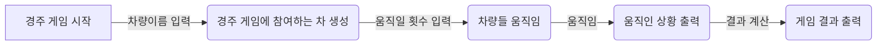

# 🏁 자동차 경주 게임

### 👀 1 주차 공통 피드백

**아래 내용을 좀 더 신경써서 구현해보자!!!!**

- [x]  **`요구사항`** 정확히 준수하자.
- [x]  `git`을 통해 관리할 자원에 대해 고려
    - **.gitignore** 파일을 이용하자
- [x]  **`커밋`** 메시지 **`의미있게`** 작성
  - 기능을 구현하기 전에 기능 목록을 만들고, 기능 단위로 commit하는 방식으로 진행한다.
  - 작업한 내용에 대해 이해가 가능하도록 작성
- [x]  PR 보내기전 `브랜치`를 확인하자 (main branch가 아닌, 기능 구현을 위해 만든 branch에서 작업)
- [x]  `이름`을 통해 의도를 드러내자.
    - 변수명, 함수 명, 클래스명을 짓는데 더 고민하자

## ⭐요구 사항
### 1️⃣ 기능 요구 사항
- [x]  **주어진 횟수** 동안 **n대의 자동차는 전진 또는 멈출 수 있다.** 
- [x]  각 자동차에 이름을 부여할 수 있다.
   - 이름은 **5자** 이하만 가능
- [x]  전진하는 자동차 출력 시 **자동차 이름이 같이 출력된다.**
   - 자동차 이름은 `쉼표(,)`를 기준으로 구분한다.
- [x]  전진하는 조건은 0에서 9 사이의 무작위 값을 구한 후 **무작위 값이 4이상인경우**
- [x]  경주 게임을 완료한 후 누가 우승을 했는지 알려준다.
   - 우승자는 1명일 수 있다.
   - 우승자가 여러 명일 경우 `쉼표(,)`를 이용해 구분한다.
- [x]  사용자가 잘못된 값을 입력한 경우 `IllegalArgumentException`을 발생시킨후 애플리케이션은 종료되어야 한다.


### 2️⃣ 입출력 요구 사항

**📍입력**
- [x]  경주 할 자동차 이름(쉼표로 기준으로 구분) 입력
- [x]  시도할 횟수 입력
  
**📍출력** 
- [x]  각 차수별 실행 결과
- [x]  단독 우승인 경우 안내 문구
- [x]  공동 우승인 경우 안내 문구


  **예시**

    ```
    경주할 자동차 이름을 입력하세요.(이름은 쉼표(,) 기준으로 구분)
    beom,pobi,woni
    시도할 회수는 몇회인가요?
    5
    
    실행 결과
    beom : -
    pobi : -
    woni : 
    
    beom : --
    pobi : --
    woni : -
    
    beom : ---
    pobi : --
    woni : --
    
    beom : ----
    pobi : ----
    woni : ---
    
    beom : -----
    pobi : -----
    woni : ----
    
    최종 우승자 : beom, pobi
    ```

### 3️⃣ 프로그래밍 요구 사항
- [x]  JDK 17 버전에서 실행 가능
  
  

- [x]  프로그램 실행의 시작점은 Application의 main() 이다
- [x]  build.gradle 파일을 변경할 수 없고 외부 라이브러리를 사용하지 않는다.
- [x]  [Java 코드 컨벤션](https://github.com/woowacourse/woowacourse-docs/tree/main/styleguide/java) 가이드를 준수하여 프로그래밍한다.
- [x]  프로그램 종료 시 System.exit()를 호출하지 않는다.
- [x]  프로그램 구현이 완료되면 ApplicationTest의 모든 테스트가 성공해야 한다.
  
  

- [x]  파일, 패키지 이름을 수정하거나 이동하지 않는다.
- [ ]  **indent(인덴트, 들여쓰기) depth**를 **3**이 넘지 않도록 구현한다. (2까지 허용)
    - ex) while 믄 안에 if문이 있다면 들여쓰기는 2이다.
    - 함수를 분리해서 구현하자.
- [x]  **3항 연산자**를 쓰지 않는다.
- [x]  함수(또는 메서드)가 **한 가지 일만 하도록** 최대한 작게 만들어라
- [x]  **JUnit5와 AssertJ**를 이용해 본인이 정리한 기능 목록이 정상 동작함을 **테스트 코드로** 확인한다.

### 4️⃣ 과제 진행 요구 사항
- [x]  [java-racingcar-6](https://github.com/woowacourse-precourse/java-racingcar-6)저장소를 Fork & Clone해 시작
- [x]  **기능을 구현하기 전`docs/README.md`에 구현할 기능 목록을 정리**해 추가한다
    - [커밋 메시지 컨벤션](https://gist.github.com/stephenparish/9941e89d80e2bc58a153)가이드를 참고해 커밋 메시지를 작성한다.
- [x]  과제 진행 및 제출 방법은[프리코스 과제 제출](https://github.com/woowacourse/woowacourse-docs/tree/master/precourse)문서를 참고한다.


## 🧑🏻‍💻구현
### 🏄‍♂️Flow



### 🚗**자동차**

📁 **필요한 field**

- 자동차 이름
- 자동차가 현재 전진한 횟수

🧩 **필요한 기능**

- [x]  전진 혹은 멈추는 기능
- [x]  전진하는 조건인 무작위 값을 생성하는 기능
- [x]  무작위 값이 전진할 수 있는 조건에 만족하는지 확인하는 기능
- [x]  전진하는 조건에 만족한다면 전진한 횟수의 값을 증가하는 기능

### 🕹️경주 게임

📁 **필요한 field**

- 게임에 참여한 자동차 리스트

🧩 **필요한 기능**

- [x]  입력받은 자동차 이름들을 통해 경주에 참여할 자동차 리스트 생성하는 기능
- [x]  자동차를 움직일 수 있는 횟수에 따라 자동차들 움직이는 기능
- [x]  자동차 경주 게임을 완료한 후 누가 우승했는지 계산하는 기능

## 💡 공부 및 고민한 내용

### 🧑🏻‍💻 [Notion](https://generated-silene-2be.notion.site/d16ff52082244eea8c6880b63ae0429a?pvs=4)

- 의미있는 git commit message
- MVC 패턴
- String.join(), StringJoiner
- assertAll()
- Mockito