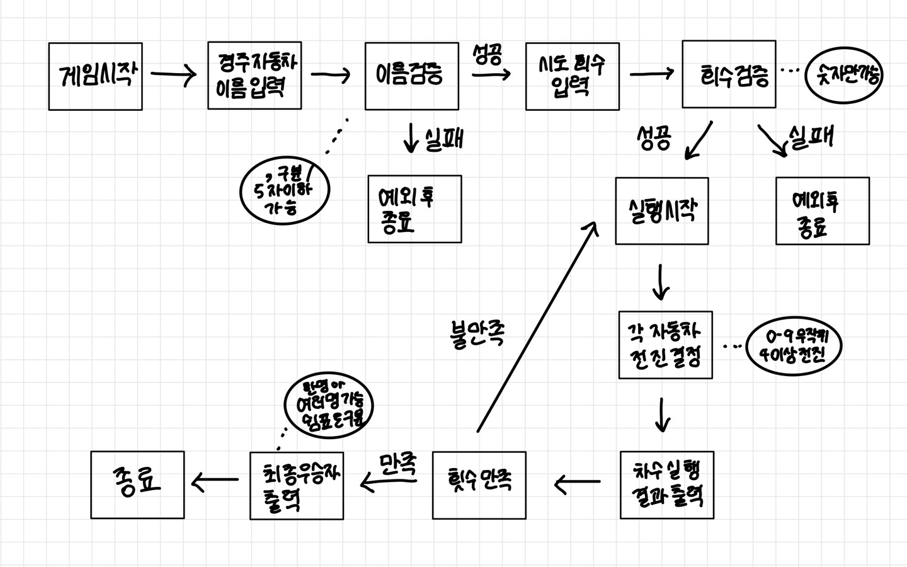

## :heavy_check_mark: 조건

### 규칙
- 자동차에 이름 부여
    - 전진하는 자동차를 출력할 때 이름도 출력
    - 쉼표 기준으로 구분하며 5자 이하
- 몇 번 이동할 건지 횟수 입력
- 주어진 횟수 동안 n대의 자동차는 전진 혹은 멈춤
    - 0에서 9 사이에 무작위 값을 구한 후 무작위 값이 4 이상일 경우 전진
    - 횟수마다 결과를 출력함
- 주어진 횟수를 만족하고 게임이 완료한 후 누가 우승했는지 출력
    - 한 명 이상 가능
    - 여러 명일 경우 쉼표 이용하여 구분
- 잘못된 값 입력시 IllegalArgumentException을 발생시킨 후 애플리케이션은 종료

### 입출력
- 입력
  - 경주 할 자동차 이름(이름은 쉼표(,) 기준으로 구분)
  - 시도할 회수 (숫자만)
- 출력
    - 각 차수별 실행 결과 =>  [ 이름 : - ] 로 총 전진 횟수 표시
    - 단독 우승자 안내 문구 => 최종 우승자 : 이름
    - 공동 우승자 안내 문구 => 최종 우승자 : 이름, 이름, 이름 (이하 반복)

 
## :heavy_check_mark: 플로우 차트

## :heavy_check_mark: 구현
- Car
    - 이름
    - 전진 회수
    - 전진 여부 결정
- Race
    - 현재 시도 회수
    - 전체 시도 회수
    - 시도 회수 만족 체크
    - 전체 차 리스트
    - 전체 차 이름 리스트 만들기
    - 전체 차 전진 횟수 리스트 만들기
    - 가장 전진 횟수 큰 자동차 알기
    - 레이스 진행
- InputView
    - 경주 자동차 이름 입력
    - 경주 자동차 이름 유효 체크
    - 시도 회수 입력
    - 시도 회수 유효 체크
- OutputView
    - 실행 결과
    - 각 회차 결과
    - 최종 우승자 한 명
    - 최종 우승자 여러 명
- GameController
    - 게임 시작
    - 게임 진행
    - 게임 종료
- InputException
  - 아무것도 입력되지 않았을 때
  - 이름이 다섯 글자 초과인 경우
  - 이름 중 공백이 있을 경우
  - 회수가 숫자가 아닐 경우
  

