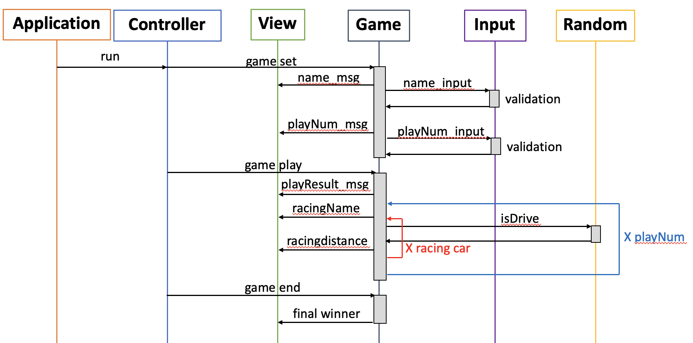

# 📑 기능 목록
1. 경주할 자동차 이름을 입력받는다.
   - readLine()을 통해 String으로 입력받기
   - String.split(',')을 통해 분리해서 List(Java Collection) 저장
   - 단!! 자동차의 이름은 5자 넘을 경우, IllegalArgumentException 발생
2. 시도할 횟수를 입력받는다.
   - readLine()을 통해 String으로 입력받기
   - 자동차 게임은 진행해야 하므로 시도 횟수는 1이상으로 제한
   - 0이나 문자일 경우, IllegalArgumentException 발생
   - error가 없을 경우 Integer로 변환
3. 0부터 9까지 랜덤한 숫자를 입력받기
   - pickNumberInRange()을 통해 숫자 생성
   - 0~3 : 정지
   - 4~9 : 전진
4. 각 차수별 실행 결과를 출력한다.
   - 각 자동차마다 3.의 결과를 통해 나온 결과를 출력 및 저장
5. 최종 우승자를 결정
   - 단독 우승자
   - 최종 우승자

# 👨🏻‍💻 프로그래밍 요구 사항(신경썼던 것)
- indent(인덴트, 들여쓰기) depth는 2까지만
- 함수(또는 메서드)가 한 가지 일만 하도록 최대한 작게 작성
- 이름 의미 있게 -> 이름만 봐도 이게 무슨 기능이구나 알 수 있게
- Java에서 제공하는 API 적극 활용
- 배열 대신 Java Collection 사용

# 📝 설계 방향
