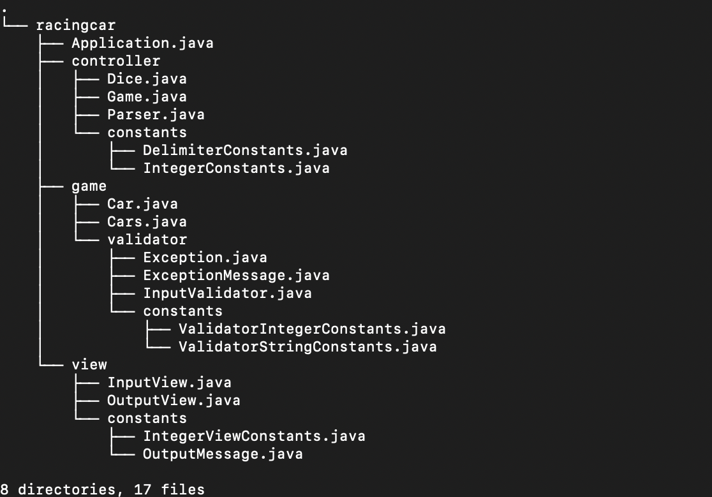
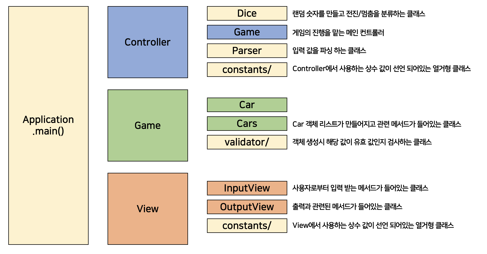
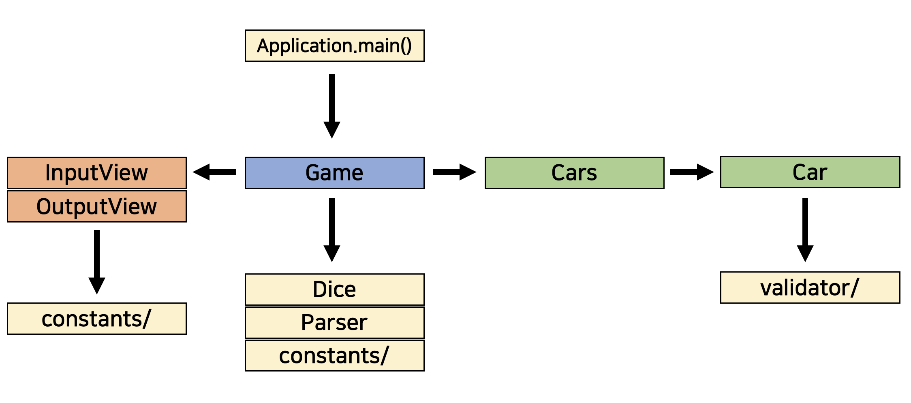

## Precourse-Week️2 [자동차 경주 게임️]

## 기능 구현 목록

### 진행
- ✅ 사용자로부터 자동차의 이름을 입력 받는다. — ```Game.askCarNames()```
- ✅ 사용자로부터 몇 번의 이동을 할 것인지 입력 받는다. — ```Game.askGameRound()```
- ✅ 게임 결과를 출력한다. — ```Game.getWinners()```
    - ✅ 전진하는 조건은 0에서 9 사이에서 무작위 값을 구한 후 무작위 값이 4 이상일 경우이다. — ```Dice.isCarCanGoForward()```
    - ✅ 우승자는 한 명 이상일 수 있다. — ```Cars.getWinners()```

### 입력 요구 사항
- ✅ 자동차 이름은 쉼표(,)를 기준으로 구분하며 이름은 5자 이하만 가능하다.
  — ```InputValidator.lessThenFiveLetters()```
- ✅ 입
  — ```InputValidator.mustBeInteger```
- ✅ 사용자가 잘못된 값을 입력할 경우 ```IllegalArgumentException```을 발생시킨 후 애플리케이션은 종료되어야 한다.
  — ```Exception.illegalArgument()```

### 출력 요구 사항
- ✅ 자동차 경주 게임의 경과 모습을 보여준다. — ```OutputView.broadcastCarRoundScore()```
- ✅ 자동차 경주 게임을 완료한 후 누가 우승했는지를 알려준다. — ```Game.getWinners```
    - ✅ 우승자는 한 명 이상일 수 있다. — ```Cars.getWinners()```
    - ✅ 우승자가 여러 명일 경우 쉼표(,)를 이용하여 구분한다. — ```Cars.winnersToString()```
  
---
## 프로젝트 구조




### 리팩토링을 하면서 신경 썼던 부분들
- 함수형 프로그래밍
  - 자바8에서 도입된 람다와 스트림에 대해 공부하고 적용시키려 노력했다.
- 상수/메소드/변수 명명

### 리팩토링을 하면서 고민 했던 부분들
- static을 이렇게 남발해도 될까?
  - 상수도 static으로 선언하는 것은 물론, valiator나 view, parser와 같이 전역적으로 사용하는 클래스들은
    static으로 선언을 하였는데, 이렇게 많이 사용하면 메모리 낭비가 될수도 있겠다는 생각이 들었습니다.
- for문으로 사용하는 forEach문 vs forEach()
- 처음에는 있으면 좋겠다는 생각에 요구 사항에 없는 예외를 만들어서 구현을 하려 했어요.
  그런데 생각해보니 프로그램에서 정해주지 않았는데 만들게 된다면 —입력하는 값은 유저 마음인데— 
  프로그램 개발을 하는 입장에서 주객전도가 되는 느낌을 받아 제외하고 개발하게 되었습니다.

### 테스트 코드에 대한 고민들
- 단위 테스트가 중요하지만 해당 프로젝트 구조적 문제로 단위 테스트 코드를 잘 작성하지 못했습니다.

이유는
1. 구조 설계가 잘못됨
2. 메서드를 사용할 때 파라미터를 사용하지 않음

입니다. 특히 2번은 최대한 객체지향적으로 구조를 만들고 싶어 그렇게 한 것인데, 좋을 것이라 생각했던 구조가 독이 되어 단위 테스트를 할 수 없게 된 것입니다. 
~~물론 제가 생각 해 내지 못한 것일 수도 있습니다.~~

그럼에도 불구하고, 좀 고민이 되었던 부분입니다.
- 테스트 코드만을 위해 코드를 수정 해도 될까?
  - 테스트 코드에서 메서드를 접근하기 위해 접근자를 수정해야 했다.
- 테스트에 필요하다고 생각되어 클래스에 메서드를 더 추가해도 되는 것인가?

---
해당 미션을 수행하면서 어떤 과정으로 구상하게 되었는지 회고록을 남겨보았습니다.

↪ [우아한 프리코스 6기 - 2주차 자동차 경주 게임 회고록](https://velog.io/@yeseul/%EC%9A%B0%EC%95%84%ED%95%9C-%ED%94%84%EB%A6%AC%EC%BD%94%EC%8A%A4-6%EA%B8%B0-2%EC%A3%BC%EC%B0%A8-%EC%9E%90%EB%8F%99%EC%B0%A8-%EA%B2%BD%EC%A3%BC-%EA%B2%8C%EC%9E%84-%ED%9A%8C%EA%B3%A0%EB%A1%9D)