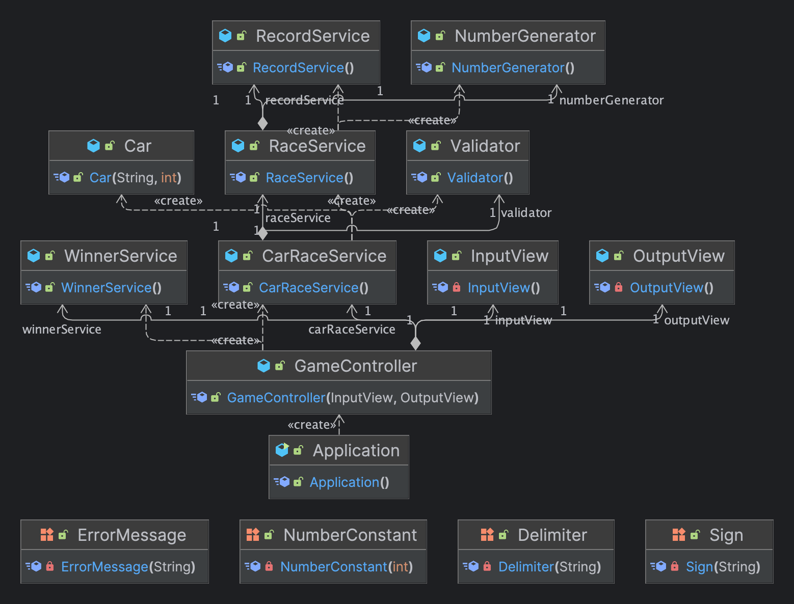

# 구현 기능 목록
- Car 자동차
  - getCarName 자동차 이름
  - getPosition 자동차 위치
  - move 이동

- InputView 사용자 입력
  - getTryCount 시도 횟수
  - getCarNameInput 자동차 이름
  - 예외
    - 자동차 이름
      - 쉼표로 구분, 5자 이하 소문자만 가능
      - 공백 입력 불가
      - 중복값 입력 불가
    - 시도 횟수
      - 1이상의 자연수

- MoveStatus 전진 여부 결정
    - 랜덤 수 4이상
      - 랜덤 수는 0~9 사이의 정수

- Race 경주 시작
  - startRace 시도 횟수 만큼 전진 여부 결정 
  - getWinners 위치가 제일 높은 사람이 우승

- ResultView 결과
  - printRace 게임 진행 출력
  - printWinners 공동 우승일 경우 쉼표로 구분

- PlayGame 게임 시작
  - playGame 게임 시작 후 입력값 받기
  - playRace 입력값을 토대로 경주 시작

# 다이어그램

