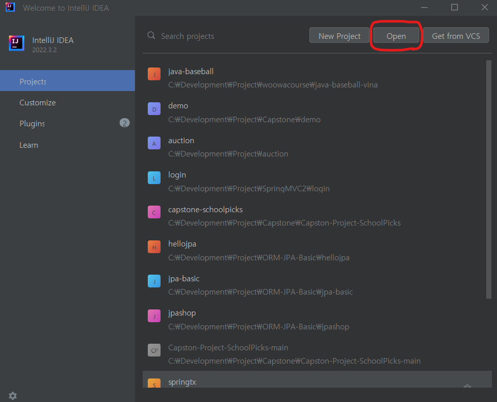
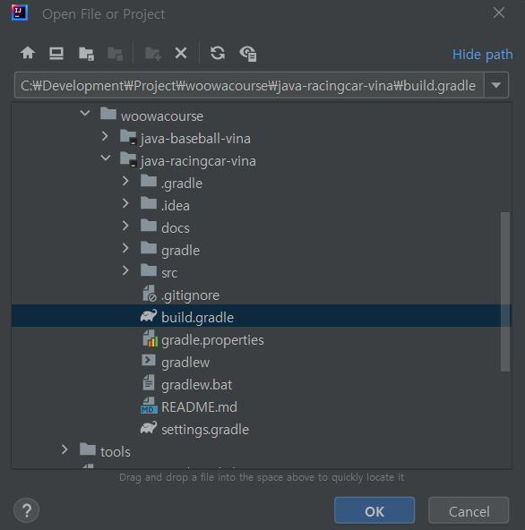
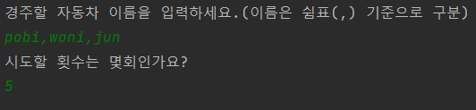
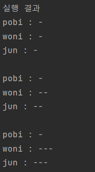
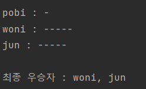

# 미션 - 자동차 경주


## :book: 프로젝트 진행
- 우아한테크코스 웹 백엔드 6기 프리코스<br>
- 개발기간: 2023.10.26 ~ 2023.11.01<br>
- 개발자: 이재홍

<br>

## :snail: 프로젝트 소개
초간단 자동차 경주 게임을 구현했습니다.

1. 경주 할 자동차들의 이름을 붙여줍니다.
> pobi,woni,jun
2. 사용자는 몇 번의 이동을 할 것인지 입력합니다.
> 5
3. 전진하는 조건은 0 에서 9 사이의 무작위 값을 구한 후, 무작위 값이 4 이상일 경우입니다.
4. 자동차 경주 게임을 완료한 후 누가 우승했는지 알려줍니다. (우승자가 여러 명일 경우 쉼표를 통해 구분합니다)
> 최종 우승자 : pobi, jun


<br>

## :rocket: 시작 가이드
### 프로그래밍 요구 사항
- 자바 [JDK-17](https://www.oracle.com/java/technologies/downloads/#java17) 버전에서 실행 가능합니다 

### 설치
```
$ git clone -b compasstar --single branch https://github.com/compasstar/java-racingcar-vina.git
$ cd java-racingcar-vina
```

### 실행
- IntelliJ 시작하고 Open 버튼을 눌러주세요<br>


- java-racingcar-vina 폴더 에서 build.gradle 를 선택 후 OK 버튼을 눌러주세요<br>


- `Application`의 `main()`에서 실행`Run`합니다
<br>


## :school: 기술 스택


 

<br>

## :computer: 화면 구성 (추가예정)


| 게임시작                             | 게임진행                             | 게임종료                             |
|----------------------------------|----------------------------------|----------------------------------|
| <!----> | <!----> | <!----> |


<br>

## :dart: 주요 기능

### 자동차 생성 기능
- 사용자가 입력한 자동차 이름만큼 자동차 객체를 생성한다
  - [검증] 자동차 이름은 쉼표(,)를 기준으로 구분하며 이름은 5자 이하만 가능하다

### 자동차 전진 또는 멈춤 기능
- 사용자는 몇 번의 이동을 할 것인지를 입력한다
  - [검증] 사용자가 입력한 이동횟수는 자연수이어야 한다
- 전진하는 조건은 0 에서 9 사이의 무작위 값을 구한 후 무작위 값이 4이상일 경우이다

### 우승자 안내 기능
- 가장 많은 수의 전진을 한 자동차가 우승자이다
- 우승자는 한 명 이상일 수 있으며, 우승자가 여러 명일 경우 쉼표(,)를 이용하여 구분한다

<br>

## :mag: 아키텍쳐 (추가예정)
### 디렉토리 구조
<!---->

### 작업 흐름
<!---->