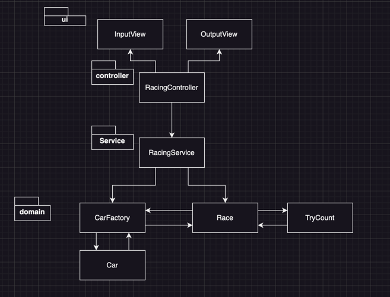

## 플로우차트

## 기능 목록

- ### 입력
  - 자동차의 이름을 입력받는다.
  - 시도할 횟수를 입력받는다.
  
- ### 무작위 값 뽑기
  - 0~9 사이의 무작위 값을 뽑는다.
  - 그 숫자가 4이상인지 판단한다.

- ### 자동차의 이동
  - 조건에 맞는다면 자동차를 한 칸 이동시켜야 한다.
  - 반대의 경우에는 자동차를 정지시킨다.

- ### 출력
  - 시작 메시지를 출력한다.
  - 시도할 회수를 묻는다.
  - 매 라운드의 실행 결과를 출력한다.
  - 최종 결과를 출력한다.

- ### 예외 처리
  - 자동차의 이름을 입력받을 때 "," 뒤에 문자가 없는 경우.
  - 자동차의 이름을 입력받을 때 "," 뒤에 바로 ","이 입력된 경우.
  - 시도할 횟수를 입력받을 때 자연수가 아닌 값을 입력한 경우.
