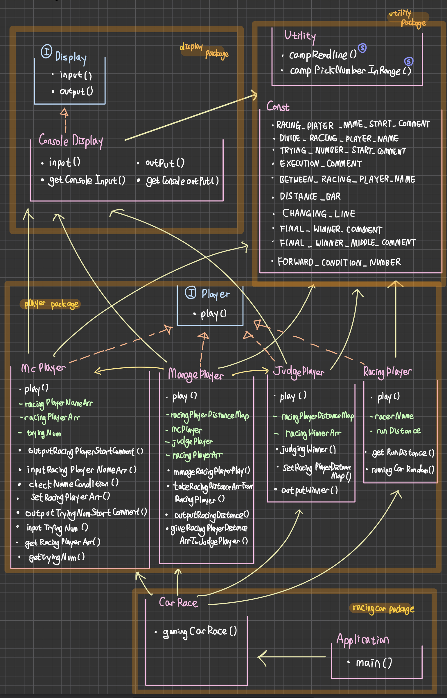

# **🪐1주차 미션🪐 - 자동차 경주 🚘**

###### 정은채
##### 🖼 class UML

------

### <u>🗂 utility package</u>

##### 🟢 Utility class

`camp.nextstep.edu.missionutils`에서 제공하는 `Randoms` 및 `Console` API를 이용하는 class입니다. api가 필요한 부분마다 이 클래스를 이용합니다. static 메서드로 구현하여 빈번한 사용이 용이하게 했습니다.

###### campReadline() 함수 : camp.nextstep.edu.missionutils.Console의 readLine() 을 활용하여 Random 값 추출함

###### campPickNumberInRange() 함수 : camp.nextstep.edu.missionutils.Randoms의 pickNumberInRange() 을 활용하여 사용자가 입력하는 값 받음

##### 🟢 Const class

하드코딩 방지 문자열 상수용 클래스입니다.

###### RACING_PLAYER_NAME_START_COMMENT 상수 : McPlayer클래스용 상수

###### DIVIDE_RACING_PLAYER_NAME 상수 : McPlayer클래스용  상수,

###### TRYING_NUMBER_START_COMMENT 상수 : McPlayer클래스용 상수

###### EXECUTION_COMMENT 상수 : ManagePlayer클래스용 상수

###### BETWEEN_RACING_PLAYER_NAME 상수 : ManagePlayer클래스용 상수

###### DISTANCE_BAR  상수 : ManagePlayer클래스용 상수, '-'

###### CHANGING_LINE  상수 : ManagePlayer,McPlayer클래스용 상수,'\n'

###### FINAL_WINNER_COMMENT  상수 : JudgePlayer클래스용 상수

###### FINAL_WINNER_MIDDLE_COMMENT  상수 : JudgePlayer클래스용 상수

###### FORWARD_CONDITION_NUMBER  상수 : RacingPlayer클래스용 상수, 4

------

### <u>🗂 display package</u>

##### 🔵 Display interface

다양한 display에 프로그램을 적용하여 입출력을 다룰 수 있도록 구현한 인터페이스입니다.

###### input() 함수 : String 입력받음

###### Output() 함수 : String 출력함

##### 🟢 ConsoleDisplay class (Display 구현)

콘솔용 입출력을 가능하게 하는 클래스입니다.

###### Input(),output() 함수 구현

###### getConsoleInput() 함수 : Utility class의 campReadline()으로 입력받음

###### getConsoleOutput() 함수 : System.out 스트림으로 출력함

------

### <u>🗂 player package</u>

##### 🔵 player interface

자동차경주게임을 기능별로 나누어 각 부분을 게임플레이어로 설정했습니다. 모든 게임 참가자가 게임에서 수행하는 역할을 구현할 play()함수를 가진 인터페이스입니다.

###### Play() 함수 : 게임 참여자가 수행하는 게임 플레이 부분

##### 🟢 McPlayer class (player 구현)

자동차경주게임의 시작을 알리고 기본 정보를 받습니다. 자동차 이름을 받아 각각 레이싱플레이어(자동차) 객체를 생성해 저장하고, 시도 횟수를 받아 저장합니다.

###### 🔘*racingPlayerNameArr* 변수 : 전체 레이싱플레이어(자동차)이름 리스트 변수

###### 🔘racingPlayerArr* 변수 : 전체 레이싱플레이어(자동차)객체 리스트 변수

###### 🔘tryingNum* 변수 : 시도 횟수 변수

###### Play() 함수 구현 : McPlayer의 게임 플레이

###### outputRacingPlayerStartCommment() 함수 : 레이싱플레이어(자동차) 이름을 입력받기 위한 게임 시작 문구 출력

###### inputRacingPlayerNameArr() 함수 : 레이싱플레이어(자동차) 이름을 입력받음

###### checkNameCondition 함수 : 레이싱플레이어(자동차) 이름 - "이름은 5자 이하만 가능" 조건 처리

###### setRacingPlayerArr 함수 : 레이싱플레이어(자동차) 객체를 생성

###### outputTryingNumStartCommment() 함수 : 시도할 횟수를 입력받기 위한 게임 시작 문구 출력

###### inputTryingNum() 함수 : 시도할 횟수를 입력받음

###### checkTryingNumCondition 함수 : 시도할 횟수 - 1 이상이어야 함 조건 처리

###### getRacingPlayerArr()함수 : 레이싱플레이어(자동차) 객체 리스트)를 반환

###### getTryingNum() 함수 :  TryingNum(시도할 횟수)를 반환

##### 🟢ManagePlayer class (player 구현)

McPlayer에게 레이싱플레이어(자동차) 객체와 시도 횟수를 받아 각각의 객체를 play(경주)시칸 후 최종 거리 리스트를 JudgePlayer에게 넘깁니다.

###### 🔘racingPlayerDistanceMap변수 : 모든 레이싱플레이어(자동차) 이름, 결과(거리) 해시맵

###### 🔘mcPlayer변수, judgePlayer변수 : ManagePlayer가 컨택하는 McPlayer,JudgePlayer 객체

###### 🔘racingPlayerArr변수 : 전체 레이싱플레이어(자동차)객체 리스트 변수

###### 🔺ManagePlayer생성자 : ManagePlayer가 컨택하는 McPlayer,JudgePlayer 객체 매개변수 생성자

###### Play() 함수 구현 : ManagePlayer의 게임 플레이

###### manageRacingPlayerPlay() 함수 : 시도 횟수만큼 레이싱플레이어(자동차) play 시키기

###### takeRacingDistanceArrFromRacingPlayer() 함수 : McPlayer의 getracingPlayerArr()를 이용해 거리를 받아 RacingDistanceArr에 저장(갱신)

###### outputRacingDistance 변수 : 각 레이싱플레이어(자동차) 이동 거리 출력

###### giveRacingPlayerDistanceArrToJudgePlayer 변수 : RacingDistanceArr에 저장된 전체 레이싱플레이어(자동차) 최종 결과(거리)를 JudgePlayer에게 전송

##### 🟢 JudgePlayer class (player 구현)

레이싱플레이어(자동차)들의 최종 거리를 보고 우승자를 가려낸 후 출력합니다.

###### 🔘racingPlayerDistanceMap 변수 : 모든 레이싱플레이어(자동차) 이름, 최종 결과(거리) 해시맵

###### 🔘racingWinnerArr 변수 :  모든 레이싱플레이어(자동차) 최종 결과(거리) 리스트

###### Play() 함수 구현 :  JudgePlayer의 게임 운영

###### setRacingPlayerDistanceMap() 함수 : racingPlayerDistanceMap 값 세팅

###### judgeWinner() 함수 : racingPlayerDistanceMap에서 우승자를 가려내 racingWinnerArr에 넣음

###### outputWinner() 함수 :  racingWinnerArr에 들어 있는 우승자 출력

##### 🟢 RacingPlayer class (player 구현)

레이싱플레이어(자동차)의 역할을 수행합니다. 랜덤 수를 받아 전진합니다.

###### 🔘racerName변수 : 레이싱플레이어(자동차) 이름 변수

###### 🔘runDistance 변수 : 레이싱플레이어(자동차)가 달린 거리 변수

###### 🔺RacingPlayer생성자 : 이름 매개변수, 이름,거리 초기화 생성자

###### Play() 함수 구현 : 게임 참여자들의 게임 운영

###### runningCarRandom() 함수 :Utility에서 campPickNumberInRange를 이용하여 전진여부를 결정

###### getRunDistance() 함수 :  레이싱플레이어(자동차)가 달린 거리 runDistance를 반환

------

### <u>🗂 racingcar package</u>

##### 🟢 CarRace class

퍼사드 패턴으로 다른 사용자 클래스들 등의 코드 부분에 대한 간략화된 프로세스를 제공하는 클래스입니다.

###### carRacing() 함수 : 자동차 경주 진행 중심 프로세스 코드

##### 🟢 Application class

###### main() 함수 : CarRace 클래스의 carRacing 함수를 호출합니다.