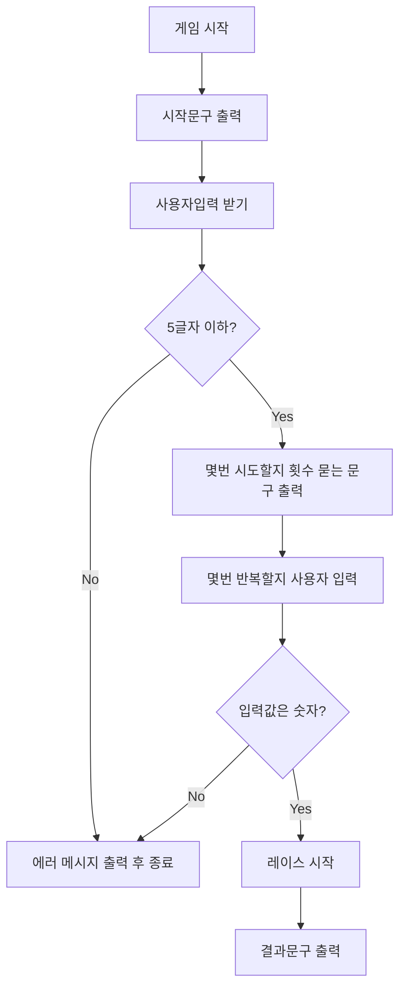
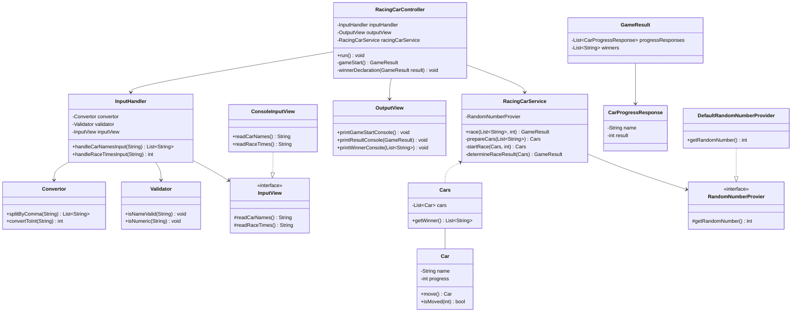

## 플로우차트

 

## 클래스 다이어그램

 

## 기능 목록

### Racing Car Controller `RacingCarController`
- [x] 전체 게임의 실행
- [x] 게임 시작
- [ ] 우승자 선언

### Input Handler `InputHandler`
- [x] 사용자 이름 가져오기
- [x] 경주 횟수 가져오기

#### Input `InputView`
- [x] 차 이름 읽기
- [x] 경주 횟수 읽기

#### Output `OutputView`
- [x] 게임 시작 콘솔 출력
- [x] 게임 결과 콘솔 출력
- [x] 우승자 콘솔 출력

### Validators `Validator`
- [x] 차의 이름 유효성 확인 (5글자 이하, 특수 문자 등)
- [x] 입력값이 숫자인지 확인

### Convertors `Convertor`
- [x] 쉼표로 분리
- [x] 문자열을 정수로 변환

### Car Management `Car`
- [x] 차 이동 (랜덤한 기준 또는 주어진 값에 따라)
- [x] 주어진 값에 따른 차 이동 여부 확인

### Cars Collection `Cars`
- [x] 경주 결과에 따른 우승자 결정

### Game Result Management `GameResult`
- [x] 차의 진행 상황에 따른 결과 관리
- [x] 우승자 정보 관리

### Progress Response `CarProgressResponse`
- [x] 차 이름 가져오기
- [x] 경주 결과 가져오기

### Racing Car Service `RacingCarService`
- [x] 주어진 차 이름 및 경주 횟수로 경주 시작
- [x] 차들의 초기 설정
- [x] 실제 경주 로직 실행
- [x] 경주 결과 결정

## 목표
- [ ] 리뷰받은 Stream, Enum, record 공부해서 적용해보기
- [ ] 리뷰하면서 알게된 var, Sealed Class 공부해서 적용해보기
- [ ] 유효성 검사를 어디서 할지 고민
- [ ] 테스트 코드 작성하면서 개발하기

