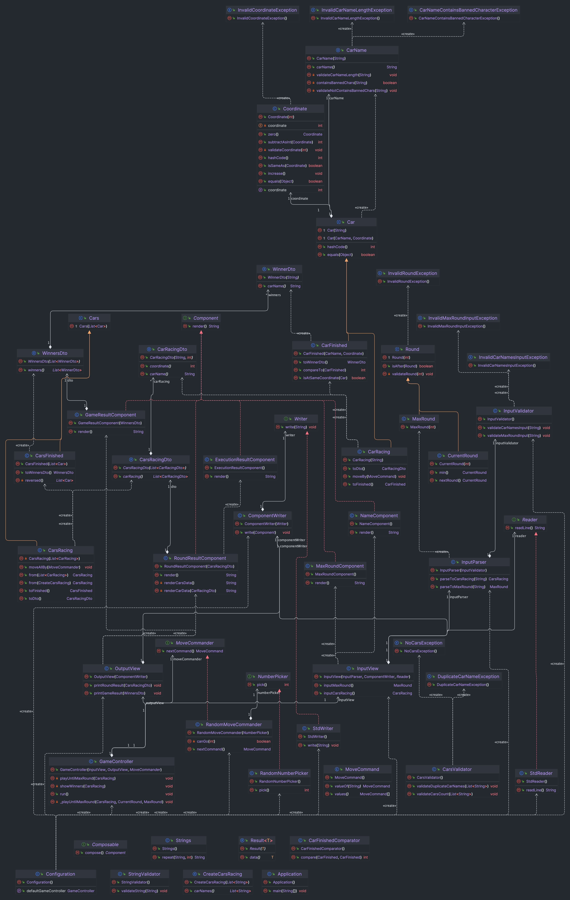
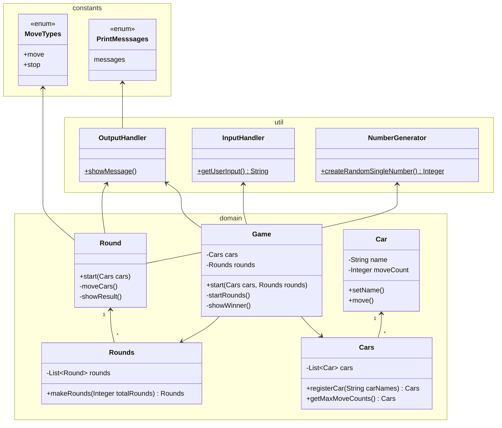

# 구현할 기능 목록

- [x] 시작 문구를 출력한다. (showMessage)

- [x] 경주할 자동차 이름을 입력한다. (promptCarNames)
    - [x] 입력한 자동차 이름을 콤마(,) 기준으로 구분하여 자동차를 생성해서 리스트로 저장한다. (registerCars)
    - [x] 입력한 자동차 이름이 5자 이하인지 체크한다. (validateCarName)

- [x] 시도할 횟수를 입력한다. (promptForRoundCount)
    - [x] 사용자가 잘못입력했을때 IllegalException 에러를 발생시킨다. (validateUserInput)

- [x] 입력한 시도 횟수 만큼 반복한다. (startRounds)
    - [x] 차수별 자동차마다 랜덤한 숫자(0부터 9 사이의 무작위 값)를 생성한다. (createRandomSingleNumber)
    - [x] 차수별 자동차마다 생성한 랜덤한 숫자가 4이상일경우 전진한다. (moveCars)
    - [x] 차수별 실행 결과를 출력한다. (showResult)

- [x] 우승자 안내 문구를 출력한다. (showWinner)

# 기능 단위

- util.InputHandler : 사용자 입력 로직 처리
- util.OutputHandler : 콜솔에 출력 되는 메시지 로직 처리
- util.NumberGenerator : 숫자 생성 로직 처리
- domain.Car : 단일 자동차에 대한 로직 처리
- domain.Cars : 생성된 다중 자동차에 대한 로직 처리
- domain.Round : 단일 라운드에 대한 로직 처리
- domain.Rounds : 생성된 다중 라운드에 대한 로직 처리
- domain.Game : 전체 게임 로직 연결 처리

# UML class diagram

