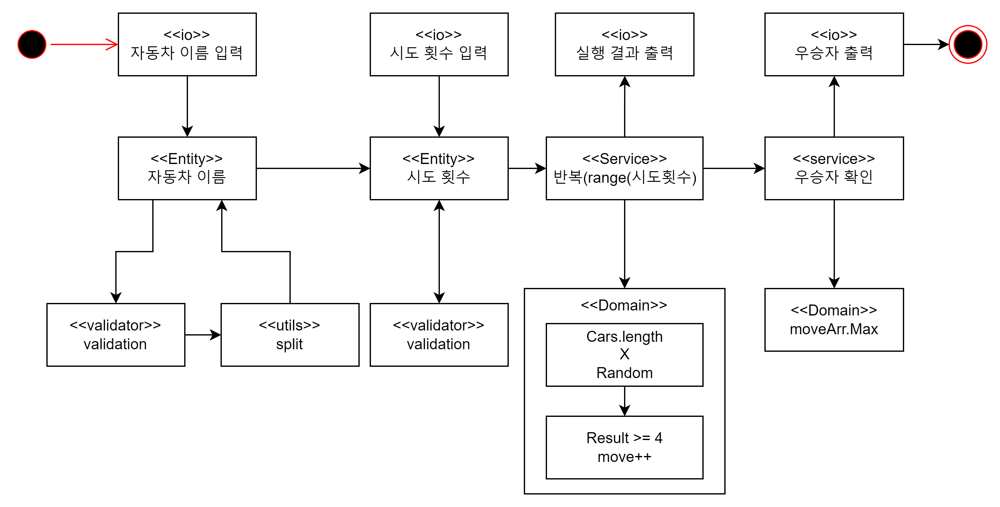

## TODO

- 명사 키워드 네이밍
- 동사 키워드 네이밍

## 기능 요구사항 분석

### 키워드 분석


- **주어진 횟수** 동안 **n대의 자동차**는 **전진** 또는 **멈출 수** 있다.
- **각 자동차에 이름을 부여**할 수 있다. **전진하는 자동차를 출력할 때 자동차 이름을 같이 출력**한다.
- 자동차 이름은 **쉼표(,)를 기준으로 구분**하며 이름은 **5자 이하**만 가능하다.
- 사용자는 **몇 번의 이동을 할 것인지를 입력**할 수 있어야 한다.
- **전진하는 조건**은 **0에서 9 사이에서 무작위 값을 구한 후 무작위 값이 4 이상일 경우**이다.
- 자동차 경주 게임을 **완료한 후 누가 우승했는지**를 알려준다. **우승자는 한 명 이상**일 수 있다.
- **우승자**가 **여러 명일 경우 쉼표(,)를 이용하여 구분**한다.
- 사용자가 **잘못된 값을 입력할 경우`IllegalArgumentException`을 발생**시킨 후 애플리케이션은 종료되어야 한다.

### 키워드 정리

- 주어진 횟수
- n대의 자동차
- 전진
    - 전진 조건 : 0~9 사이의 무작위 값 ≥ 4
- 정지
- 자동차 이름
    - 전진하는 자동차 출력 시 이름도 같이 출력
    - 쉼표(,)를 기준으로 구분
    - 5자 **이하**
- 사용자 입력
    - 몇 번의 이동을 할 것인지
    - 잘못된 값을 입력 : `IllegalArgumentException` 발생 후 종료
- 완료
    - 우승자 출력
    - 공동 우승 가능
        - 쉼표(,)를 기준으로 구분

- 입력 검증이 필요한 곳
    - 자동차 이름 입력
        - 5자 이하
        - **이름에 숫자, 영어 이외 문자 가능? 확인필요**
        - 중복된 이름 여부 확인
    - 이동 횟수
        - 정수만 가능

### 명사(상수/변수) 키워드

- 이동 횟수 (자동차가 움직인 횟수 = 자동차의 위치)
    - position
    - moveCount -> position으로 수정
      - 만약 뒤로가는 규칙 추가 시 의미가 모호해짐
    - Car 클래스에 포함됨
- 자동차들
    - cars : List<Car>
    - 자동차와 이동횟수는 1대 1로 매칭되는 객체
      - 따라서 하나의 오브젝트로 관리하는 것이 편리
- 자동차
  - Car : Object
    - name : String
      - 자동차의 이름
    - position : int
      - 이동 횟수
- 시도 횟수
  - tryCount : int

### 동사(메소드) 키워드

## 이벤트 흐름

### 진행 과정
```
경주할 자동차 이름을 입력하세요.(이름은 쉼표(,) 기준으로 구분)
pobi,woni,jun
시도할 회수는 몇회인가요?
5

실행 결과
pobi : -
woni :
jun : -

pobi : --
woni : -
jun : --

pobi : ---
woni : --
jun : ---

pobi : ----
woni : ---
jun : ----

pobi : -----
woni : ----
jun : -----

최종 우승자 : pobi, jun
```

### 흐름 정리

1. 사용자 : 게임 시작 (프로그램 실행)
2. 시스템 : print - “경주할 자동차 이름을 입력하세요.(이름은 쉼표(,) 기준으로 구분)”
3. 시스템 : get()
4. 사용자 : input - 자동차들의 이름
5. 시스템 : validate - input(자동차들의 이름)
6. 시스템 : print - “시도할 회수는 몇회인가요?”
7. 시스템 : get()
8. 사용자 : input - 시도 횟수
9. 시스템 : validate - input(시도 횟수)
10. 시스템 : 반복(range(시도 횟수)) -> 11~13 반복
11. 시스템 : '자동차 수' 만큼 랜덤 번호 생성
12. 시스템 : 조건(randomNumber ≥ 4) -> 자동차 이동
13. 시스템 : print - 실행 결과
14. 시스템 : 우승자 확인
15. 시스템 : print - "최종 우승자 : " + 우승자 


---
## 설계

### 도메인 설계



---

# 고민 사항

## 검증 과정

### 자동차 이름 입력

- 자동차 이름의 중복을 허용할지
  - 동일한 이름을 가지고 있으면 우승 결과에서도 구분이 안될 것 같다.
  - 결론 : X
- 공백 검사
  - 아예 공백으로만 이루어진 이름
    - 여러 명이 있다면 구분이 안된다.
    - 우승 결과에서도 확인이 어렵다
    - 결론 : X
  - 띄어쓰기로 공백이 들어간 경우
    - 하나의 문자로 인정 해줘야 하는지 애매함
    - 차량 이름을 검색해본 결과 띄어쓰기가 포함된 경우는 없음(일부 파생 모델 표기 제외) 
      - 참고자료 : [네이버 블로그](https://m.blog.naver.com/starshow88/27076090)
    - 만약 띄어쓰기가 필요하다 하더라도 언더스코어('_')로 대체 가능
    - 결론 : X
- 영문 이외의 문자
  - 언어에 상관없이 '한 글자 == 길이 1' 이 성립한다.
  - 인코딩 문제가 발생할 가능성 있다.
    - 인코딩 문제가 발생할 경우 원본의 길이와 달라질 수 있음
  - 인코딩 문제가 발생하였음을 판단할 수 있는 방법
    - UTF-8에서는 0xC0, 0xC1, 0xF5부터 0xFF까지의 바이트 값이 유효하지 않는다고 한다.
    - 다만, 해당 방법도 완벽하지 않다.
  - 결론 : X
- 특수 문자 혀용
  - 'Mk-II', 'P&G'과 같은 이름은 나름 로망있다고 생각한다.
  - 자동차 이름을 구분하는 쉼표 문자 이외라면 상관 없다고 생각한다.
  - ASCII에 포함되는 특수문자에 한정하면 인코딩 문제가 발생할 가능성도 현저히 낮다.
  - 결론 : O

### 시도 횟수 입력

- 시도 횟수에 제한을 둘지
  - 기본적으로 제한을 둘 필요는 없다고 생각한다.
  - 다만 Integer 범위를 초과하는 것은 바람직하지 않다고 생각한다.
  - 추후 성능 테스트 이후 값의 범의를 더 조절하는 것을 고려해 볼 수 있다.
  - 결론 : △ (일단 try ≤ Integer.MAX_VALUE)

## 성능

## 실행 결과

### 실행 결과 출력

- 실행 결과를 모두 연산한 후 출력 or 연산 실행 마다 결과 출력
  - 성능과 메모리 관리, 유지보수성을 모두 고려해야 한다.
    - 전자의 경우 만약 시도 횟수가 Integer.MAX_VALUE에 근접하다면, 메모리 낭비가 매우 커짐
  - 책임 분리가 필요하다.
    - 연산/출력을 나눠서 표현할 필요성이 있다고 생각한다.
    - 분리하면 유지보수성도 향상된다는 장점이 있다.
  - Stream API의 이용
    - 하나의 스트림 파이프라인 내에서 처리 가능하다.
    - 성능도 후자와 유사하다.
    - 가독성이 떨어질 가능성이 있다.