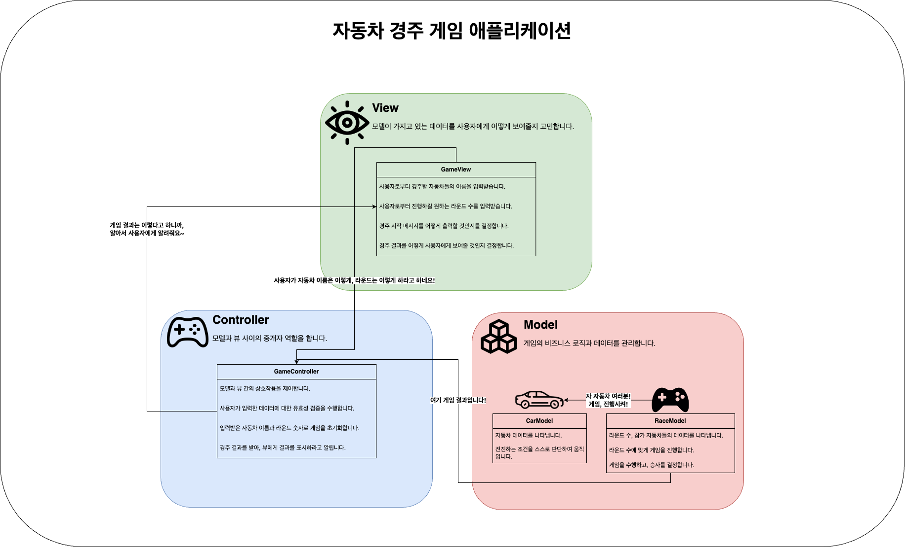

# Java 자동차 경주 게임 기능 구현 목록

### 어떤 객체가 필요하고, 각 객체가 어떤 역할을 해야 하는지 정의합니다.

### 경주 할 자동차 이름을 입력하는 기능을 구현합니다.

- 아래의 조건을 만족하지 않는 잘못된 값을 입력한 경우, `IllegalArgumentException` 예외가 발생해야 합니다.
    - 자동차 이름은 쉼표(,)를 기준으로 구분합니다.
    - 자동차 이름은 5자 이하만 가능합니다.
    - 자동차 이름은 중복될 수 없습니다.
    - 자동차 이름은 공백일 수 없습니다.
    - 자동차 이름은 null일 수 없습니다.

### 시도할 라운드 수를 입력받는 기능을 구현합니다.

- 아래의 조건을 만족하지 않는 잘못된 값을 입력한 경우, `IllegalArgumentException` 예외가 발생해야 합니다.
    - 라운드 수는 양수인 정수만 가능합니다.

### 입력받은 자동차 이름으로 자동차 객체를 생성하는 기능을 구현합니다.

- 자동차 객체는 자동차 이름과 위치 정보를 가지고 있습니다.

### 자동차의 전진 기능을 구현합니다.

- 자동차는 0에서 9 사이의 랜덤 값을 구한 후, 랜덤 값이 4 이상일 경우 전진합니다.

### 자동차 이름과 시도할 회수를 입력한 후 실행 결과를 출력하는 기능을 구현합니다.

- 자동차가 전진할 경우, `-`를 출력합니다.
- 자동차가 멈출 경우, ` `를 출력합니다.
- 실행 결과는 `자동차 이름 : 실행 결과` 형태로 출력합니다.

### 실행 결과를 출력한 후 우승자를 출력하는 기능을 구현합니다.

- 우승자는 한 명 이상일 수 있습니다.
- 우승자가 여러 명일 경우 쉼표(,)를 이용하여 구분합니다.
