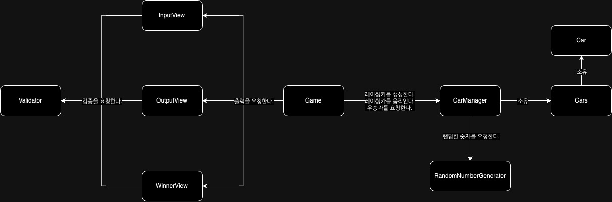

# 기능 명세서

--- 

## 🚀 구현 객체 목록

| Game                  | 게임 전체 실행을 관리하는 컨트롤러 클래스      |
|-----------------------|------------------------------|
| Car                   | 레이싱카의 상태를 저장할 클래스            |
| Cars                  | 레이싱카 리스트를 저장하는 일급 컬랙션 클래스    |
| CarManager            | 자동차의 생성과 상태를 관리하는 클래스        |
| Validator             | 사용자 입력을 검증하는 역할을 수행하는 클래스    |
| RandomNumberGenerator | 랜덤한 숫자를 생성하는 클래스             |
| InputView             | 사용자에게 데이터를 입력받는 역할을 수행하는 클래스 |
| OutputView            | 실행 결과를 출력하는 역할을 수행하는 클래스     |
| WinnerView            | 우승자를 출력하는 역할을 수행하는 클래스       |

## 🗺️ 객체 관계도

## 📑 필요 기능 목록

### Game

- [X]  게임을 실행할 수 있다.

### Car

- [X]  레이싱카의 상태인 이름(name: String) 과 이동거리 (distance: int) 를 저장한다.
- [X]  이동거리를 증가시킨다.

### Cars

- [X]  CarManager를 통해 생성된 Car 리스트를 저장한다.
- [X]  Car 리스트 중 가장 이동거리가 높은 Car 를 반환한다.

### CarManager

- [X]  입력받은 이름 목록의 Car를 생성하고 Cars에 저장한다.
- [X]  저장된 Cars 을 규칙에 맞게 이동시킨다.
- [X]  우승자를 반환한다.

### Validator

- [X]  입력이 정수인지 검증한다.
- [X]  입력한 숫자가 양의 정수인지 검증한다.
- [X]  입력에 공백이 없는지 검증한다.
- [X]  콤마가 연속으로 입력되어 있는지 검증한다.
- [X]  이름에 허용되는 문자(영어,한글,숫자)만 포함되어있는지 검증한다.
- [X]  이름에 중복이 있는지 검증한다.
- [X]  이름이 5글자 이하인지 검증한다.

### RandomNumberGenerator

- [X]  주어진 범위 내의 랜덤으로 생성된 숫자를 반환한다.

### InputView

- [X]  경주할 자동차 이름을 입력받는다.
- [X]  시도할 횟수를 입력받는다.

### OutputView

- [X]  실행결과를 출력한다.

### WinnerView

- [X]  우승자를 출력한다.