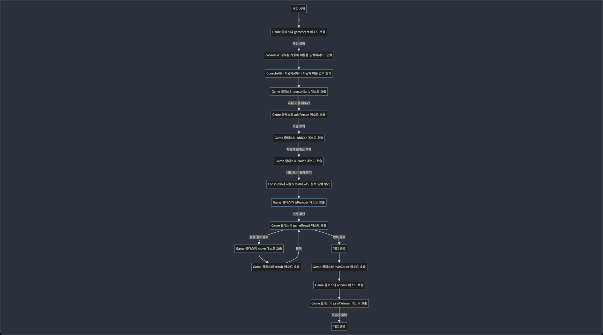

# 자동차 게임 플로우차트

## 게임 준비
- `Game` 클래스의 `gameStart` 메소드를 호출한다.
  - "경주할 자동차 이름을 입력하세요."를 Console에 출력한다.
  - Console에서 사용자로부터 자동차에 추가할 이름들을 입력받는다.
  - `personSplit` 메소드 호출
      - 사용자가 입력한 자동차 이름들을 쉼표로 나눈다.
  - `addPerson` 메소드 호출
      - 나뉜 자동차 이름들을 리스트에 추가한다.
  - `addCar` 메소드 호출
      - 각 자동차 이름에 대해 `Car` 객체를 생성하고 리스트에 추가한다.

## 게임 실행
- `count` 메소드 호출
    - "시도할 횟수는 몇회인가요?"를 Console에 출력한다.
    - Console에서 사용자로부터 시도 횟수를 입력받는다.
    - `isNumber` 메소드 호출
        - 입력한 값이 숫자인지 확인한다.
    - `gameResult` 메소드 호출
        - 실행 결과를 출력한다.
        - `move` 메소드 호출
            - 각 자동차에 대해 랜덤 숫자를 생성하고, `Car` 클래스의 `move` 메소드를 호출하여 이동한다.
        - `result` 메소드 호출
            - 각 자동차의 이동 결과를 출력한다.
        - 반복하여 실행 횟수만큼 결과를 출력한다.

## 게임 결과
- `maxCount` 메소드 호출
    - 자동차들 중 최대 이동 횟수를 찾는다.
- `winner` 메소드 호출
    - 최대 이동 횟수와 일치하는 자동차들을 찾는다.
- `printWinner` 메소드 호출
    - 최종 우승자를 출력한다.

# 자동차 게임 순서도
