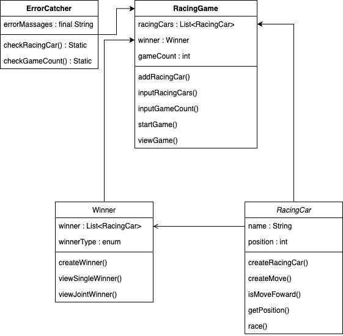

# 구현할 기능 목록 정리

### RacingGame
- 각 자동차에 이름을 부여하는 기능
  - 자동차의 이름을 입력받는 기능
- 게임의 진행 상황을 출력하는 기능
  - 자동차의 이름을 출력하는 기능
  - 자동차의 전진 상태를 출력하는 기능
- 이동 횟수(게임 횟수) 입력받는 기능
### RacingCar
- 자동차의 전진 또는 멈춤 기능
  - 전진 조건을 무작위로 생성하는 기능
  - 전진 조건을 체크하는 기능
- 자동차를 생성하는 기능
### Winner
- 우승자를 판단하는 기능
- 우승자를 출력하는 기능
    - 단독 우승
    - 공동 우승
### ErrorCatcher
- 에러체크
    - 자동차 이름 입력이 5자 이하인지
    - 시도할 횟수가 1이상의 정수인지

## 도메인 모델

- RacingCar -> getName() 추가
- Winner -> viewWinner() 추가
- RacingGame -> doGame() 추가