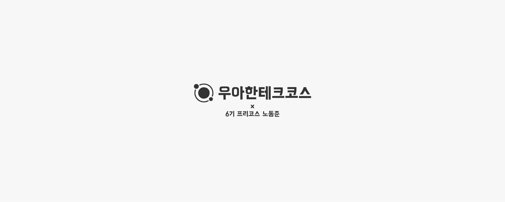

    

#  프리코스 2주차 미션: 자동차 경주
---

> 우아한테크코스 4기 2주차 미션, 자동차 경주를 구현한 저장소입니다.

 

---
## 기능 목록

### 1. 플레이어 등록
- [x] 플레이어 이름을 쉼표(,)를 기준으로 구분하여 등록한다.

#### 1-1. 예외 처리

- 플레이어 명이 5자 초과한 경우, ``IllegalArgumentException``를 호출한다
- 플레이어 명이 1자 미만인 경우, ``IllegalArgumentException``를 호출한다
- 플레이어 명이 중복된 경우, ``IllegalArgumentException``를 호출한다
- 참가 플레이어가 단 1명일 경우, ``IllegalArgumentException``를 호출한다
- 아무것도 입력하지 않았을 경우, ``IllegalArgumentException``를 호출한다

### 2. 시도 횟수 입력

### 3. 우승자 출력

-[x] 플레이어 명을 나열하여 플레이어를 등록할 수 있다.
-[x] 시도 횟수를 설정하면 각각의 플레이어가 시도 횟수만큼 렌덤값을 뽑아낸다
-[x] 렌덤값이 4이상일 때 이동, 미만일 때 정지할 수 있다.

### ⚠️ 예외 목록
-[x] 5자 초과한 플레이어 이름 ``IllegalArgumentException``
-[x] 공백인 플레이어 이름 ``IllegalArgumentException``
-[x] 숫자가 아닌 입력 ``IllegalArgumentException``