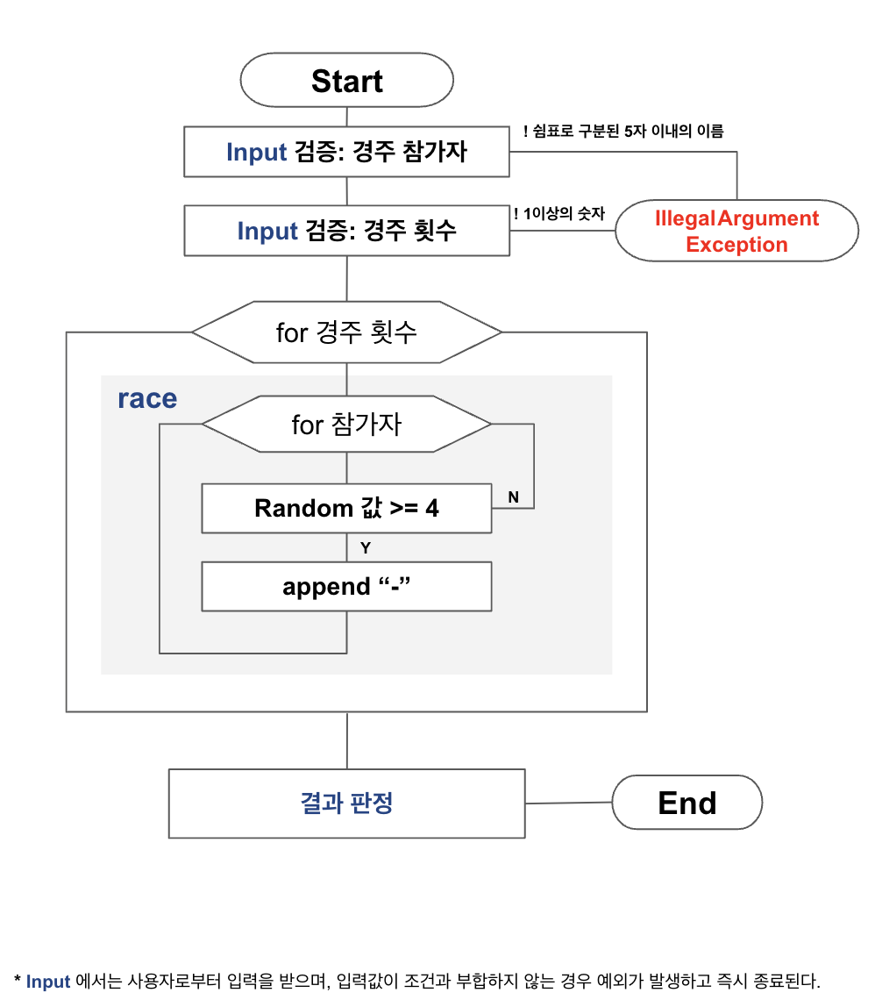

# 기능 목록

## 경주 자동차 생성 기능
- [x] 경주 자동차 이름 입력 기능 구현
  - [x] 자동차 이름 입력 문구 출력
    - [x] "경주할 자동차 이름을 입력하세요.(이름은 쉼표(,) 기준으로 구분)" 출력
    - [x] 유저의 입력 받기
      - [x] `camp.nextstep.edu.missionutils.Console.readLine()`을 통해 사용자의 입력 받기
  - [x] 입력 받은 입력값을 ',' 기준으로 분리하기
  - [x] 자동차 이름들 공백 제거
  - [x] 자동차 객체 생성하기
    - [x] 자동차 최대 개수를 넘어가면  `IllegalArgumentException` 
    - [x] 자동차 이름이 5자를 넘어가면 `IllegalArgumentException`
    - [x] 자동차 이름이 0자면 `IllegalArgumentException`
    - [x] 자동차 이름으로 객체 생성하기
  - [x] 객체를 배열로 리턴하기

## 시도 횟수를 받는 기능
- [x] 시도 횟수 입력 기능 구현
  - [x] 시도 횟수 입력 문구 출력
    - [x] "시도할 회수는 몇회인가요?" 출력
  - [x] 유저의 입력 받기
    - [x] `camp.nextstep.edu.missionutils.Console.readLine()`을 통해 사용자의 입력 받기
  - [x] 공백 제거
  - [x] 시도 횟수 예외 처리
    - [x] 숫자가 아니면 예외처리 `IllegalArgumentException`

## 시도 횟수만큼 경주를 진행하는 기능
- [x] 시도 횟수만큼 경주 진행
  - [x] 자동차 한 대의 랜덤 넘버 생성
    - [x] `camp.nextstep.edu.missionutils.Randoms.pickNumberInRange()`로 랜덤 숫자 생성
  - [x] 자동차 이동 거리 갱신
    - [x] 4 이상이면 이동 거리 +1
    - [x] 4 이하면 아무것도 안한다.
  - [x] 경주 결과 출력
    - [x] 실행 결과 문구 출력
      - [x] "실행 결과" 출력
    - [x] 자동차 이동 거리 출력
      - [x] 자동차마다 반복
        - [x] "%s : " 으로 자동차 이름 출력
        - [x] 자동차의 이동 거리를 출력

## 최종 우승자 출력 기능
- [ ] 최종 우승자를 판정하는 기능 구현
  - [x] 자동차 이동거리 순으로 정렬
  - [x] 가장 첫번째 자동차와 모든 자동차의 이동거리를 비교
    - [x] 같은 이동 거리면 우승자 리스트에 추가
  - [ ] 최종 우승자 출력
    - [x] "최종 우승자 : " 출력
    - [ ] 최종 우승자들 출력
      - [ ] 최종 우승자들을 쉼표로 구분해 출력
        - [ ] 유저에게 이름을 불린 순으로 출력

## 게임을 진행하는 기능
- [ ] 자동차 이름에 대한 입력을 받기
- [ ] 시도 횟수에 대한 입력을 받기
- [ ] 시도 횟수만큼 턴을 진행하기
- [ ] 최종 우승자 출력하기 

# 실행 흐름도

