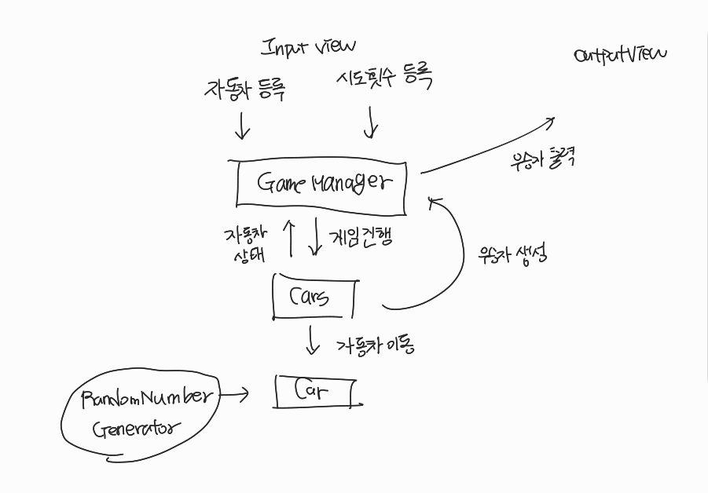

# 💪 프로젝트 개요

자동차 경주 게임을 구현한다.
자동차의 이름과 전진을 시도할 횟수를 입력받고, 자동차를 전진시킨 후 우승자를 선정한다.

# 📝 구현 기능 목록

### 자동차 이름을 입력하는 기능

- [x] `경주할 자동차 이름을 입력하세요.(이름은 쉼표(,) 기준으로 구분)`를 출력한다.
- [x] 자동차의 이름을 입력받는다.
  - [x] 빈 문자열이 아님을 검증한다.
  - [x] 올바른 구분자로 구분되었음을 검증한다.
  - [x] 중복되는 이름이 없음을 검증한다.
  - [x] 5자 이하의 이름인지 검증한다.

### 시도할 횟수를 입력하는 기능

- [x] `시도할 회수는 몇회인가요?`를 출력한다.
- [x] 시도할 횟수를 입력한다.
  - [x] 빈 문자열이 아님을 검증한다.
  - [x] 1 이상의 숫자로 이루어져 있음을 검증한다.

### 자동차를 전진하는 기능

- [x] 입력한 횟수만큼 자동차 전진을 시도한다.
- [x] 무작위 값을 생성하고 전진하는 조건을 검사한다.
- [x] 조건에 부합한다면 자동차를 전진시킨다.

### 자동차의 상태를 출력하는 기능

- [x] 모든 자동차의 이름과 이동한 갯수를 뷰에 전달한다.
- [x] 뷰에서 자동차 이름을 출력하고 이동한 갯수를 `-`로 출력한다.

### 우승자를 출력하는 기능

- [x] 가장 많이 이동한 자동차를 선정한다.
- [x] `최종 우승자 : pobi`와 같이 우승자를 출력한다.

# 🛠 시스템 흐름도

