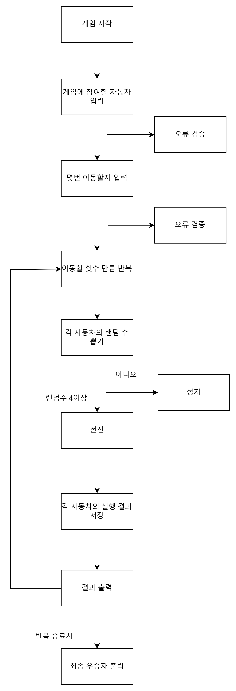
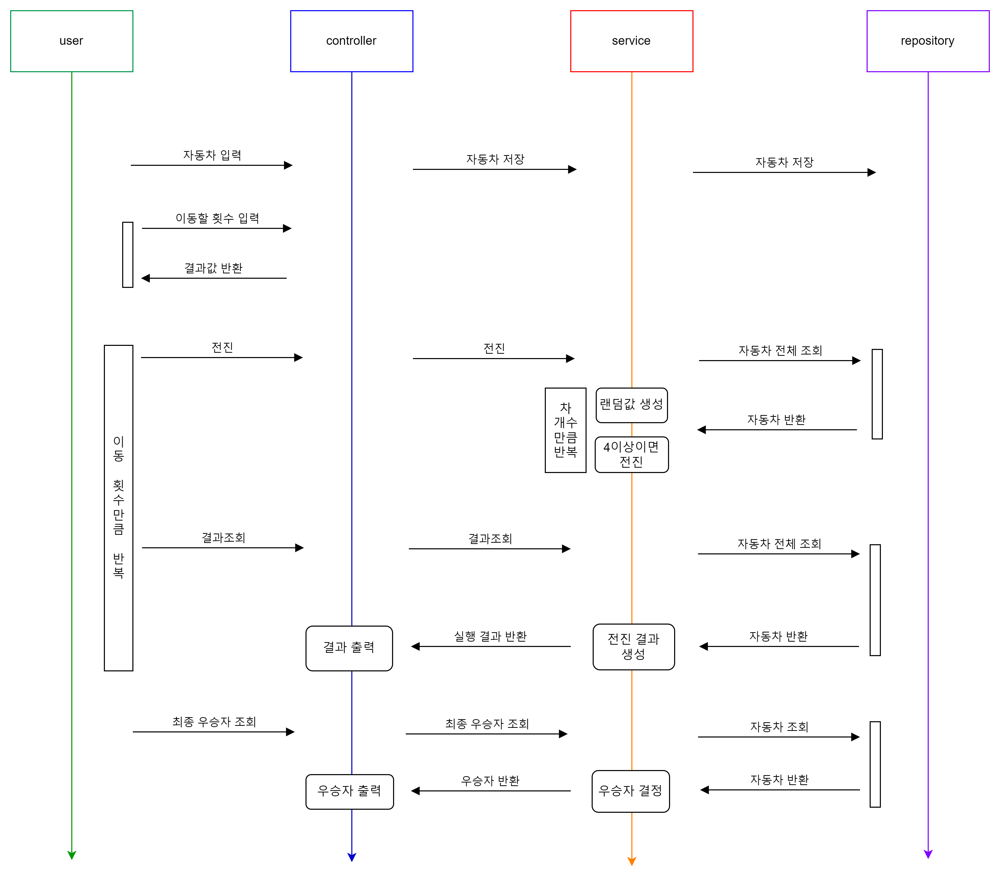

# **⚾︎ 미션 - 자동차 경주**

## 👀 문제 확인하기

- 우아한테크코스 2주차 과제 중 '**자동차 경주**'의 구현 기능 목록, 플로우 차트, 시퀀스 다이어그램을 담은 문서입니다.

---

## 🌟 구현 기능 목록

### ✔ 입력값 검증 기능 ️

- 경주 할 자동차 입력
    - 각 자동차 이름의 길이가 1~ 5인지 판단
    - 자동차 이름이 중복되어 있는지 판단
    - 자동차 이름에 공백이 있는지 판단
    - 이름이 비어 있는지 판단
    - null이 아닌지 판단
    - 자동차 이름이 ,로 구분되어 있는지 판단
- 시도할 횟수 입력
    - 숫자 포맷인지 판단
    - 0이하 인지 판단

### ✔ User

- 게임 제어 기능
    - 자동차 입력
    - 이동할 횟수 입력
    - 이동 횟수만큼 반복
        - 전진 호출
        - 결과 조회
    - 최종 우승자 조회

### ✔ Controller

- 자동자 입력 기능
- 이동할 횟수 입력 기능
- 각 차수별 실행 결과 출력 기능
- 우승자 출력 기능

### ✔ Service

- 전진 기능
    - 자동차 전체 조회
    - 차 개수만큼 반복
        - 각 차의 랜덤값 생성
        - 랜덤값이 4 이상이면 전진
        - 전진시 차의 raceCount 1 증가
- 자동차 전체 조회 기능
- 전진 실행 결과 생성 기능
    - 자동차 전체 조회
    - 각 차의 raceCount에 따라 실행결과 생성
- 우승자 결정 기능
    - 자동차 전체 조회
    - 각 차의 raceCount를 비교해서 우승자 결정

### ✔ Repository

- 자동차 저장 기능

### ✔ Car

- 랜덤값 생성 기능
- 입력된 문자열을 ,를 기준으로 분리하는 기능

---

## 💡 플로우 차트

---

## 💡 시퀀스 다이어그램
