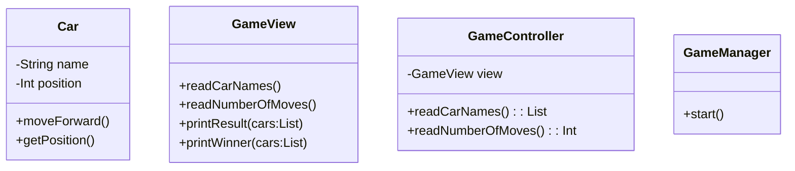

# 요구사항 분석
## usecase diagram

## usecase description
### 경주 시작
- **액터**: 사용자
- **시작조건**: 프로그램을 실행
- **기본 흐름**
    1. "경주할 자동차를 입력하세요.(이름은 쉼표(,) 기준으로 구분)" 출력
    2. 사용자가 자동차 이름들을 쉼표(,)로 구분하여 입력한다.
    3. 입력한 자동차 이름들이 유효한지 검사한다.
    4. 시스템이 자동차 이름들을 저장한다.
    5. "시도할 회수는 몇회인가요?" 출력
    6. 사용자가 이동 횟수를 입력한다.
    7. 입력한 이동 횟수가 유효한지 검사한다.
    8. 시스템이 이동 횟수를 저장한다.
    9. 이동횟수만큼 자동차들이 이동한 정도를 출력한다.
    10. 경주 결과를 출력한다.
- **대안 흐름**
- **예외 흐름**
    1. 자동차 이름이 5자를 초과한다면, `IllegalArgumentException`에러를 발생시키고 프로그램을 종료한다.
    2. 자동차 이름이 쉼표(,)로 구분되어 있지 않다면, `IllegalArgumentException`에러를 발생시키고 프로그램을 종료한다.
    3. 이동 횟수가 0 혹은 양의 정수가 아니라면, `IllegalArgumentException`에러를 발생시키고 프로그램을 종료한다.
- **종료 조건**: 경주 결과를 출력한다.

## class diagram

