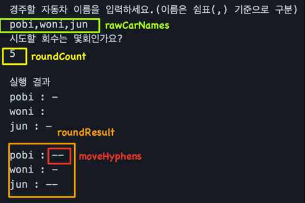

# 기능 목록
   

   

1. 게임 시작 문구 출력
2. 플레이어로부터 자동차 이름( **_rawCarNames_** )을 입력 받음
3. **_rawCarNames_** 파싱 및 유효성 검사
   1. 구분자(,) 파싱
   3. 두 개 이상의 이름
   2. 구분된 각 이름의 길이는 공백을 제외하고 (1 이상) 5 이하
   3. 중복된 이름이 없어야 함
4. 각 자동차 이름에 해당하는 **_Car_** 객체 생성
6. 플레이어로부터 이동 횟수( **_roundCount_** ) 입력 받음
7. **_roundCount_** 유효성 검사
    1. 문자열의 각 문자는 모두 숫자로 구성
    2. 문자열이 “0”일 수는 없음
8. 입력 받은 이동 횟수를 숫자형으로 변환
9. Car 객체를 저장한 ArrayList를 순회하며 각 객체에 대해
    1. 0 ~ 9 사이의 난수를 생성
    2. 생성된 난수가 4 이상이라면 전진
10. **_roundCount_** 만큼 (9)를 반복
12. 우승자 목록 추출 및 출력

   

# 구현 결정
   

### 리스트 자료구조 전달은 Iterator로
1. 리스트 자체를 전달하면 외부에서 해당 리스트를 조작 가능
2. 특정 자료구조에 의존성 최소화

   ex- ArrayList에서 linkedList로 구현이 변경되어도 클래스 외부에 해당 변경 사항이 파급되지 않음
   
   

### ArrayList의 초기 사이즈 지정

ArrayList 크기를 사전에 알고있다면 이를 입력해 런타임에 메모리를 할당하는 overhead를 최소화 

   

### 전진 관련 정보를 정수형이 아닌 문자열로 선택(make the common case fast!)
1. 전진 횟수를 정수형으로 저장하면 우승자를 추출하는 데에 유리
2. 그러나, 각 라운드 별 실행 결과를 출력할 때 전진 횟수에 맞춰 문자열을 새로 생성해야하는 overhead 발생

라운드 횟수가 많아질수록, (2)의 overhead가 커지므로,

(1)에서의 손해를 감내하고 문자열( Car 클래스 내부의 **_moveHyphens_** )로 전진 관련 정보를 저장

   

### 우승자 추출을 위해 Car 클래스의 comparable 구현

우승자 목록 추출 방법
1. CarList를 전진한 횟수를 기준으로 내림차순 정렬
2. CarList를 맨 앞 Car 객체의 전진 횟수를 변수(**_maxMoveCount_**)에 저장
3. CarList를 앞에서부터 순회하며

   Car 객체의 **_moveCount_** 가 **_maxMoveCount_** 와 같다면 우승자 명단에 추가
   
   아니라면, break

위와 같이 정렬 후 맨 앞에서부터 순회하는 방법은 O(n log n)의 복잡도로

정렬되지 않은 리스트를 순회하며 우승자를 뽑는 방법( O(n) )에 비해 성능이 떨어짐.

그러나, 단순 리스트 순회는 
1.  가독성이 떨어짐 -> 반복문 내부에 여러 조건문을 두어야 하며, 리스트 관련 메서드를 여럿 호출
3. 확장에 취약함 -> 새로운 요구 사항에서 1등 뿐 아니라 1 ~ 5등까지 뽑아주길 원한다면, 유연하게 대처 불가능

   

그러므로, 조금의 성능 저하를 감안하고서라도 정렬을 수반한 우승자 추출 방법 선택