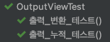
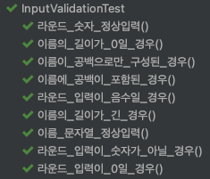
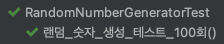
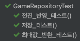
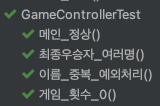
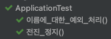

미션 - 자동차 경주 🚘
=

# 🎯 진행 방식

### 게임 규칙
- 자동차는 '전진' 혹은 '정지'가 가능하다.
- 0 ~ 9 사이 숫자 중 무작위로 뽑은 수가 4 이상일 경우 전진한다.
    - 전진 확률은 60% 이다.
- 최종 우승자는 한 명일수도, 둘 이상일 수도 있다.

### 게임 진행
- n대의 자동차가 경주를 진행한다.
- 각각의 자동차에는 이름을 부여한다.
- 라운드마다 0 ~ 9 사이의 무작위 숫자에서 4 이상의 경우에 전진한다.
- 라운드 별로 게임 진행 상황이 출력된다.
- 게임 종료 후 최종 우승자를 출력한다. (여러 명일 수 있다.)

### 입력
- <U>게임에 참여할 자동차 이름</U>을 `,`로 구분하여 `문자`로 입력한다.
- <U>몇 라운드 게임을 진행할 지</U> `숫자`를 입력한다.

### 출력
- 게임시작
    - `경주할 자동차 이름을 입력하세요.(이름은 쉼표(,) 기준으로 구분)` 출력
    - `시도할 회수는 몇회인가요?` 출력
- 라운드 진행
    - 매 라운드마다 결과를 출력한다.
    - 출력 순서 입력된 이름의 순서를 유지한다.
    - 전진 여부를 `-` 를 누적하며 출력한다.
- 게임 종료
    - 마지막 라운드를 기준으로 가장 멀리 전진한 이름을 출력한다.
    - ex) `최종 우승자 : 이름1` 출력
    - 최종 우승자는 2명 이상일 수 있고 여러 명인 경우 `, `로 구분하여 출력한다.

### 요구사항
- 프로그램 종료 시 `System.exit()`으로 강제 종료를 하지 않는다.
- 구현이 완료되면 `ApplicationTest`의 모든 테스트를 성공해야한다.
- 입력은 `Console` 라이브러리를 활용하여 받도록 한다.
- 랜덤 함수의 경우 제공되는 `Randoms` 라이브러리를 활용한다.
- 사용자가 잘못된 값을 입력할 경우 `IllegalArgumentException` 발생 후 종료되어야 한다.
- indent depth는 3이 넘지 않아야 한다. 2까지만 허용된다.
- 메서드가 한 가지 일만 하도록 작게 만든다.
- 테스트를 통해 기능 목록이 정상 작동 됨을 확인한다.

---

# 🤔 고민해 봐야 할 점
## ✅ 이름 입력

### 공백을 글자로 인정해주어야 할까?
- 기능 요구 사항에는 "이름은 5자 이하만 가능하다." 라고 기재되어 있다.
- 그렇다면 의도적인 공백을 포함한 입력은 글자로 포함하여 길이 카운트를 해야한다고 생각했다. ex) "a b c"
- 다만, 공백 만으로만 이루어진 입력(ex. space, tab 등)의 경우에는 가시적인 이름 확인이 어렵다. ex) " "
- 그러므로 '공백으로만' 입력한 경우에는 이름에 대한 입력이 없다고 판단하기로 하였다. -> `IllegalArgumentException`
- 추가로, 입력이 아예 없는 경우 또한 위의 공백에 대한 처리와 마찬가지로 판단하였다. ex) "" -> `IllegalArgumentException`

### 공백만 다르고 글자 구성이 같은 경우에는 동일한 이름일까?
- 예를 들어 이름 입력이 "a bc"로 입력되었다고 가정해보았다.
- 이 경우, 만약 "abc"라는 다른 이름이 존재한다면 구분이 꽤나 어려울 수 있다고 생각했다.
- 그러므로, '<U>글자가 포함된</U> 이름'일 경우 1차적으로 글자수로 유효성 판단을 하고, 최종적으로는 공백을 제거하는 쪽으로 통일하여 저장하도록 하였다.

### 중복은 어떻게 해야할까?
- 이는 위의 예시와 이어진다.
- 위의 예시처럼 이름 입력이 "abc,a bc"로 입력된다면 "abc,abc"로 저장하기로 하였다.
- 이 경우, 같은 이름이 여러 번 입력된 것이므로, 중복이 발생한 것이고 예외 처리를 하기로 하였다. -> `IllegalArgumentException`

### 결론
1. 이름 입력은 철저히 글자 수로 1 ~ 5 개의 글자인지 여부로 판단한다.
2. 다만, 입력이 없거나, 공백으로만 구성된 이름의 경우 구분이 어려우므로 예외를 발생시킨다.
3. 공백 배치만 차이가 있고 글자의 구성과 순서가 같은 이름인 경우, 중복으로 판단하고 예외를 발생시킨다.

## ✅ 결과 출력

### 라운드 결과는 매 번 나누어서 출력을 해주어야 할까?
- 라운드 별로 출력 테스트를 하기 위해선 매번 print를 해주는 것이 편할 것이다.
- 그러나, 게임 횟수가 단 몇 번이 아닌, 수백만번, 수천만번이라고 가정을 해보았다.
- 이 경우, 매 라운드마다 print 메서드가 호출되므로 상당히 비효율 적일 것이라고 판단했다.
- 그러므로, 테스트보다는 효율적인 게임 흐름에 보다 초점을 맞추어, 라운드는 StringBuilder로 쌓아서 단 1번 출력하기로 하였다.
- 즉, 출력은 `이름 요구` -> `게임 횟수 요구` -> `라운드 별 결과` -> `최종 우승자` 순으로 4번 발생한다.

### 최종 우승자에 이름은 입력한 이름 그대로를 출력해주어야 할까?
- 위에서 이름은 '공백을 제거하여' 저장하기로 하였다.
- 즉, 사용자가 이름에 공백을 포함하더라도, 결국은 공백이 제거되어 저장된다.
    - 실제로 많은 서비스에서 유저 이름이나 아이디에 공백을 넣을 수 없도록 하기에 이와 동일하게 생각했다.
    - 입력에서 공백을 허용했던 것은, 단순히 유저의 편의를 위해 넣은 기능이라고 생각하면 될 것 같다.
- 즉, 공백이 제거되었고, 중복 또한 체크를 한 상황에서, 공백이 없더라도 자신이 입력한 이름은 판단이 가능하다고 생각했다.
- 그러므로, 이름에서 공백이 제거된 상태를 기반으로 게임을 진행했기에, 최종 우승자 출력에도 변형된 상태로 반영하기로 하였다.

## ✅ MVC 패턴의 구조
### 입력은 어디서 받아주어야할까?
- 입력을 controller에서 받아야할지 view에서 받아야할지 생각해보아야한다.
- 실제 서비스를 생각해보면 controller는 view에서 받은 정보를 바탕으로 일을 수행한다.
- 그런데 view는 단순히 입력을 받은 그대로 가공 없이 전달해야할까?
- 일반적으로, view는 컨트롤러에 어떤 형태로 값을 준다.
- 그러나 가공을 한다면, view에서 exception 처리를 해야하는 상황이 올 수 있다.
    - 실제로는 하겠지만 콘솔로 인앤아웃이 이루어지는 미션이기에..
    - 입력이 없는 경우에는 view에서 유효성 검증을 하여 Exception 처리를 하도록 하였다.
    - 입력이 있는 경우에는, 유효성 검증을 controller에서 이루어지도록 하였다.
    - 즉, 입력받은 String 형태 그대로 controller에 전달하도록 하였다.
- 마무리하자면, view가 입력을 받고 전달하여, controller가 이를 확인하고 가공하여 처리하도록 한다.

---

# 🛠️ 기능 목록

## 💡 Main Class
### Application
- [x] 게임 실행

 

## 💡 Domain

### Car
- [x] 이름과 전진 횟수를 담는다.
- [x] equals와 hashcode를 Override하여 이름만으로 동일한 판단을 가능하게 한다.

 

## 💡 DTO

### GameDto
- [x] 게임 횟수와 입력된 Car의 정보들을 담는다.

 

## 💡 Controller

### GameController
- [x] run 메서드
    - 이름 입력 요구 출력
    - view에서 이름 입력받기 + validation
    - 라운드 입력 요구 출력
    - view에서 라운드 수 입력받기 + validation
    - 게임 정보 저장하기 (GameDto 전달)
    - 게임 실행하기
- [x] 게임 실행 메서드 (파라미터로 라운드 수를 받기)
    - 라운드 진행 메서드
    - 실행 결과를 출력
    - 최종 우승자를 출력

 

## 💡 Service

### GameService
- [x] 게임정보 저장 메서드 (GameDto 받기)
- [x] 라운드 진행 메서드 (파라미터로 라운드 수 받기)
    - 라운드 수만큼 진행
    - 라운드마다 진행한 결과를 Repository에 반영
- [x] 최종 우승자를 도출하는 메서드

 

## 💡 Repository

### GameRepository
- [x] 최대 전진 거리
- [x] Car 정보들을 담은 `List`
- [x] 저장 메서드 (Game)
- [x] 전진 메서드 (파라미터로 전진할 Car들을 받는다.)
  - 전진 시 최대 전진 거리 갱신
- [x] List 반환 메서드
- [x] 최대 전진 거리 반환 메서드

 

## 💡 View

### InputView
- 입력과 입력에 대한 출력을 담당하는 클래스이다.
- [x] 이름 입력 질문을 출력하는 메서드
- [x] 라운드 입력 질문을 출력하는 메서드
- [x] 입력을 받아서 `문자열`로 반환하는 메서드
    - 기본적으로 빈 문자열 체크만 하도록 한다.

### OutputView
- 출력을 담당하는 클래스이다.
- [x] `OutputConstant`를 활용하여 `System.out.println()`을 통해 출력을 한다.

### InputConstant
- [x] INPUT_DELIMITER : `,`
- [x] NAMES_REQUEST : `경주할 자동차 이름을 입력하세요.(이름은 쉼표(,) 기준으로 구분)`
- [x] ROUND_REQUEST : `시도할 회수는 몇회인가요?`

### OutputConstant
- 출력에 필요한 상수들을 담은 Enum 클래스이다.
- [x] SEPERATOR : ` : `
- [x] FORWARD_MARK : `-`
- [x] GAME_RESULT : `\n실행 결과\n`
- [x] WINNER : `최종 우승자 : `
- [x] WINNER_DELIMITER : `, `

 

## 💡 Utility

### RandomNumberGenerator
- 난수 생성 역할을 하는 유틸 클래스이다.
- [x] 난수 생성 메서드

### NumberConstant
- 매직넘버들을 상수로 처리한 Enum 클래스이다.
- [x] MIN_NUMBER : 0
- [x] MAX_NUMBER : 9
- [x] FORWARD_POINT : 4
- [x] MIN_LENGTH : 1
- [x] MAX_LENGTH : 5

### InputRegex
- 입력의 유효성 검증에 사용되는 정규표현식으로 이루어진 Enum 클래스이다.
- [x] WHITE_SPACE_REGEX : 공백 여부 정규표현식
- [x] LETTER_EXIST_REGEX : 공백 제외 문자 포함여부 판단 정규표현식
- [x] LENGTH_RANGE_REGEX : 글자 길이 판단 정규표현식

### InputValidation
- 입력의 유효성을 판단하는 클래스이다.
- [x] 이름 입력 유효성 판단 메서드
    - 길이 판단
    - 공백 이외의 문자 존재 여부 판단
    - 중복 여부 판단
- [x] 라운드 입력 유효성 판단 메서드
    - 숫자 여부 판단
- [x] 유효하지 않은 입력의 경우 `IllegalArgumentException`

 

## 💡 Exception

### ErrorMessage
- 에러메세지들을 담을 Enum 클래스이다.
- [x] null 에러 메세지 : `입력을 하지 않았습니다.`
- [x] 입력 길이 에러메세지 : ` -> 이름은 1 ~ 5 글자여야 합니다.`
- [x] 공백 에러 메세지 : ` -> 이름에 공백만 포함할 수 없습니다.`
- [x] 중복 에러 메세지 : ` -> 중복된 이름을 입력할 수 없습니다.`
- [x] 숫자 에러 메세지 : ` -> 숫자만 입력 가능합니다.`

  

---

📠 TEST
=

- [x] 출력 테스트  
    
   

- [x] 입력값 유효성 테스트  
    
   

- [x] 난수 생성 테스트  
    
   

- [x] Repository 테스트  
    
   

- [x] 결과값 테스트  
    
   

- [x] 메인 테스트  
    
   
