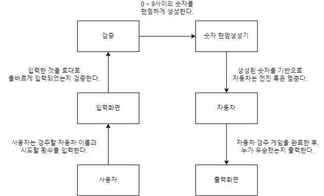

## 객체 간의 협력관계 파악하기

## [View]

### InputView

- 사용자는 경주할 자동차 이름을 입력한다.
    - 이때, 이름은 5자 이하만 가능하다.
    - 사용자가 잘못된 값을 입력할 경우, `IllegalArgumentException` 을 발생시킨다.
- 시도횟수를 입력한다.
    - 사용자가 잘못된 값을 입력할 경우, `IllegalArgumentException` 을 발생시킨다.

### OutputView

- 게임 시작시,
    - `경주할 자동차 이름을 입력하세요.(이름은 쉼표(,) 기준으로 구분)`
    - `시도할 회수는 몇회인가요?`

  를 출력한다.

- `실행결과` 를 출력한다.
- `-` 을 이용하여, 자동차 리스트들의 이동 현황을 출력한다.
- `최종 우승자 :`  출력 및 우승자가 여러명일 경우, `,` 를 이용하여 구분한다.

## [Controller]

### RacingController

- 사용자가 입력한 자동차 이름과 시도횟수를 토대로, 각각의 자동차는 `RandomGenerator`에서 생성된 랜덤의 값으로 전진 혹은 멈출 수 있다.

## Util

### [RandomGenerator]

- 0에서 9사이의 무작위 값을 구한다.

### [StringUtils]

- 사용자가 입력한 자동차의 문자열을 토대로, String[] 배열에 저장한다.

## Model

### [Car]

- 자동차를 저장하기 위한 객체

### [Name]

- 자동차의 이름을 저장하기 위한 객체

### [Position]

- 각 자동차들의 위치를 저장하기 위한 객체

### [Winner]

- 우승자를 저장하기 위한 객체