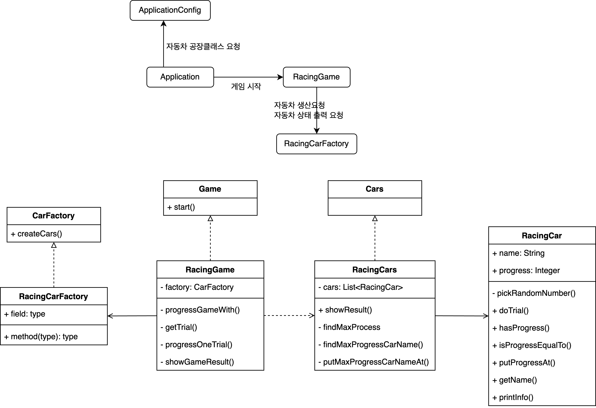

# 🏎️ 자동차 경주 게임 🏎️  
 

### 📉 클래스 다이어그램
***

 
    
### 📄 기능 요구 사항
***
* 경주 할 자동차 이름 입력받음(쉼표로 구분해서 입력, 5자 이하)
* 시도할 횟수 입력받음
* 전진 조건은 0~9사이에서 무작위 값을 구한 후 무작위 값이 4 이상일 경우
* 각 차수별 진행 결과 출력
* 게임 완료하면 누가 우승했는지 알려줌, 우승자는 한 명 이상 가능(쉼표로 구분)
* 사용자 입력이 잘못됐을 경우 예외터뜨림

### 🛠️ 클래스별 구현 기능 목록  
***
>❐ **Application: 메인 메서드를 가진 어플리케이션 실행 클래스**  
>* main RacingCarGameController 객체를 생성하고 게임 시작

 
🌅 VIEW 

>**❐ RacingCarGameView: 입출력 담당 클래스**
>* inputCarNames 유저에게 차 이름 입력받음
>* inputTryCount 유저에게 시도 횟수 입력받음 
>* printResult 현재 경주 결과를 출력
>* printFinalResult 경주 우승자 출력 

 
📱 MODEL 

>**❐ RacingCarGameService: 게임 진행 담당 클래스**
>* continueGame 전진 판단 후 현재 결과 반환 

>**❐ CarNames: carNames 리스트를 멤버로 가지는 일급컬렉션 클래스**
>* verifyInput 차 이름을 구분하기전에 사용자 입력 검증
>* verifySpaceNextToComma 입력값에서 쉼표 찾아서 verifyIllegal호출
>* verifyIllegal 전달받은 쉼표 인덱스 양옆 공백 확인
>* verifyDoubleComma 쉼표 연속 두 개인지 검증
>* createCarNames 입력받은 차 이름 리스트 생성
>* verifyInputToken 각각의 차 이름이 길이는 5를 넘지 않는지, 중복인지 아닌지, 입력값이 없는건 아닌지 판단
>* getCarNames 일급 컬렉션 멤버를 수정불가한 상태로 반환 

>**❐ TryCount: 입력받은 시도 횟수 랩핑 클래스**
>* verifyCount: 인자로 전달받은 count가 양의 정수이고 MAX_VALUE보다 작은지 검증
>* getCount: 남은 시도횟수 반환
>* decreaseCount: 시도횟수 감소 

>**❐ RacingResult: 게임 진행 시 결과를 담는 클래스**
>* moveForward: 전달받은 이름에 해당하는 차 전진시킴
>* getResult: 현재 결과 반환
>* getNames: 경주 진행하는 차 이름 셋 반환
>* getWinners: 결과에서 우승자를 리스로 반환 

>**❐ Winner: 우승자 리스트를 멤버로 가지는 일급컬렉션 클래스**
>* getWinners: 우승자 리스트 반환 

 
🕹️ CONTROLLER 

>**❐ RacingCarGameController: 어플리케이션의 컨트롤러 담당 클래스** 
>* gameStart: 게임 시작하는 메서드. RacingCarGameView클래스를 통해서 이름과 시도 횟수를 입력 받고 RacingCarGameService를 통해서 시도횟수만큼 게임 진행하고 우승자 뽑아냄

### 📟 테스트
***
📱 MODEL 

>**❐ CarNamesTest** 
>* 차_이름_검증_테스트: 임의로 입력값을 만들고 예외 터뜨리는지 테스트 

>**❐ RacingResultTest**
>* 전진_결과_테스트: moveForward 메서드가 정상 동작하는지 테스트
>* 우승자_확인_테스트: RacingResult에서 우승자를 정확하게 뽑는지 테스트 

>**❐ TryCountTest**
>* 시도횟수_검증_테스트: TryCount를 생성할 때 예상하지 않은 범위의 정수가 들어왔을 때 예외 터뜨리는지 테스트
