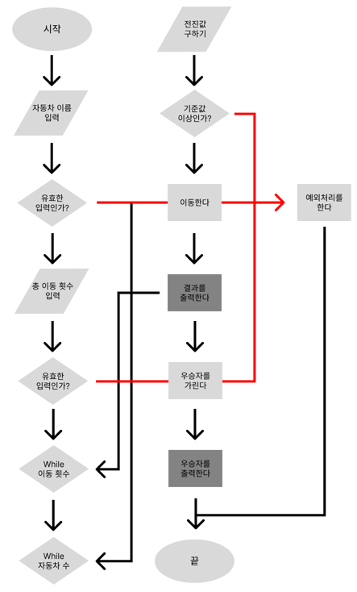

### **레이싱 게임 구현 체크리스트**

### **기본 구조**
#### 초기구상

#### 실제구현

### **기능 상세**

1. **차량 이름 입력 받기**
    - [x]  사용자로부터 쉼표로 구분된 차량 이름을 입력 받는다.
    - [x]  차량 이름은 5자 이하만 가능하다.
2. **이동 횟수 입력 받기**
    - [x]  사용자로부터 이동 횟수를 입력 받는다.
3. **랜덤 값에 따른 차량 이동**
    - [x]  0에서 9 사이의 랜덤 값을 구한다.
    - [x]  랜덤 값이 4 이상일 경우 차량을 전진시킨다.
4. **게임 진행**
    - [x]  사용자가 입력한 이동 횟수만큼 게임을 진행한다.
    - [x]  각 차량의 상태를 출력한다.
5. **우승자 판별**
    - [x]  게임이 끝난 후 가장 멀리 이동한 차량을 우승자로 판별한다.
    - [x]  우승자가 여러 명일 경우 쉼표로 구분하여 출력한다.
6. **결과 출력**
    - [x]  각 라운드별 차량의 상태를 출력한다.
    - [x]  우승자를 출력한다.

### **예외 처리**

- [x]  차량 이름이 5자 초과인 경우 IllegalArgumentException 처리.
- [x]  이동 횟수가 숫자가 아닌 경우 IllegalArgumentException 처리.

### **프로그래밍 요구 사항**

- [x]  JDK 17에서의 정상 동작.
- [x]  Java 코드 컨벤션 준수.
- [x]  외부 라이브러리 미사용.
- [x]  indent depth 2까지 허용.
- [x]  3항 연산자 사용 금지.
- [x]  함수(메서드)가 한 가지 일만 하도록 작게 만들기.
- [x]  **`camp.nextstep.edu.missionutils.Randoms`** 및 **`Console`** 사용.

### **테스트**

- [x]  각 기능별 단위 테스트 구현.
- [x]  전체 통합 테스트 구현.

### **개인 추가 목표**
- [x] 테스트 주도개발...?
- [ ] 일관된 깃 컨벤션
