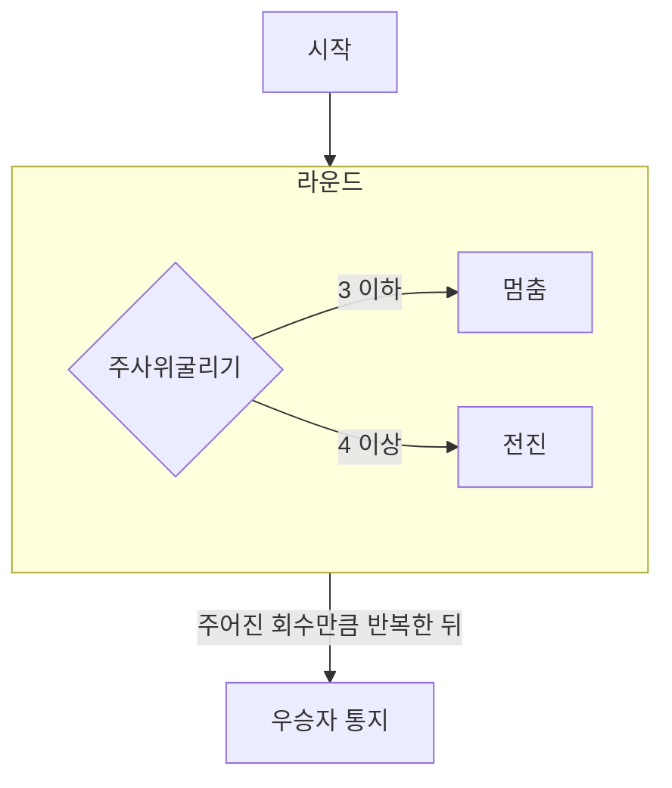

## 순서도

## 기능 구현 목록

### Model

- Car
  - 이름 유지
  - 전진
  - 멈춤
- CarManager
  - n대의 자동차 유지
  - 자동차에 대한 통합적인 연산 진행

### View

- InputView
  - 자동차명 입력
  - 회수 입력
- OutputView
  - 각 차수별 실행 결과 출력
  - 우승자 출력
- InputValidator

### Controller

- 선행 정보 입력
- 각 차수 진행 및 결과 통지
- 최종 우승자 통지
