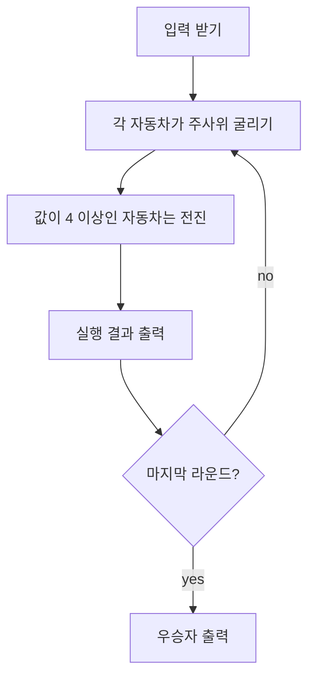
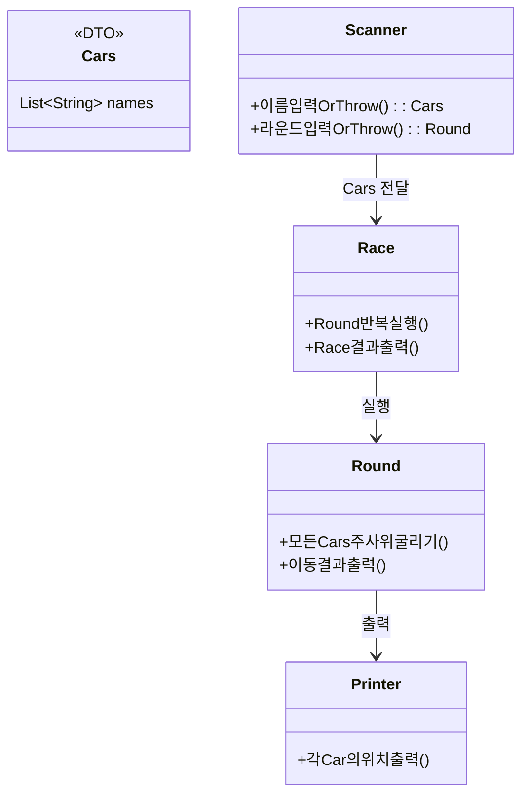

# 플로우 설계

```mermaid
flowchart TD
A[입력 받기] --> B[각 자동차가 주사위 굴리기]
B --> C[값이 4 이상인 자동차는 전진]
C --> E
E --> D
D --> |no|B
D --> |yes|F[우승자 출력]
D{마지막 라운드?}
E[실행 결과 출력]
F[우승자 출력]
```
# 클래스 설계

```mermaid
classDiagram
class Cars {
	<<DTO>>
	List~String~ names
}
class Scanner {
	+이름입력OrThrow() : Cars
	+라운드입력OrThrow() : Round
}
class Race {
	+Round반복실행()
	+Race결과출력()
}
class Round {
	+모든Cars주사위굴리기()
	+이동결과출력()
}
class Printer {
	+각Car의위치출력()
}
Scanner --> Race : Cars 전달
Race --> Round : 실행
Round --> Printer : 출력
```
# 구현할 기능 목록
- 이름 입력
- 라운드 개수 입력
    - 예외 처리
- 자동차 각각을 객체로 관리하기? 혹은 모든 자동차 목록을 DTO로 관리하기?
    - 모든 자동차가 주사위 굴리기
- 각 라운드 결과 출력
- 최종 이동 거리가 가장 큰 자동차 복수선택 및 출력
- 테스트 작성
