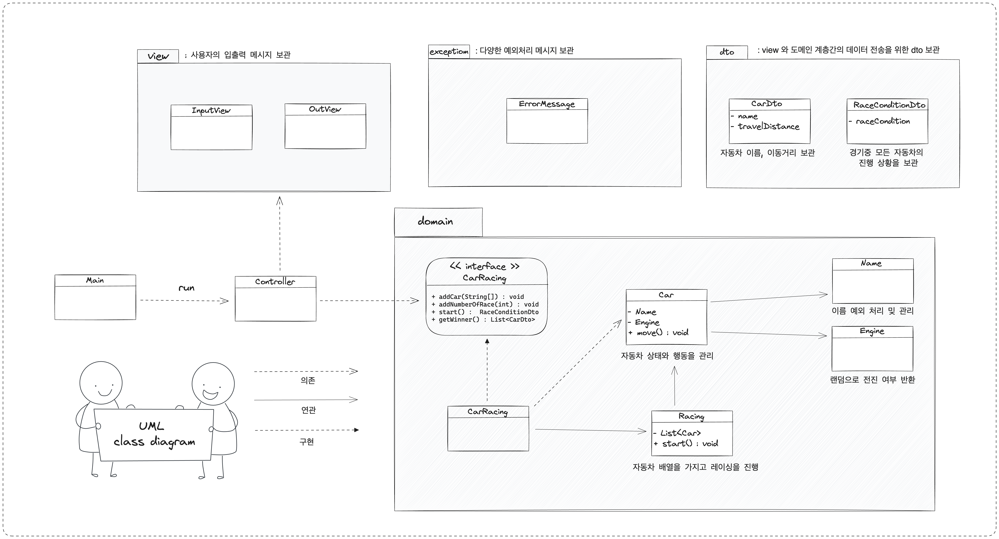

# 완료한 기능 목록

- [x] 주어진 횟수 동안 n대의 자동차는 전진 또는 멈출 수 있다.
- [x] 각 자동차에 이름을 부여할 수 있다. 전진하는 자동차를 출력할 때 자동차 이름을 같이 출력한다.
- [x] 자동차 이름은 쉼표(,)를 기준으로 구분하며 이름은 5자 이하만 가능하다.
- [x] 사용자는 몇 번의 이동을 할 것인지를 입력할 수 있어야 한다.
- [x] 전진하는 조건은 0에서 9 사이에서 무작위 값을 구한 후 무작위 값이 4 이상일 경우이다.
- [x] 자동차 경주 게임을 완료한 후 누가 우승했는지를 알려준다. 우승자는 한 명 이상일 수 있다.
- [x] 우승자가 여러 명일 경우 쉼표(,)를 이용하여 구분한다.
- [x] 사용자가 잘못된 값을 입력할 경우 IllegalArgumentException을 발생시킨 후 애플리케이션은 종료되어야 한다.

 

# 완료한 테스트 목록

- Car 
  - [x] 랜덤값에 따른 차 이동거리 증가 여부
- Name 
  - [x] 이름 1 미만 5 초과일경우 에러 반환 여부
- Engine 
  - [x] 확률 조건에 따른 이동 여부 값 판단
- Racing
  - [x] carList null 이거나 비어있는 경우 예외처리
  - [x] 레이싱 중 경기 상황 반환 여부
  - [x] 레이싱 우승자 반환 여부

 

# UML diagram

 

# 구조와 도메인 설명

- **view package** : 입력과 출력을 관리하는 클래스들
  - `inputView class`
    - 사용자의 입력을 받고 원하는 타입으로 가공하는 역할을 가진다.
  - `outView class`
    - 결과값을 처리하여 사용자에게 출력하는 역할을 가진다.

- **domain package** : 로직을 구현하는 핵심 도메인
  - `Car class`
    - name, engine을 가진다.
    -  확률적으로 이동거리가 1 증가한다.
  - `Name class`
    - 사용자로부터 입력받은 이름이 5자 이하인지 판단한다. 5자 초과 라면 IllegalArgumentException 에러를 방생시킨다.
  - `Engine class`
    - 확률 조건에 따른 이동 여부를 알려준다. (확률 조건 : 0에서 9 사이에서 무작위 값을 구한 후 무작위 값이 4 이상일 경우)
  - `Racing class`
    - car list를 가진다.
    - 자동차들을 경주시킨다. 
    - 자동차들의 이동거리를 반환한다.
    - 가장 이동거리가 긴 자동차를 반환한다.
  - `CarRacing interface` : 구현 해야되는 전체 기능들
    - 이름들을 받아 자동차를 등록한다.
    - 레이싱의 경기횟수를 입력받는다.
    - 레이싱을 시작하고 경기상황을 반환한다.
    - 레이싱의 우승자를 반환한다.
- **controller package**
  - `RacingCarController class`
    - 도메인과 입출력관의 전체적인 흐름을 제어한다.

 

## 객체지향적 코드를 위한 규칙
- 클래스 보다 어떤 객체들이 뭔지 필요한지 생각하기
- 하나의 클래스의 하나의 책임만 지게하기
- 객체를 독립적인 존재가 아닌 협력 공동체의 일원으로 보기
- 객체의 상태를 숨기고 행동만 외부에 공개하기 (캡슐화)
- 객체의 상태보다 행동에 집중하기

 

  
<b>커밋규칙</b>

  

    태그 : 제목

예시 : `Feat : 회원 도메인을 추가 하였습니다.`

### 유의 사항
1. 제목과 본문을 빈 행으로 구분합니다.
2. 제목을 50글자 이내로 제한합니다.
3. 제목의 첫 글자는 대문자로 작성합니다.
4. 제목의 끝에는 마침표를 넣지 않습니다.
5. 제목은 명령문으로! 과거형을 사용하지 않습니다.
6. 본문의 각 행은 72글자 내로 제한합니다.
7. 어떻게 보다는 무엇과 왜를 설명합니다.

### 태그 설명
| 태그 이름 | 설명 |
| --- | --- |
| Feat | 새로운 기능을 추가할 경우 |
| Fix | 버그를 고친 경우 |
| Style | 코드 포맷 변경, 세미 콜론 누락, 코드 수정이 없는 경우 |
| Refactor | 프로덕션 코드 리팩토링 |
| Comment | 필요한 주석 추가 및 변경 |
| Docs | 문서를 수정한 경우 |
| Test | 테스트 추가, 테스트 리팩토링(프로덕션 코드 변경 X) |
| Rename | 파일 혹은 폴더명을 수정하거나 옮기는 작업만인 경우 |
| Remove | 파일을 삭제하는 작업만 수행한 경우 |

  

