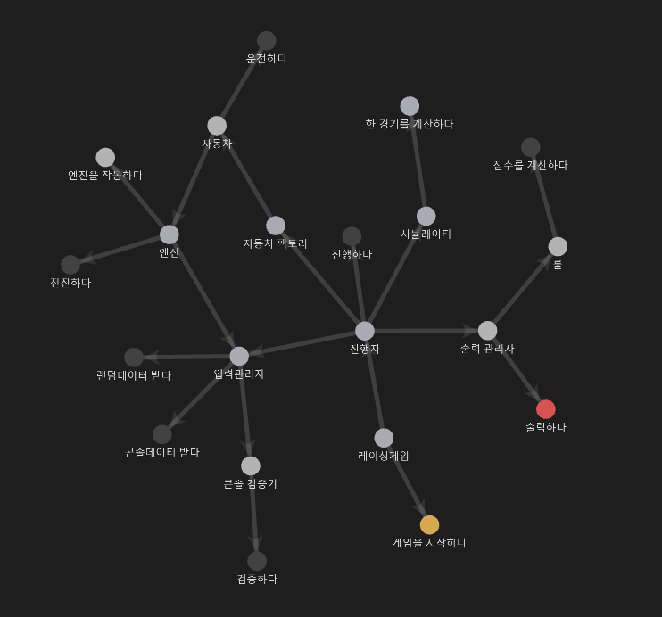

# 프로그래밍 목표
1. [객체지향 SOLID](SOLID.md) 원칙 준수
2. [JUnit5](JUnit5.md), [AssertJ](AssertJ.md) 사용
3. [TDD 방법론](TDD.md) 이용 
4. 아키텍쳐 패턴 ([MVC](MVC.md)) 준수

# 기능 구현 목표

1. 자동차 이름을 입력받는 문구를 출력한다.
2. 자동차 이름을 입력받는다.
3. 자동차 이름의 유효성을 체크한다. 유효하지 않을 시 IllegalArgumentException을 반환한다.
   - 세 개의 이름을 입력받았는지 확인한다.
   - 각각의 이름이 5글자 이하인지 확인한다.
   - (추가 검증) 서로 다른 이름인지 확인한다.
   - (추가 검증) printable한 문자로 이루어져 있는지 확인한다.
4. 몇 번의 이동을 할 것인지 입력받는 문구를 출력한다.
5. 몇 번의 이동을 할 것인지 입력받는다.
6. 입력 받은 이동 횟수의 유효성을 체크한다. 유효하지 않을 시 IllegalArgumentException을 반환한다.
   - int형인지 확인한다.
   - 0이상인지 확인한다.
7. 0에서 9사이의 무작위 값을 구한다.
8. 무작위 값이 4이상일 경우, 해당 자동차의 이동 횟수를 1 증가시킨다.
9. 5~6 과정을 두 번 더 반복한다.
10. 5~7 과정을 입력 받은 이동 횟수만큼 반복한다.
11. 결과를 출력한다.
12. 우승자(들)를 구한다.
13. 우승자(들)를 출력한다.

# 테스트 구현 목표