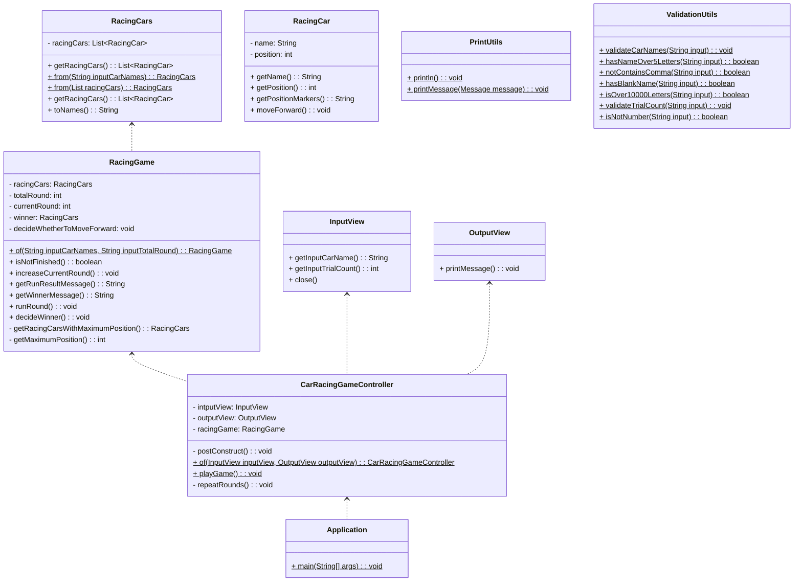

# 자동차 경주 미션 기능 목록

## 🖥 프로그램 동작 순서
1. 자동차 이름 입력 프롬프트를 출력한다.
2. 쉼표로 구분된 자동차 이름을 입력받는다.
   - 입력 값을 검증하고 실패 시 `IllegalArgumentException`을 반환 후 종료한다.
     - 이름이 5자 이하인지
     - 한 명 이상인지(쉼표 한 개 이상 포함)
     - 이름들이 빈 값이 아닌지
     - 입력 길이 
3. 시도 횟수 입력 프롬프트를 출력한다.
4. 시도할 횟수를 입력받는다. 
   - 입력 값을 검증하고 실패 시 `IllegalArgumentException`을 반환 후 종료한다.
     - 숫자 여부
5. 경주를 진행한다.
   - `pickNumberInRange(0, 9)`를 이용하여 출력한 난수 값이 4 이상이면 전진한다.
   - 전진일 경우 자동차의 위치를 증가시킨다.
   - 각 자동차별 진행 결과를 출력한다.
   - 다음 차수가 남았는지 판단하고 남았을 경우 다음 차수로 넘어간다.
6. 모든 라운드가 종료됐을 경우 우승자를 출력한다.
   - 단독 우승자는 단독 우승자만 표시하고 공동 우승자는 `, `로 구분하여 출력한다.

## 📝 기능 구현 목록

프로그램 동작 순서를 바탕으로 구현하여야 할 기능들을 정리하였다.

* ☑️ 입력
  * ☑️ 자동차 이름 입력받기
  * ☑️ 시도 횟수 입력 받기
* ☑️출력
  * ☑️ 자동차 이름 입력 프롬프트 출력
  * ☑️ 시도 횟수 입력 프롬프트 출력
  * ☑️ 자동차별 위치 출력
  * ☑️ 우승자 출력
* ☑️ 검증
  * ☑️ 자동차 이름 입력 값 검증
  * ☑️ 시도 횟수 입력 값 검증
* ☑️ 게임 관련
  * ☑️ 전진 여부를 결정
  * ☑️ 자동차의 위치 증가
  * ☑️ 다음 차수가 남았는지 판단

## 🗺️ 객체 구성

본 애플리케이션을 구성하는 객체 목록 및 클래스 다이어그램이다. 하기 목록은 구현 시 필요에 따라 변경될 수 있다.
* 애플리케이션
  * 컨트롤러(CarRacingGameController)
* 입력 뷰(InputView)
* 출력 뷰(OutputView)
* 컨트롤러(CarRacingGameController)
  * 입력 뷰(InputView)
  * 출력 뷰(OutputView)
* 경주게임(RacingGame)
  * 자동차들(RacingCars)
  * 게임 차수(totalRound)
  * 현재 차수(currentRound)
  * 우승자(winner)
* 자동차들(RacingCars)
  * 자동차 리스트(List<RacingCar>)
* 자동차(RacingCar)
  * 자동차 이름(name)
  * 위치(position)

# ⚠️ 프로그래밍 요구사항 
* 아래 사항에 유의하자!
  - depth 2 이하 유지
  - 삼항연산자(ternary operator) 사용 금지
  - 함수가 한가지 일만 하도록 최대한 작게 만들기
  - JUnit5, AssertJ 이용한 테스트 코드 작성
