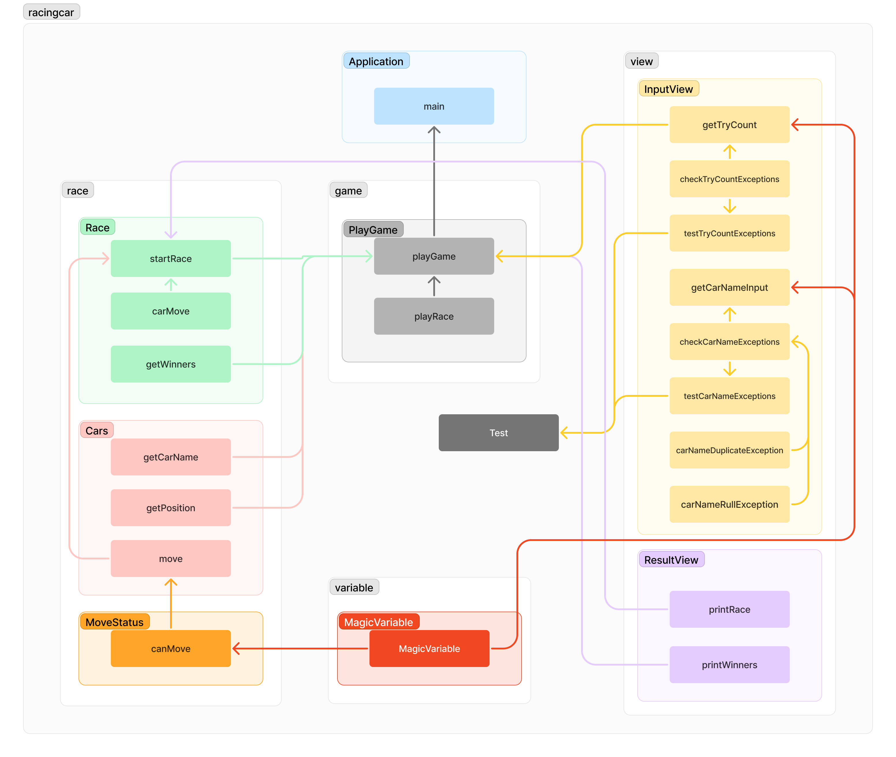

# 구현 기능 목록
- race package
  - Car 자동차
    - getCarName 자동차 이름
    - getPosition 자동차 위치
    - move 이동
  - MoveStatus 전진 여부 결정
    - 랜덤 수 4이상
      - 랜덤 수는 0~9 사이의 정수
  - Race 경주 시작
    - startRace 시도 횟수 만큼 전진 여부 결정
    - getWinners 위치가 제일 높은 사람이 우승

- variable package
  - MagicVariable 상수와 문장 변수로 지정

- view package
  - InputView 사용자 입력
    - getTryCount 시도 횟수
    - getCarNameInput 자동차 이름
    - 예외
      - checkCarNameExceptions 자동차 이름
        - carNameRullException 쉼표로 구분, 5자 이하 소문자만 가능, 공백 입력 불가
        - carNameDuplicateException 중복값 입력 불가
      - checkTryCountExceptions 시도 횟수는 1이상의 자연수만 가능
  - OutputView 결과
    - printRace 게임 진행 출력
    - printWinners 공동 우승일 경우 쉼표로 구분

- game package
  - PlayGame 게임 시작
    - playGame 게임 시작 후 입력값 받기
    - playRace 입력값을 토대로 경주 시작

# 다이어그램

