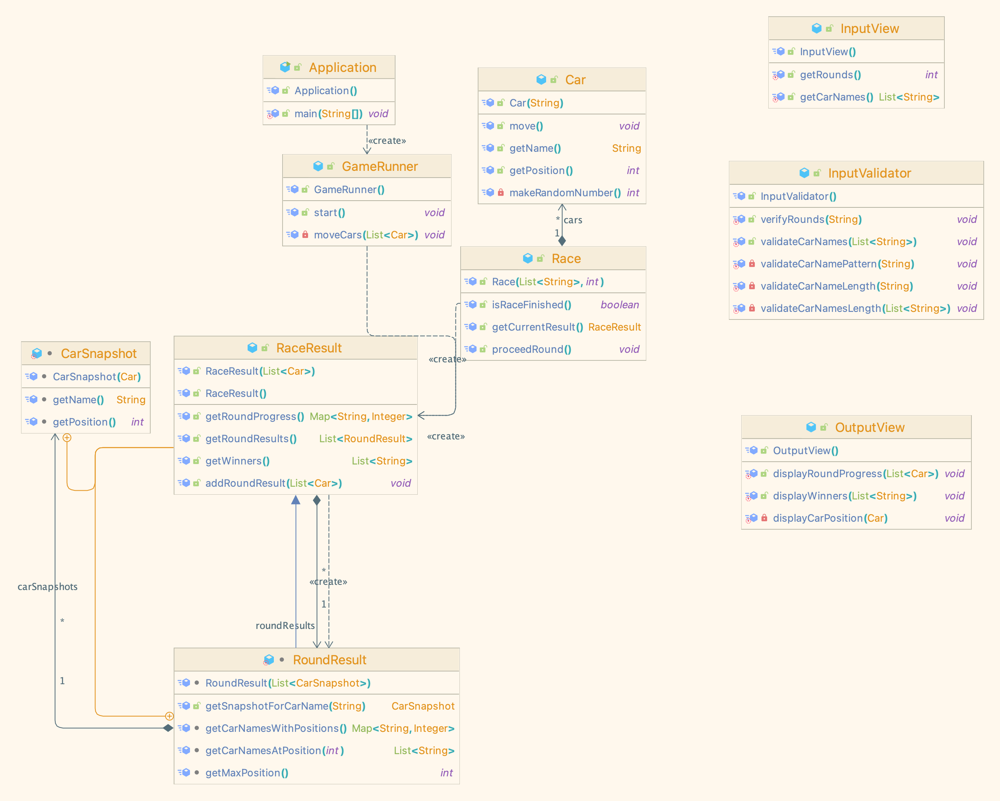

## 자동차 경주 게임 기능 흐름도

## 클래스 다이어그램

## 기능 목록

### InputView

- 사용자로부터 자동차 이름을 입력받는 기능
- 사용자로부터 시도할 회수를 입력받는 기능

### InputValidator (예외 처리 및 검증)

- 입력값이 비어 있거나 null인 경우
- 이름 길이가 5자를 초과하는 경우
- 입력값이 숫자가 아니거나 음수인 경우
- 입력값이 한글, 영문, 숫자 및 쉼표만 포함 하는지 검증
- 자동차 최대 이름을 넘겨서 입력한 경우
- 중복된 자동차 이름을 두 개 입력한 경우
- 이동 횟수를 허용 범위 밖으로 입력한 경우

### Car

- 자동차 객체를 생성하는 기능
- 자동차의 전진 또는 멈춤 결정 기능
- 0-9 사이의 랜덤한 숫자를 생성하는 기능
- 랜덤 값이 4 이상일 경우 전진하는 기능
- 자동차의 현재 위치를 반환하는 기능
- 자동차의 이름을 반환하는 기능

### RaceController

- 사용자의 입력을 받아 경주 게임을 진행하는 기능
- Race 객체 생성 및 실행하는 기능
- 경기 종료 조건 만족할 때 진행 및 결과 출력 (OutputView 활용)

### Race (Domain, 실제로 경주를 진행하는 객체)

- 경주에 참여하는 자동차들의 목록을 설정하는 기능 (InputView)
- 라운드 별 자동차의 전진/멈춤을 결정하는 기능 (Car)
- 라운드 별 경기 결과를 저장하고 반환하는 기능 (RaceResult)
- 종료 조건을 확인하는 기능 (라운드 수)

### RaceResult(RoundResult, CarSnapshot을 포함)

- 라운드 별 경기 결과를 저장하는 기능 (List<RoundResult>로 구현)
    - CarSnapshot은 자동차의 이름과 현재 위치를 저장하는 기능을 수행
- 최종 우승자 계산하고 반환하는 기능 (마지막 라운드의 RoundResult에서 최대 position 값을 가진 자동차들의 이름 리스트를 반환)
- 라운드별 경주의 결과 반환하는 기능 (RoundResult의 리스트를 반환(각 자동차들의 CarSnapshot 리스트)

### RaceException

- 경주 게임에서 발생하는 예외를 관리하는 클래스
- 경주 게임에서 발생하는 예외의 종류를 enum으로 관리
- 예외의 종류에 따라 예외 메시지를 반환하는 기능
- 발생 가능한 예외
    - 자동차 이름이 null 또는 빈 문자열인 경우
    - 자동차 이름의 길이가 5자를 초과하는 경우
    - 라운드 횟수가 0 혹은 음수인 경우

### OutputView

- 콘솔에서 경주의 진행 상황을 출력하는 기능 (RaceResult의 value ex : pobi : ----)
    - 각 라운드가 끝날 때마다 호출되며, 자동차의 현재 위치를 RaceResult에서 받아 출력
- 경기 종료 시 경주의 최종 우승자를 출력하는 기능 (RaceResult의 최종 우승자)
    - 우승자가 여러 명일 경우 쉼표(,)로 구분하여 출력
- 에러 메시지를 출력하는 기능 (InputView에서 받은 에러 메시지, 별도 enum으로 status code 관리)