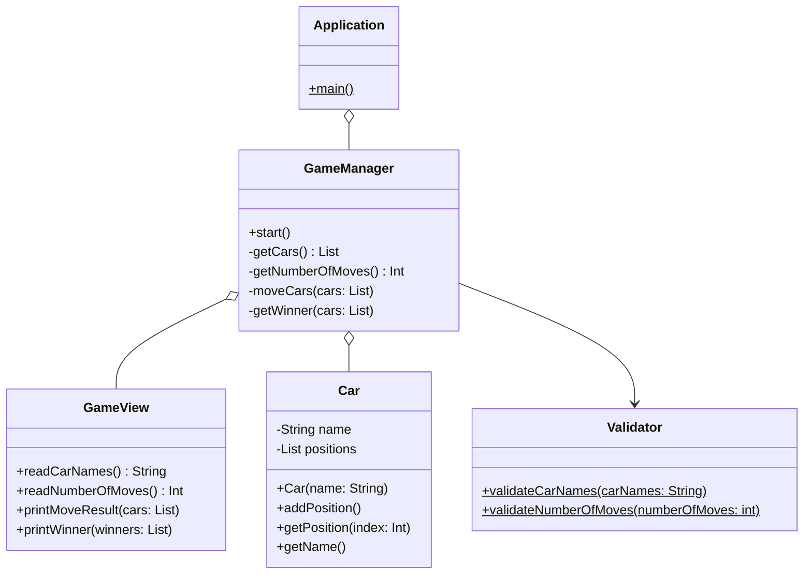

# 요구사항 분석
## 요구사항 명세
### 제약사항

1. JDK 17 버전에서 실행 가능해야 한다.
2. 외부 라이브러리를 사용하지 않는다.
3. 프로그램 종료 시 System.exit()를 호출하지 않는다.
4. 요구 사항에서 달리 명시하지 않는 한 파일, 패키지 이름을 수정하거나 이동하지 않는다.
5. `camp.nextstep.edu.missionutils` 에서 제공하는 `Randoms` 및 `Console` API를 사용하여 구현해야 한다.
  1. Random 값 추출은 `camp.nextstep.edu.missionutils.Randoms`의 `pickNumberInRange()`를 활용한다.
  2. 사용자가 입력하는 값은 `camp.nextstep.edu.missionutils.Console`의 `readLine()`을 활용한다.
6. indent depth를 3이 넘지 않도록 구현한다.
7. 3항 연산자를 쓰지 않는다.
8. 함수 혹은 메서드가 한 가지 일만 하도록 최대한 작게 만든다.
9. JUnit 5와 AssertJ를 이용하여 정리한 기능 목록이 정상 동작함을 테스트 코드로 확인한다.
### 기능요구

**Java 코드 컨벤션을 준수한다.**

| 기능종류 | ID               | 기능명               | 설명                                                                                                                                                                                                                                       |
|------|------------------|-------------------|------------------------------------------------------------------------------------------------------------------------------------------------------------------------------------------------------------------------------------------|
| 입력   | I-01(Input)      | 자동차 이름 입력         | 사용자는 5자 이하의 자동차 이름들을 쉼표(,)로 구분하여 입력한다.                                                                                                                                                                                                   |
| 입력   | I-02(Input)      | 이동 횟수 입력          | 사용자는 경주 게임에서 이동할 횟수를 입력한다.                                                                                                                                                                                                               |
| 검증   | V-01(Validation) | 자동차 이름 입력값 검증     | 1. 이름의 길이가 1~5자가 아니라면 IllegalArgumentException 을 발생시키고 프로그램을 종료한다.   2. 이름이 아무것도 없다면 IllegalArgumentException 을 발생시키고 프로그램을 종료한다.                                                                                                     |
| 검증   | V-02(Validation) | 이동 횟수 입력값 검증      | 1. 입력값이 없으면 IllegalArgumentException을 발생시키고 프로그램을 종료한다.   2. 이동 횟수 입력값이 정수로 변환되지 않는다면 IllegalArgumentException 을 발생시키고 프로그램을 종료한다.  3. 이동 횟수가 0보다 작다면 IllegalArgumentException을 발생시키고 프로그램을 종료한다.                                  |
| 출력   | O-01(Output)     | 자동차 이름 입력 도움문구 출력 | “경주할 자동차 이름을 입력하세요.(이름은 쉼표(,) 기준으로 구분)”를 출력한다.                                                                                                                                                                                           |
| 출력   | O-02(Output)     | 이동 횟수 입력 도움문구 출력  | “시도할 회수는 몇회인가요?”를 출력한다.                                                                                                                                                                                                                  |
| 출력   | O-03(Output)     | 실행 결과 출력          | “실행 결과”를 출력한다.   이후 이동 횟수만큼 진행된 결과를 아래 형식으로 출력한다.   [자동차이름1] : [시점 i에서의 이동량만큼 ‘-’를 출력]   [자동차이름2] : [시점 i에서의 이동량만큼 ‘-’를 출력]   …   [자동차이름1] : [시점 i+1에서의 이동량만큼 ‘-’를 출력]  [자동차이름2] : [시점 i+1에서의 이동량만큼 ‘-’를 출력]   … |
| 출력   | O-04(Output)     | 승자 출력             | 경주 게임에서 승리한 자동차 이름을 출력한다.   ”최종 우승자 : “[우승자 자동차 이름1], [우승자 자동차 이름2], [우승자 자동차 이름3] …                                                                                                                                                  |
| 진행   | P-01(Process)    | 자동차 전진            | 각 자동차는 0에서 9사이의 무작위 값을 구한 후 무작위 값이 4이상인 경우 전진한다.                                                                                                                                                                                         |
| 진행   | P-02(Process)    | 승자 결정             | 이동 횟수만큼 자동차 전진을 진행하고 가장 많이 전진한 자동차 혹은 자동차들을 찾는다.                                                                                                                                                                                         |

## usecase diagram

## usecase description
### 경주 시작
- **액터**: 사용자
- **시작조건**: 프로그램을 실행
- **기본 흐름**
    1. "경주할 자동차를 입력하세요.(이름은 쉼표(,) 기준으로 구분)" 출력
    2. 사용자가 자동차 이름들을 쉼표(,)로 구분하여 입력한다.
    3. 입력한 자동차 이름들이 유효한지 검사한다.
    4. 시스템이 자동차 이름들을 저장한다.
    5. "시도할 회수는 몇회인가요?" 출력
    6. 사용자가 이동 횟수를 입력한다.
    7. 입력한 이동 횟수가 유효한지 검사한다.
    8. 시스템이 이동 횟수를 저장한다.
    9. 이동횟수만큼 자동차들이 이동한 정도를 출력한다.
    10. 경주 결과를 출력한다.
- **대안 흐름**
- **예외 흐름**
    1. 자동차 이름의 길이가 1~5자를 초과하면 `IllegalArgumentException`을 발생시키고 프로그램을 종료한다.
    2. 자동차 이름이 아무것도 없다면 `IllegalArgumentException` 을 발생시키고 프로그램을 종료한다.
    3. 이동 횟수 입력값이 없으면 `IllegalArgumentException`을 발생시키고 프로그램을 종료한다.
    4. 이동 횟수 입력값이 정수로 변환되지 않는다면 `IllegalArgumentException` 을 발생시키고 프로그램을 종료한다.
    5. 이동 횟수가 0보다 작다면 `IllegalArgumentException`을 발생시키고 프로그램을 종료한다. 
- **종료 조건**: 경주 결과를 출력한다.

## class diagram

