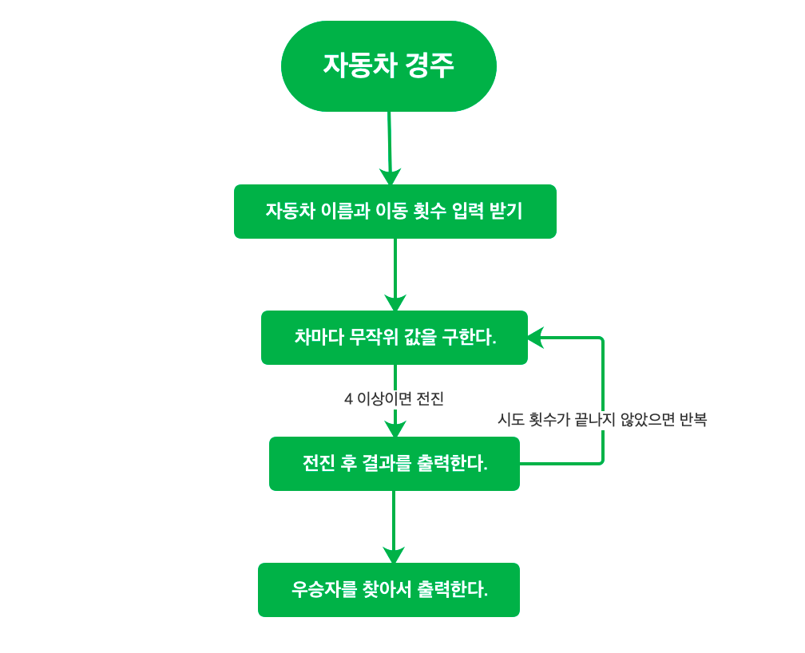

# 개요

---
## main
#### [Application]
  - RacingGame을 실행한다.
#### [view]
  - OutputView
    - 각 라운드 마다 결과를 출력한다.
      - carName + forwardCriterion + raceLength
    - 마지막 우승자 car리스트를 받아서 출력한다.
  - InputUser
    - 문제에 맞는 문구 출력과 사용자 입력을 받는다.
  - GameViewMessage (enum)
    - WRITE_CAR_NAME_MESSAGE
    - WRITE_RACE_LENGTH_MESSAGE
    - OUTPUT_FIRST_LINE_MESSAGE
    - OUTPUT_WINNER_MESSAGE
    - COLON_STRING
    - SPACE_BAR
  - ExceptionString (enum)
    - INPUT_INTEGER_ROUND_ERROR_MESSAGE
    - INPUT_STRING_ROUND_ERROR_MESSAGE
    - CAR_NAME_OVER_LENGTH_ERROR_MESSAGE
    - DUPLICATE_CAT_NAME_ERROR_MESSAGE
#### [controller]
  - RacingGame
    - carNameString 입력을 ArrayList<Car>형태로 받아온다.
    - 입력받은 문자열로 car이름을 추출한 뒤 각 Car객체에 담아서 ArrayList로 생성한다.
    - 라운드 횟수 입력을 받아온다.
    - 잘못된 사용자 입력을 확인해서 예외처리를 한다.
        - carName 입력시
            - car이름이 중복될 경우
            - 이름이 5자 초과일 경우
            - car개수가 1이하일 경우
            - car이름이 공백일 경우
        - roundLength 입력시
            - 숫자가 아닐 경우
            - 0이하일 경우
    - 라운드를 진행한다.
  - Round
    - 각 carName마다 전진을 결정(desicionMove)한다.
    - OutputView를 실행한다.
    - 위 두 과정을 라운드 횟수만큼 반복한다.
    - 모든 라운드가 끝나면 우승자를 선정한다.
    - goForward
      - 조건(decisionforward)에 따라 각 carName마다 raceLength에 step하나를 누적한다.
    - decisionforward
      - randomInt에 따라 forwardCriterion과 비교하여 조건에 맞으면 전진 실행(goForward)
    - randomInt
      - 0~9까지 수 중에 무작위로 추출 후 반환
  - InputException
    - 사용자 입력이 잘못되었을 경우 예외 호출한다.
      - carName 입력시
        - 예외처리
      - roundLength 입력시
        - 예외처리
#### [model]
  - Car
    - 필드 : carNameArray,raceLength,oneStep,stepDistance
    - Car가 게임플레이 중 step을 갔을 때 raceLength 1, stepDistance는 onestep 증가
    - Car의 현재까지 진행한 총 거리의 문자열을 반환
  - GameState
    - 필드 : Map(carName, stepDistance)
    - 각라운드당 게임 참여 중인 Car들의 display할 상태

---
## 기능 조직도
