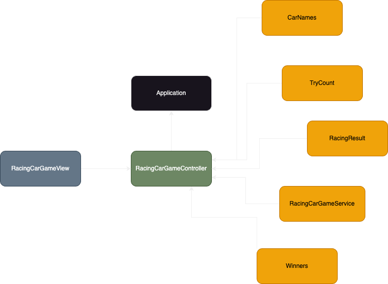

## 구현기능

- 레이싱 게임에서 차량을 생성하는 클래스의 인터페이스인 `CarFactory`와 레이싱 카를 생성하는 구현체인 RacingCarFactory를 구현한다.
- 애플리케이션의 설정정보를 담은 `ApplicationConfig` 클래스를 구현한다. 게임을 시작하기 전에 이곳에서 게임에서 사용할 CarFactory 구현체를 
받아 Game 인터페이스 구현체에 주입한다.
- 자동차의 이름들, 레이싱 카를 담은 컬렉션만을 필드로 가지고 있는 일급객체를 생성한다. (`CarNames`, `RacingCars`)
- 레이싱 카의 데이터와 기능을 담고 있는 `RacingCar` 클래스를 구현한다. `RacingCar`의 주요 역할은 다음과 같다.
  - 랜덤한 수를 뽑아 진행로직을 수행한다.
  - 현재 레이싱카의 상태를 출력한다.
- 만들어진 자동차들로 게임을 수행하는 로직을 작성한다.
- RacingCars 일급 컬렉션 객체에 우승자 판단 로직을 작성한다.
- 게임의 결과를 출력하는 로직을 작성한다.
- 게임에서 사용된 상수를 하나의 클래스에 담아 처리한다.
- 입력 검사로직을 작성한다.

## 테스트 코드 작성
