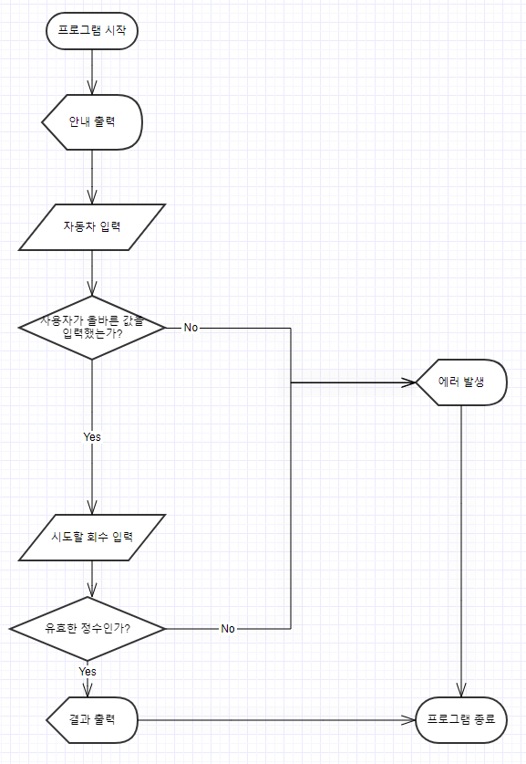

# 구현 기능 목록

## 목차

- [기능](#기능)
- [플로우 차트](#플로우-차트)
- [프로젝트 구조](#프로젝트-구조)
- [예외](#예외)
- [요구 사항](#요구-사항)
- [권장 사항](#권장-사항)
- [출력 예시](#출력-예시)
- [테스트 결과](#테스트-결과)

## 기능

- 경주 자동차 입력 기능
- 시도 횟수 입력 기능
- 무작위 값 생성 기능
- 전진 조건 판별 기능
- 전진 자동차 출력 기능
- 우승자 출력 기능

## 플로우 차트



## 프로젝트 구조

- src
    - main
        - java
            - racingcar
                - Application.java : 프로그램 실행 엔트리포인트
                - controller
                    - GameController.java : 컨트롤러
                - domain
                    - Attempts.java : 시도할 횟수를 포장한 객체
                    - Car.java : 자동차를 포장한 객체
                    - CarName.java : 자동차의 이름을 포장한 객체
                    - CarPosition.java : 자동차의 위치를 포장한 객체
                    - Cars.java : 자동차를 포장한 객체의 List를 갖는 일급컬렉션
                - util
                    - Generator.java : 숫자생성 인터페이스
                    - Parser.java : 파싱을 처리하는 유틸클래스
                    - RandomNumberGenerator.java : 숫자생성 인터페이스를 구현한 랜덤한 숫자를 생성하는 유틸클래스
                    - Separator.java : 글자를 분할하는 유틸클래스
                - view
                    - InputView.java : userinput을 처리하는 뷰
    - test
        - java
            - generator
                - NumberGenerator.java : 숫자생성 인터페이스를 구현한 특정한 숫자를 생성하는 테스트용 클래스
            - racingcar
                - ApplicationTest.java
                - domain
                    - AttemptsTest.java : Attempts 테스트클래스
                    - CarNameTest.java : CarName 테스트클래스
                    - CarPositionTest.java : CarPosition 테스트클래스
                    - CarsTest.java : Cars 테스트클래스
                    - CarTest.java : Car 테스트클래스
            - util
                - NumberGeneratorTest.java : RandomNumberGenerator 테스트 클래스
                - ParserTest.java : Parser 테스트 클래스
                - SeparatorTest.java : Separator 테스트 클래스
            - study
                - StringTest.java

## 예외

1. 자동차 이름을 입력할 때
    * 쉼표가 존재하지 않을 경우 (== 경주할 자동차가 하나일 경우)
    * 쉼표만 존재할 경우
    * 이름이 6자 이상일 경우
2. 시도할 회수를 입력할 때
    * 문자열을 입력한 경우
    * 음수, 0을 입력한 경우
    * 매우 큰 수를 입력한 경우

## 요구 사항

1. indent(인덴트, 들여쓰기) depth를 3이 넘지 않도록 구현한다. 2까지만 허용한다
2. 3항 연산자를 쓰지 않는다.
3. 함수(또는 메서드)가 한 가지 일만 하도록 최대한 작게 만들어라.
4. JUnit 5와 AssertJ를 이용하여 본인이 정리한 기능 목록이 정상 동작함을 테스트 코드로 확인한다
6. 삼항연산자를 사용하지 않는다.
7. JDK에서 제공하는 Random 및 Scanner API 대신 camp.nextstep.edu.missionutils에서 제공하는 Randoms 및 Console API를 사용하여 구현해야 한다.

### 권장 사항

1. else 예약어를 쓰지않는다.
2. 모든 원시값과 문자열을 포장한다.
3. 한 줄에 점 하나만 찍는다.
4. 클래스는 3개이상의 인스턴스 변수를 가지지않게한다
5. 일급컬렉션을 사용한다

## 출력 예시

```java
경주할 자동차 이름을 입력하세요.(이름은 쉼표(,)기준으로 구분)
        pobi,woni,jun
        시도할 회수는 몇회인가요?
        5

        실행 결과
        pobi:-
        woni:
        jun:-

        pobi:--
        woni:-
        jun:--

        pobi:---
        woni:--
        jun:---

        pobi:----
        woni:---
        jun:----

        pobi:-----
        woni:----
        jun:-----

        최종 우승자:pobi,jun
```

## 테스트 결과

