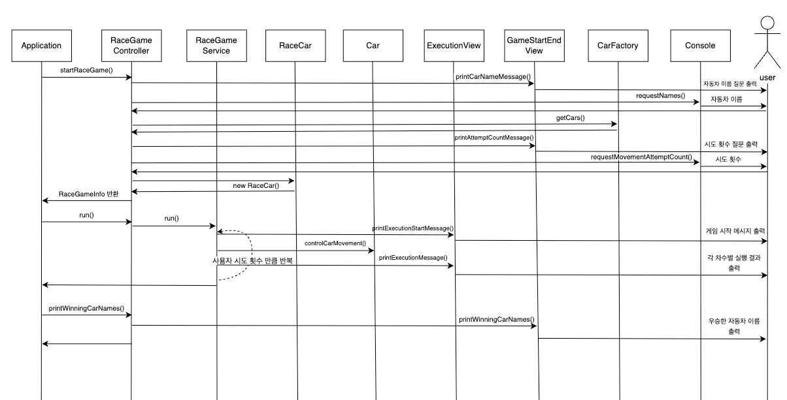

# 자동차 경주 게임
- 초간단 자동차 경주 게임을 구현한다.

## 📂 디렉토리 구조
```
├── main
│   └── java
│       └── racingcar
│           ├── Application.java
│           ├── constants
│           ├── controller
│           ├── domain
│           │   └── car
│           ├── dto
│           ├── service
│           ├── util
│           └── view
└── test
    └── java
        ├── study
        └── racingcar
            ├── controller
            ├── domain
            │   └── car
            ├── service
            ├── util
            └── view
```
---

## 👻 기능 목록

### 자동차 기능
- [X] 무작위 값을 구한 후 무작위 값이 4 이상일 경우 전진 아니라면 멈출 수 있다.
    - 0에서 9까지의 정수 중 한 개의 정수 반환 예시) Randoms.pickNumberInRange(0,9);
- [X] 하나의 자동차는 이름을 가지고 있다.
    - 유효성 검증 :
      - 이름은 5자 이하만 가능하다.
- [X] 전진한 횟수에 정보를 가지고 있다.

### controller 기능
- [X] 사용자 입력을 통해서 게임 정보를 생성한다.
- [X] 게임 정보를 통해서 레이스 게임을 시작할 수 있다.
- [X] GameStartEndView를 통해서 게임 문구를 출력할 수 있다.
    - 사용자의 입력을 받기 위해서 자동차의 이름과, 시도 횟수를 출력할 수 있다.
      ```
      - 경주할 자동차 이름을 입력하세요.(이름은 쉼표(,) 기준으로 구분)
      - 시도할 회수는 몇회인가요?
      ```
    - 게임의 승리한 자동차의 이름을 출력할 수 있다.
      - 단독 우승자 안내 문구
        ```
        최종 우승자 : pobi
        ```
      - 공동 우승자 안내 문구
        ```
        최종 우승자 : pobi, jun
        ```
        - 우승자가 여러 명일 경우 쉼표(,)를 이용하여 구분한다.

### service 기능
- [X] ExecutionView를 통해서 진행중인 게임의 각 차수별 실행 결과를 출력할 수 있다.
  - 게임 시작 처음 메시지
    ```
    실행 결과
    ```
- [X] 사용자가 입력한 이동하는 값만큼 반복할 수 있다.
  - 각 차수별 실행 결과
    - 전진하는 자동차를 출력할 때 자동차 이름을 같이 출력한다.
    - 게임을 진행하는 동안 전진한 횟수만큼 -를 추가한다.
      ```
      pobi : --
      woni : ----
      jun : ---
      ```
- [X] 자동차 객체에게 Random값을 보내줄 수 있다.
  - Random값은 0~9 사이의 숫자다.
- [X] 반복이 종료되면 자동차 경주 게임을 완료한다.

### 출력 기능
- [X] ExecutionView
  - service에서 게임이 진행되는 동안 메시지 출력
- [X] GameStartEndView
  - controller에서 게임이 시작하고 종료시 메시지 출력

### 유틸 기능
- [X] 0~9 사이의 랜덤값을 생성한다.
  - Random 값 추출은 camp.nextstep.edu.missionutils.Randoms의 pickNumberInRange()를 활용한다.
- [X] 사용자에게 입력을 받을 수 있다.
  - 사용자가 입력하는 값은 camp.nextstep.edu.missionutils.Console의 readLine()을 활용한다.
    - 자동차 이름 입력 기능
      - 쉼표(,)를 기준으로 구분하며 자동차의 이름을 가진 배열을 생성할 수 있다.
    - 숫자 입력 기능
      - 숫자가 아닌경우 예외가 발생한다.
- [X] 자동차의 이름을 통해서 여러 자동차를 생성할 수 있다.
  - 이름이 중복될 경우 예외가 발생한다.

### ⚠️ 주의사항
- [X] indent depth는 2까지만 허용한다.
- [X] 3항 연산자를 쓰지 않는다.
- [X] 함수(또는 메서드)가 한 가지 일만 하도록 최대한 작게 만들어라.
- [X] JUnit 5와 AssertJ를 이용하여 본인이 정리한 기능 목록이 정상 동작함을 테스트 코드로 확인한다.
  - 테스트 도구 사용법이 익숙하지 않다면 test/java/study를 참고하여 학습한 후 테스트를 구현한다.
---
## 시퀀스 다이어그램

