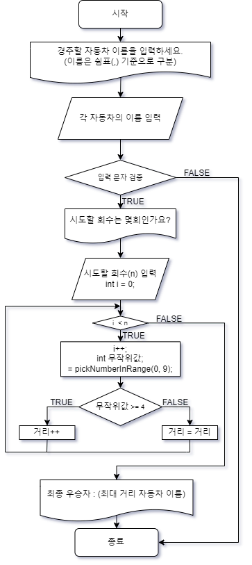

# 게임 진행
1. 자동차 이름을 5자 이하로 쉼표를 기준으로 구분하여 원하는 만큼 입력한다.
2. 입력 문자에 대하여 예외 처리를 한다.

3. 반복 횟수 입력
4. 반복 횟수만큼 게임을 반복(전진)
5. 반복이 끝났을 때 가장 많이 전진을 한 자동차가 최종 우승자 (중복 가능)
# 순서도

# 기능 목록
* 자동차 이름 입력 받기
  * split(",")으로 나눈 뒤, 입력 문자에 대하여 예외 처리
    * 자동차 이름 is not null
    * 자동차 이름의 길이는 5자 이하
    * 자동차 이름 is unique
* 반복 횟수 입력 받기
* 반복 횟수만큼 게임 반복
  * 반복마다 각 자동차에게 0~9의 숫자를 부여
  * 숫자가 4 이상이라면 전진 거리++
* 반복이 끝나면 전진 거리 값이 가장 큰 자동차 선택 후 출력

# 디렉토리 구조 설계
## controller

## service

## view

## util